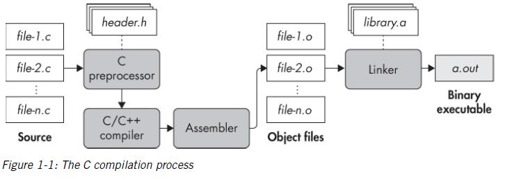
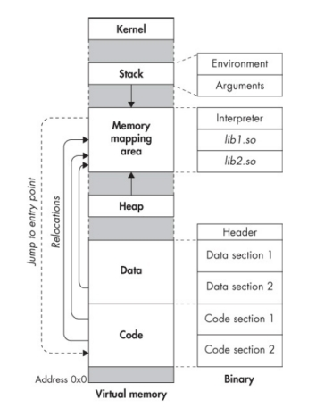
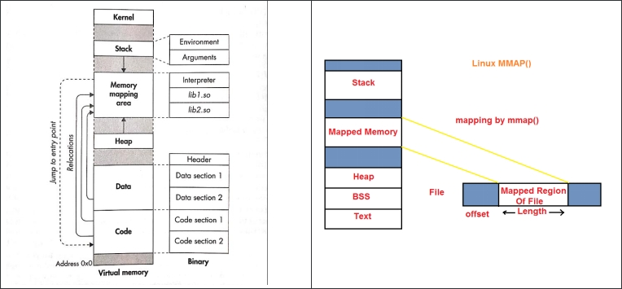

# [Practical Binary Analysis]  Part.1 (Chapter.1)

<!-- >

As malware increasingly obfuscates itself and applies anti-analysis techniques to thwart our analysis, we need more sophisticated methods that allow us to raise that dark curtain designed to keep us out--binary analysis can help. The goal of all binary analysis is to determine (and possibly modify) the true properties of binary programs to understand what they really do, rather than what we think they should do. While reverse engineering and disassembly are critical first steps in many forms of binary analysis, there is much more to be learned.

SOMMARIO


2 ANATOMY OF BINARY 6

2.1 The C Compilation Process 6

2.1.1 The Processing Phase 7

2.1.2 The Compiling Phase 9

2.1.3 The Assembly Phase 11

2.1.4 The Linking Phase 12

2.2 Symbols and Stripped Binaries 15

2.2.1 Viewing Symbolic Information 15

2.2.2 Another Binary Turns to the dark side: Stripping a Binary 17

2.3 Disassembling a Binary 18

-->
The content of this page is entirly coming from the "Practical Binary Analysis" book (https://practicalbinaryanalysis.com/) from Andriesse (https://mistakenot.net/)


##  **CHAPTER 1** 
([pdf](pba.pdf))
## &#9656;  **The anatomy of a BINARY** 
=================

***What exactly is a binary?***

Modern computers perform their computations using the binary numerical
system, which express all numbers as strings of one and zeros.

The machine code that these systems execute is called **binary code.**

*Every program consists of a collection of*:

-   **Binary code** *the machine instructions*

-   **Data** variables, constants and the like

To keep track of all the different programs on a given system is needed
a way to store all the code and data belonging to each program in a
self-contained file.

*These files*, containing executable binary programs, are called
**binary executable files** or simply **binary**

## &#9656; The C Compilation Process
-------

Binaries are produced through **compilation**:

<table><tr><td>
<b>COMPILATION</b> : Is the process of translating human-readable source code into machine code that the processor can execute.
 </td></tr></table>

Compiling C code involves four phases (modern compilers often merge some
or all of these phases):

1.  **Processing**

2.  **Compilation**

3.  **Assembly**

4.  **Linking**


### &#9702; The Processing Phase


Below a typical compilation process for C code:



The compilation process starts with a number of source files that have
to be compiled ( ***file-1.c*** through ***file-n.c*** )


It is possible to have one large file but typically, *large programs are
composed of many files*, this for the following reasons:

a)  **It makes the project easier to manage**

b)  **It speeds up compilation because if one file changes, only that
    file has to be recompiled instead of all the code.**

*C source files contain:*

-   **Macros** (*\#define*)

-   **Directives** (*\#include*): *are used to include header files (with the
        extension .h), on which the source code depends.*

The Processing phase expands any **“\#define”** *macros* or **“\#include”**
*directives* in the source file, so all that is left is pure C code ready
to be compiled.

Let take the following code as an example:
``` c 
  //compilation_example.c
  
  #include <stdio.h>
  
  #define FORMAT_STRING “%s”
  
  #define MESSAGE “Hello, world!\n”
  
  int
  
  main(int argc, char \*argv\[\])
  
  {
  
  printf(FORMAT_STRING,MESSAGE);
  
  return 0;
  
  }

```
Let us compile the file “*compilation\_example.c” using **gcc** (into
*x86-64 code*)* using the following parameters:

-   **-E** : tells gcc to stop after processing

-   **-P** : causes the compiler to omit the debugging information, so
    that the output is a bit cleaner.

Below the output of the C processor of the *compilation\_example.c **gcc
-E -P compilation\_example.c***
``` c
  ---
 $ gcc -E -P compilation_example.c 
  
  typedef long unsigned int size_t;
  
  typedef unsigned char __u_char;
  
  typedef unsigned short int __u_short;
  
  typedef unsigned int __u_int;
  
  typedef unsigned long int __u_long;
  
   /*.....*/
  
  extern int sys_nerr;
  
  extern const char *const sys_errlist\[\];
  
  extern int fileno (FILE *__stream) __attribute__ ((__nothrow__ , __leaf__)) ;
  
  extern int fileno_unlocked (FILE *__stream) __attribute__ ((__nothrow__ , __leaf__)) ;
  
  extern FILE *popen (const char *__command, const char *__modes) ;*
  
  extern int pclose (FILE *__stream);*
  
  extern char *ctermid (char *__s) __attribute__ ((__nothrow__ , __leaf__));
  
  extern void flockfile (FILE *__stream) __attribute__ ((__nothrow__ , __leaf__));
  
  extern int ftrylockfile (FILE *__stream) __attribute__ ((__nothrow__ , __leaf__));
  
  extern void funlockfile (FILE *__stream) __attribute__ ((__nothrow__ , __leaf__));
  
  int
  
  main(int argc, char *argv[]) {
  
  printf("%s", "Hello, world!\n");
  
  return 0;
  
  }

  ---
```
The “*stdio.h”* header is included in its entirety, with all *its type
definitions, global variables, and function prototypes* “copied in” to
the source file.

-   Because this happens for every **\#include directive**, preprocessor
    output can be quite verbose.

-   The preprocessor also fully expands all of any **\#define macros**
    used. In the above example both arguments to “printf”* are
    evaluated and replaced by the constant strings they represent:
``` c
  -----
  ..
  
  #define FORMAT_STRING <b>“%s”</b>
  
  #define MESSAGE <b>“Hello, world!\n”</b>
  
  ..
  
  printf(FORMAT_STRING,MESSAGE);*..
  -----
```
to:
``` c
  -------
  ..
  
  printf(**"%s**", **"Hello, world!\n"**);
  
  ..
  -------
```
### &#9702; The Compiling Phase
-

After the processing part is completed, the source is now ready to be
compiled-

<table><tr><td>
The <b>compilation phase</b> takes the preprocessed code and translate it into assembly language.
 </td></tr></table>


**Most compilers also perform heavy optimization in this phase,
typically configurable as an optimization level through command line
switches such as option **–Oo3** through **–O3** in **gcc**. The degree
of optimization during compilation can have a profound effect on
disassembly.**

The main reason why the compilation phase produces assembly language
instead of machine code is that *writing a compiler that emits, at the
same time, machine code for many different languages* would be an
extremely demanding and time-consuming task.

It is better to instead emit assembly code, which is an already
challenging task, and have *a single dedicated assembler* that *can
handle* the final translation of assembly to machine code for every
language.

Therefore, the output of the compilation phase is:

-   **Assembly**, *in a reasonably human-readable form, *with symbolic
    information intact**.

As mentioned, gcc normally calls all compilation phases automatically,
so:

To see the emitted assembly from the compilation stage, the *parameters
and options* to use in order to tell ***gcc*** to stop after stage and
store the assembly to the disk *are*:

-   **-S** : This flag is for the conventional extension for assembly
    files ***“\*.s”***

-   **-masm=intel** : With this option “gcc” emits assembly in Intel
    syntax rather than the default AT&T syntax

Below the output of the C processor of the *compilation\_example.c **gcc
-S -masm=intel compilation\_example.c***
``` shell
  --------
  $ gcc -S -masm=intel compilation\_example.c
  
 $ ls –la
  
  *total 32*
  
 \*….\*
  
  -rw-r--r-- 1 binary binary 173 dec 8 16:29 compilation_example.c
  
 -rw-rw-r-- 1 binary binary 562 dec 8 19:57 **compilation_example.s*
  
 -rw-r--r-- 1 binary binary 10240 apr 19 2018 hello.exe
  
 -rw-r--r-- 1 binary binary 723 apr 19 2018 Makefile
  --------
```
Below the output of ***\$ cat compilation\_example.s***
``` shell
  
  $gcc -S -masm=intel compilation\_example.c
  
  $cat compilation\_example.s
  
  .file "compilation\_example.c"
  
  .intel\_syntax noprefix
  
  .section .rodata
  
  .LC0: (1)
  
  .string "Hello, world!"
  
  .text
  
  .globl main
  
  .type main, @function
  
  main: (2)
  
  .LFB0:
  
  .cfi_startproc
  
  push rbp
  
  .cfi_def_cfa_offset 16
  
  .cfi_offset 6, -16
  
  mov rbp, rsp
  
  .cfi_def_cfa_register 6
  
  sub rsp, 16
  
  mov DWORD PTR [rbp-4], edi
  
  mov QWORD PTR [rbp-16], rsi
  
  mov edi, OFFSET FLAT:.LC0 (3)
  
  call puts
  
  mov eax, 0
  
  leave
  
  .cfi_def_cfa 7, 8
  
  ret
  
  .cfi_endproc
  
  .LFE0:
  
  .size main, .-main
  
  .ident "GCC: (Ubuntu 5.4.0-6ubuntu1\~16.04.5) 5.4.0 20160609"
  
  .section .note.GNU-stack,"",@progbits
  
```
The above code looks relatively easy to read because the symbols and
functions have been preserved:
<ul>
<li>ln.12 - The auto generated name <b><i>LC0</i></b> for the nameless “Hello, world!” string. </li>
<li>ln.22 - The explicit label for the <b><i>main</i></b>function.</li>
<li>ln.44 - The symbolic reference to code and data to the <b><i>LC0</i></b>(the“Hello, world!” string).</li>
</ul>

<u>Constants and variables have symbolic names rather than just address:</u>
- ***Unfortunately, with stripped binaries it’s not possible to gain all these extensive information.***

### &#9702; The Assembly Phase


The ***Assembly phase***: when some real machine code is finally
generated!

The input of the assembly phase is the set of assembly language files
generated in the compilation phase, and the output is a set of object
files, sometimes also referred to as module. *Object files contain
machine instructions that are in principle executable by the processor*.
Typically, each source file corresponds to one assembly file, and each
assembly file corresponds to one object file.

Below the process of generating an object file with **gcc** .*The
parameter* *to generate an object file*, is **-c** : Flag to generate an
object file.
```
  -----
  ***\$ gcc -c compilation\_example.c***
  
  *\$ ls -la*
  
  *total 36*
  
  *drwxr-xr-x 2 binary binary 4096 dec 8 23:44 .*
  
  *drwxrwxr-x 16 binary binary 4096 apr 19 2018 ..*
  
  *-rw-r--r-- 1 binary binary 173 dec 8 16:29 compilation\_example.c*
  
  *-rw-rw-r-- 1 binary binary 1536 dec 8 23:44 compilation\_example.o*
  
  *-rw-rw-r-- 1 binary binary 562 dec 8 19:57 compilation\_example.s*
  
  *-rw-r--r-- 1 binary binary 10240 apr 19 2018 hello.exe*
  
  *-rw-r--r-- 1 binary binary 723 apr 19 2018 Makefile*
  -----
```
The **“file &lt;file.o&gt;”** utility to confirm that the produced file
is indeed and object file

<table class="view">
<tr><td  class="top" style="font-weight:bold;">$ file compilation\_example.o</td></tr>
<tr><td style="font-weight:bold;">compilation\_example.o: <span style="background-color: #990099;color:white">ELF 64-bit LSB relocatable,</span> x86-64, version 1 (SYSV), <span style="background-color: #004C99;color:white">not stripped</span><td></tr>
</table>


Let’s analyse the output, the first part of the file output shows that
the file conforms to the elf specification for binary executables:

<table class="list">
<!-- <tr><td style="background:#272C34;color:#B09765;text-align:center;font-weight:bold;">ELF 64-bit LSB relocatable  </td></tr> -->
<tr><td style="background:#990099;ext-align:center;font-weight:bold;text-align:center;color:white">ELF 64-bit LSB relocatable:</td></tr>
<tr>    <td style="background:white;color:black"><ul style="list-style-type: circle;">
      <li>It is a 64-bit ELF file (since we are compiling for 64-bit)</li>
      <li>It is <b>LSB</b>, meaning that numbers are ordered in memory with their least significant byte first. <b>But most important is that is <u>relocatable</u></b></li>
      <li>Relocatable files don’t rely on being placed at any particular address in memory; rather, they can be moved around at will without this breaking any assumption in the code.</li>
      <li>When you see the term relocatable in the file output, you know are dealing with an object file and not with an executable. (There *are also position-independent relocatable files executable, but these show up in files as shared objects rather than relocatable. You can tell them apart from ordinary shared libraries because they have an entry point)</li></ul></td></tr>
<tr><td style="background:#004C99;ext-align:center;font-weight:bold;text-align:center;color:white;">not stripped:</td></tr>
<tr> <td style="background:white;color:black"><ul style="list-style-type: circle;"><li><b>Non-stripped binaries</b> <u>have debugging information built into it.</u> So if you compile an executable with the flag -g (gcc -g), it contains debugging information.</li></ul></td></tr>
</table>


<!--

<table>

  <tr>
    <td style="border: 1px solid black;background:#990099; width:20%; text-align:center;color:black;">ELF 64-bit LSB relocatable </td>
    <td style="border: 1px solid black;"><ul>
      <li>It is a 64-bit ELF file (since we are compiling for 64-bit)</li>
      <li>It is **LSB**, meaning that numbers are ordered in memory with their least significant byte first. **But most important is that is *relocatable***</li>
      <li>Relocatable files don’t rely on being placed at any particular address in memory; rather, they can be moved around at will without this breaking any assumption in the code.</li>
      <li>When you see the term relocatable in the file output, you know are dealing with an object file and not with an executable. (There *are also position-independent relocatable files executable, but these show up in files as shared objects rather than relocatable. You can tell them apart from ordinary shared libraries because they have an entry point)</li></ul></td>
   
  </tr>
  <tr>
      <td style="border: 1px solid black;background:#3399FF; width:20%; text-align:center;color:black">Not stripped </td>
    <td style="border: 1px solid black;"><ul><li>***Non-stripped binaries*** *have debugging information built into it*. So if you compile an executable with the flag -g (gcc -g), it contains debugging information.</li></ul></td>
  
  </tr>

</table>

-->

Object files are compiled independently from each other, so the
assembler has no way of knowing the memory addresses of other objects
files when assembling an object file.

That’s why objects files need to be relocatable; so that you can link
them together in any order to form a complete binary executable. (**If
objects files were not relocatable, that action would be impossible)**

### &#9702; The Linking Phase
--------
<table class="text">
<tr><td>
The linking phase is the *final phase of the compilation process*. As
the name implies, this phase links together all the object files **into
a single binary executable.**
</td></tr>
<tr><td>
In modern systems, *the linking phase* sometimes incorporate an
**additional optimization pass**, called:
<ul style="list-style-type: circle;">
      <li>**link-time optimization (LTO)**</li></ul>

   
</td></tr>
<tr><td>
The program that performs the linking phase is called a ***linke**r*, or
***link editor*** and ***it is typically separate from the compiler**,
which usually implements all the preceding phases*.
</td></tr>
<tr><td>
**Objects file are relocatable** because they are **compiled
independently from each other**, preventing the compiler from assuming
that an object **will end up at any particular address**. **Moreover,
“*object file”* may reference functions or variables in other *objects
files* or in libraries that are external to the program**.
</td></tr>
<tr><td>
**Before** the linking phase, **the address** at which the referenced
code and data will be placed **are not yet known**:
<ul style="list-style-type: circle;">
      <li>-   ***relocation symbol*** : The **object files** **only contain**
    “*relocation symbol”* that can specify how function and variable
    references should eventually be resolved.</li>
      <li>-   ***symbolic references** :* in the context of linking, *references
    that rely on a relocation symbol*</li></ul>
</td></tr>
<tr><td style="padding: 0;border-collapse: collapse;padding-bottom: 1em;border: none;">
**When an object file references *one of its own functions or variables
by absolute address*, the reference will also be symbolic**.

>***The linker’s job is to***:
>
>- Take all the object files belonging to a program.
>- Merge them into a single coherent executable, <i>typically intended
>    to be loaded at a particular memory address</i>.
></td></tr>
<tr><td style="padding: 0;border-collapse: collapse;padding-bottom: 1em;border: none;">
Now that the arrangement of all modules in the executable is known, the
linker can also resolve most symbolic refences.

**References to libraries **may or may** **not be completely resolved**,
depending on the type of library**.

-   ***Static libraries***(on Linux typically have extension **“*.
    a****”)*:

    -   Are merged into the binary executable, allowing any references
        to them to be resolved entirely.

-   ***Dynamic** (shared) **libraries*** :

    -   Are shared in memory among all programs that run on a system.

    -   Rather then copying the library into every binary that uses it,
        *dynamic libraries are loaded into memory only once*, and any
        binary that wants to use the library *needs to use this shared
        copy.*

    -   *During the linking phase*, *the address* at which dynamic
        libraries will reside *are not yet known*, so references to them
        cannot be resolved. Instead, *the linker leaves symbolic
        references to these libraries* even in the final executable, and
        these references are not resolved until the binary is actually
        loaded into memory to be executed.
</td></tr>
<tr><td style="padding: 0;border-collapse: collapse;padding-bottom: 1em;border: none;">
To produce a complete binary executable, only **gcc with no special
switches is required. **
</td></tr>
<tr><td style="padding: 0;border-collapse: collapse;padding-bottom: 1em;border: none;">
The below example shows the generated binary executable with **gcc (with
-o it’s possible to name the file)**
</td></tr>
</table>


<table class="view">
<!-- <tr><td class="top" colspan="11">&nbsp;</td></tr> -->
<tr><td colspan="11" class="top" style="font-weight:bold;">$ gcc compilation_example.c</td></tr>
<tr><td></td><td></td><td></td><td></td><td></td><td></td><td></td><td></td><td></td><td></td></tr>
<tr><td style="font-weight:bold;">$ ls -la</td><td></td><td></td><td></td><td></td><td></td><td></td><td></td><td></td><td></td></tr>
<tr><td></td><td></td><td></td><td></td><td></td><td></td><td></td><td></td><td></td><td></td></tr>
<tr><td>total</td><td>40</td><td></td><td></td><td></td><td></td><td></td><td></td><td></td><td></td></tr>
<tr><td></td><td></td><td></td><td></td><td></td><td></td><td></td><td></td><td></td><td></td></tr>
<tr><td>drwxr-xr-x</td><td>2</td><td>binary</td><td>binary</td><td>4096</td><td>dec</td><td>10</td><td>17:38</td><td>.</td><td></td></tr>
<tr><td></td><td></td><td></td><td></td><td></td><td></td><td></td><td></td><td></td><td></td></tr>
<tr><td>drwxrwxr-x</td><td>16</td><td>binary</td><td>binary</td><td>4096</td><td>apr</td><td>19</td><td>2018</td><td>..</td><td></td></tr>
<tr><td></td><td></td><td></td><td></td><td></td><td></td><td></td><td></td><td></td><td></td></tr>
<tr><td>-rwxrwxr-x</td><td>1</td><td>binary</td><td>binary</td><td>8616</td><td>dec</td><td>10</td><td>17:38</td><td style="font-weight:bold;"><span style="background-color:#95692F;color:white">a.out</span></td><td><span style="background-color:#95692F;color:white">(with no switches, by default the executable is called ‘a.out’)</span></td></tr>
<tr><td></td><td></td><td></td><td></td><td></td><td></td><td></td><td></td><td></td><td></td></tr>
<tr><td>-rw-r--r--</td><td>1</td><td>binary</td><td>binary</td><td>172</td><td>apr</td><td>19</td><td>2018</td><td>compilation_example.c</td><td></td></tr>
<tr><td></td><td></td><td></td><td></td><td></td><td></td><td></td><td></td><td></td><td></td></tr>
<tr><td>-rw-r--r--</td><td>1</td><td>binary</td><td>binary</td><td>10240</td><td>apr</td><td>19</td><td>2018</td><td>hello.exe</td><td></td></tr>
<tr><td></td><td></td><td></td><td></td><td></td><td></td><td></td><td></td><td></td><td></td></tr>
<tr><td>-rw-r--r--</td><td>1</td><td>binary</td><td>binary</td><td>723</td><td>apr</td><td>19</td><td>2018</td><td>Makefile</td><td></td></tr>
<tr><td></td><td></td><td></td><td></td><td></td><td></td><td></td><td></td><td></td><td></td></tr>
</table>

Let's run <b>file</b> commmand angainst the generated binary file <b>a.out</b>
<table class="view">
<tr><td colspan="11" class="top"style="font-weight:bold;">$ file a.out</td></tr>
<tr><td colspan="11" style="font-weight:bold;">a.out: <span style="background-color:#3741C3;color:white">ELF 64-bit LSB executable</span>, x86-64, version 1 (SYSV), <span style="background-color:#A15716;color:white">dynamically linked</span>, <span style="background-color:#3C6F3C;color:white">interpreter /lib64/ld-linux-x86-64.so.2</span>, for GNU/Linux 2.6.32, BuildID\[sha1\]=c21ccd6d27df9e553a574b2be2d6d58501fa8a0b, <span style="background-color:#E27EA4;color:white">not stripped</span></td></tr>
</table>

<!-- #C5E0B3
``` 
  -
  ***\$ gcc compilation\_example.c***
  
  ***\$ ls -la***
  
  *total 40*
  
  *drwxr-xr-x 2 binary binary 4096 dec 10 17:38 .*
  
  *drwxrwxr-x 16 binary binary 4096 apr 19 2018 ..*
  
  *-rwxrwxr-x 1 binary binary 8616 dec 10 17:38 **a.out (with no switches, by default the executable is called ‘a.out’)***
  
  *-rw-r--r-- 1 binary binary 172 apr 19 2018 compilation\_example.c*
  
  *-rw-r--r-- 1 binary binary 10240 apr 19 2018 hello.exe*
  
  *-rw-r--r-- 1 binary binary 723 apr 19 2018 Makefile*
  
  ***\$ file a.out***
  
  *a.out: ELF 64-bit LSB executable, x86-64, version 1 (SYSV), dynamically linked, interpreter /lib64/ld-linux-x86-64.so.2, for GNU/Linux 2.6.32, BuildID\[sha1\]=c21ccd6d27df9e553a574b2be2d6d58501fa8a0b, not stripped*
  -
```-->

Let’s analyse the output generated by the ***“file”*** utility (**\$
file a.out**):


<table class="list">
<!-- <tr><td style="background:#272C34;color:#B09765;text-align:center;font-weight:bold;">ELF 64-bit LSB relocatable  </td></tr> -->
<tr><td style="background:#3741C3;ext-align:center;font-weight:bold;text-align:center;color:white">ELF 64-bit LSB executable:</td></tr>
<tr><td style="background:white;color:black"><ul style="list-style-type: circle;">
<li style="list-style-type: circle;">Rather then being relocatable, as in the assembly phase, <b>now the ELF 64-bit LSB is executable</b></li>
      <li style="list-style-type: circle;">It is <b style="color:black;">LSB</b>, meaning that numbers are ordered in memory with their least significant byte first. <b>But most important is that is <i>executable</i></b></li></ul></td>
</tr>
<tr><td style="background:#A15716;ext-align:center;font-weight:bold;text-align:center;color:white;">dynamically linked:</td></tr>
<tr> <td style="background:white;color:black"><ul>
    <li style="list-style-type: circle;">The file is dynamically linked, meaning that it uses some libraries that are nit merged into the executable but are instead shared among all programs running on the same system.</li></ul></td>
</tr>
<tr><td style="background:#3C6F3C;text-align:center;font-weight:bold;text-align:center;color:white">interpreter /lib64/ld-linux-x86-64.so.2 :</td></tr>
<tr><td style="background:white;color:black"><ul>
      <li style="list-style-type: circle;"><i>“interpreter /lib64/ld-linux-x86-64.so.2”</i> in the file output tells which dynamic linker will be used to resolve the final dependencies on dynamic libraries when the executable is loaded into memory to be executed.</li>
      <li style="list-style-type: circle;">Running the binary, with <b>$ ./a.out</b>, produces “<b>Hello, world!</b>” to the standard output.<u>This confirms that we have a working binary.</u></li></ul></td>
</tr>
<tr><td style="background:#E27EA4;text-align:center;font-weight:bold;text-align:center;color:white;">not stripped :</td></tr>
<tr> <td style="background:white;color:black"><ul>
    <li style="list-style-type: circle;"><b><i>Non-stripped binaries</i></b> <i>have debugging information built into it</i>. So if you compile an executable with the flag -g (gcc -g), it contains debugging information</li>
    <li style="list-style-type: circle;"><b><i>Stripped binaries</i></b> generally <i> do not have this debugging information</i> which is not necessary for execution. The file size is also reduced</li><ul></td>
</tr>
</table>


<!--
<table style="background:white;color:black;">

 
  
  </tr>
  <tr>
    <td style="border: 1px solid black;background:#C5E0B3; width:20%; text-align:center;color:black;">interpreter /lib64/ld-linux-x86-64.so.2 </td>
    <td style="border: 1px solid black;">
      </td>
   
  </tr>
  <tr>
      <td style="border: 1px solid black;background:#E27EA4; width:20%; text-align:center;color:black">Not stripped </td>
    <td style="border: 1px solid black;"><ul>
    <li style="list-style-type: circle;">**Non-stripped binaries*** *have debugging information built into it*. So if you compile an executable with the flag -g (gcc -g), it contains debugging information</li>
    <li style="list-style-type: circle;">***Strip binaries*** generally *remove this debugging information* from the binary file which is not necessary for execution so as to reduce the size of the file</li><ul></td> 
  </tr>
</table>
-->

## &#9656; Symbols and Stripped Binaries 
=============================

High-level source code, such as C code, centers around functions and
variables with meaningful, human-readable names.

><b>When compiling a program, compiler emit <i>symbols</i>, which:</b>
>
>-   *Keep track* of such symbolic names.
>
>-   *Record* which binary code and data correspond to each symbol.
>

For instance, function symbols provide a mapping from symbolic,
high-level function names to the first address and the size of each
function.

This information is normally used by the linker when combining object
files (for instance, to resolve function and variable references between
modules) and also aids debugging.

### &#9702; Viewing Symbolic Information


The below example shows some symbolic information for the file “a.out”
using “**readelf --syms”:**

-   **‘-s’ or ‘--syms’ or ‘--symbols’ (An alias for ‘--syms’) :**
    Display the symbol table


    

<table class="view">
<tr><td colspan="8" class="top" style="font-weight:bold;">$ readelf –syms a.out</td></tr>
<tr><td colspan="8">Symbol table '.dynsym' contains 4 entries:</td></tr>
<tr style="font-weight:bold;"><td style="width:5%;">Num</td><td >Value (the address)</td><td>Size</td><td>Type</td><td>ind</td><td>Vis</td><td>Ndx</td><td>Name</td></tr>
<tr><td>0:</td><td>0000000000000000</td><td>0</td><td>NOTYPE</td><td>LOCAL</td><td>DEFAULT</td><td>UND</td><td></td></tr>
<tr><td>1:</td><td>0000000000000000</td><td>0</td><td>FUNC</td><td>GLOBAL</td><td>DEFAULT</td><td>UND</td><td>puts@GLIBC_2.2.5(2)</td></tr>
<tr><td>2:</td><td>0000000000000000</td><td>0</td><td>FUNC</td><td>GLOBAL</td><td>DEFAULT</td><td>UND</td><td>__libc_start_main@GLIBC_2.2.5(2)</td></tr>
<tr><td>3</td><td>0000000000000000</td><td>0</td><td>NOTYPE</td><td>WEAK</td><td>DEFAULT</td><td>UND</td><td>__gmon_start__</td></tr>
<tr><td colspan="8">&nbsp;</td></tr>
<tr><td colspan="8" style="font-weight:italic">Symbol table '.symtab' contains 67 entries:</td></tr>
<tr style="font-weight:bold;"><td style="width:5%;">Num</td><td >Value (the address)</td><td>Size</td><td>Type</td><td>ind</td><td>Vis</td><td>Ndx</td><td>Name</td></tr>
<tr><td>...</td><td>&nbsp;</td><td>&nbsp;</td><td>&nbsp;</td><td>&nbsp;</td><td>&nbsp;</td><td>&nbsp;</td><td>&nbsp;</td></tr>
<tr><td>56</td><td>0000000000601030</td><td>0</td><td>OBJECT/td><td>GLOBAL</td><td>HIDDEN</td><td>25</td><td>__dso_handle</td></tr>
<tr><td>57:</td><td>00000000004005d0</td><td>4</td><td>OBJECT</td><td>GLOBAL</td><td>DEFAULT</td><td>16</td><td>_IO_stdin_used</td></tr>
<tr><td>58:</td><td>0000000000400550</td><td>101</td><td>FUNC</td><td>GLOBAL</td><td>DEFAULT</td><td>14</td><td>__libc_csu_init</td></tr>
<tr><td>59:</td><td>0000000000601040</td><td>0</td><td>NOTYPE</td><td>GLOBAL</td><td>DEFAULT</td><td>26</td><td>_end</td></tr>
<tr><td>60:</td><td>0000000000400430</td><td>42</td><td>FUNC</td><td>GLOBAL</td><td>DEFAULT</td><td>14</td><td>_start</td></tr>
<tr><td>61:</td><td>0000000000601038</td><td>0</td><td>NOTYPE</td><td>GLOBAL</td><td>DEFAULT</td><td>26</td><td>__bss_start</td></tr>
<tr style="background-color:#95692F;color:white;font-weight:bold;"><td >62:</td><td>0000000000400526</span></td><td>32</td><td>FUNC</td><td>GLOBAL</td><td>DEFAULT</td><td>14</td><td>main</td></tr>
<tr><td>63:</td><td>0000000000000000</td><td>0</td><td>NOTYPE</td><td>WEAK</td><td>DEFAULT</td><td>UND</td><td>_Jv_RegisterClasses</td></tr>
<tr><td>64:</td><td>0000000000601038</td><td>0</td><td>OBJECT</td><td>GLOBAL</td><td>HIDDEN</td><td>25</td><td>__TMC_END__</td></tr>
<tr><td>65:</td><td>0000000000000000</td><td>0</td><td>NOTYPE</td><td>WEAK</td><td>DEFAULT</td><td>UND</td><td>_ITM_registerTMCloneTable</td></tr>
<tr><td>66:</td><td>00000000004003c8</td><td>0</td><td>FUNC</td><td>GLOBAL</td><td>DEFAULT</td><td>11</td><td>_init</td></tr>
</table>

In the above listing, with the utility ****readelf**** is possible to
display the symbol table, among many unfamiliar symbols we can find a
symbol for:


<table class="view">
<tr><td colspan="8" class="top" style="font-weight:bold;">$ readelf –syms a.out</td></tr>
<tr><td colspan="8">Symbol table '.dynsym' contains 4 entries:</td></tr>
<tr style="font-weight:bold;"><td style="width:5%;">Num</td><td >Value (the address)</td><td>Size</td><td>Type</td><td>ind</td><td>Vis</td><td>Ndx</td><td>Name</td></tr> 
<tr><td colspan="8">....</td></tr>
<!-- <tr><td>61:</td><td>0000000000601038</td><td>0</td><td>NOTYPE</td><td>GLOBAL</td><td>DEFAULT</td><td>26</td><td>__bss_start</td></tr>-->
<tr style="background-color:#95692F;color:white;font-weight:bold;"><td >62:</td><td>0000000000<span style="background-color:#3741C3;color:white">400526</span></td><td><span style="background-color:#3C6F3C;color:white">32</span></td><td><span style="background-color:#E27EA4;color:white">FUNC</span></td><td>GLOBAL</td><td>DEFAULT</td><td>14</td><td><span style="background-color:#3741C3;color:white">main</span></td></tr>
<!-- <tr><td>63:</td><td>0000000000000000</td><td>0</td><td>NOTYPE</td><td>WEAK</td><td>DEFAULT</td><td>UND</td><td>_Jv_RegisterClasses</td></tr>-->
<tr><td colspan="8">....</td></tr>
<!-- <tr><td>66:</td><td>00000000004003c8</td><td>0</td><td>FUNC</td><td>GLOBAL</td><td>DEFAULT</td><td>11</td><td>_init</td></tr> -->
</table>


<!-- >
  ---
  ***\$ readelf --syms a.out***
  
  */\*….\*/*
  
    *Num:*   ***Value** (the address)*   ***Size***   ***Type***   *Bind*     *Vis*       *Ndx*   ***Name***
    --------  --- --- - -- ------- 
    *…*                                                                                           
    *61:*    *0000000000601038*          *0*          *NOTYPE*     *GLOBAL*   *DEFAULT*   *26*    *__bss\_start*
    *62:*    *0000000000**400526***      ***32***     ***FUNC***   *GLOBAL*   *DEFAULT*   *14*    ***main***
    *66:*    *00000000004003c8*          *0*          *FUNC*       *GLOBAL*   *DEFAULT*   *11*    *\_init*
                                                                                                  
  
  ---
-->
-   *The <span style="background-color:#3741C3;color:white">**main**</span> function*: the value <span style="background-color:#3741C3;color:white;font-weight:bold;">0x400526</span>represents the
    **address** at which "main" will reside when the binary is loaded into
    memory.

-   The output also shows the code size of main (<span style="background-color:#3C6F3C;color:white">**32** bytes</span>) and
    indicates that you are dealing with a function symbol (<span style="background-color:#E27EA4;color:white">type
    **FUNC**</span>)

><b>Symbolic information can be emitted either</b>
>
>**a)**  As part of the binary (as shown above).
>
>**b)**  Or in the form of a separate symbol file, and it comes on various
>    flavours.
>
<table class="text">
<tr><td>
The linking phase is the *final phase of the compilation process*. As
the name implies, this phase links together all the object files **into
a single binary executable.**
</td></tr>
<tr><td>
In modern systems, *the linking phase* sometimes incorporate an
**additional optimization pass**, called:
<ul style="list-style-type: circle;">
      <li>**link-time optimization (LTO)**</li></ul>

   
</td></tr>
<tr><td>
The linker needs only basic symbols, but far more extensive information
can be emitted for debugging purposes. **Debugging symbols** information
go as far as providing a full mapping between source lines and
binary-level instructions, and they **even describe** function
parameters, stack frame information, and more.
</td></tr>
<tr><td>

-   **ELF binaries**: In *ELF binaries*, debugging symbols are typically
    generated in the DWARF format. **DWARF information is usually
    embedded within the binary.**

-   **PE binaries**: PE binaries usually use the proprietary Microsoft
    Portable Debugging (PDB) format. **PDB comes in the form of a
    separate symbol file.**
</td></tr>
<tr><td>
As you might imagine, symbolic information is extremely useful for
binary analysis. Having a set of well-defined function symbols at your
disposal makes disassembly much easier because you can use each function
symbol as a starting point for disassembly.
</td></tr>
<tr><td>
This makes it much less likely that you will *accidentally disassemble
data as code*, for instance (which would lead to bogus instructions in
the disassembly output)
</td></tr>
<tr><td>
Knowing which part of a binary belong to which function, and what the
function is called, also makes it much easier for human reverse engineer
to compartmentalize and understand what the code is doing. Even just
basic linker symbols are already a tremendous help in many binary
analysis applications.
</td></tr>
<tr><td>
**Unfortunately, extensive debugging information typically isn’t
included in production-ready binaries, and even symbolic information is
stripped to reduce the size and prevent reverse engineering, especially
in the case of malware or proprietary software. **
</td></tr>
</table>


### &#9702; Stripping a Binary


**Another Binary Turns to the Dark Side: Stripping a Binary**


Apparently, the default behaviour of gcc is not to automatically strip
newly compiled binaries.

The below example shows how binary with symbols end up stripped by using
the command :<br>**\$ strip --strip-all a.out**


<table class="view">
<tr><td colspan="11" style="font-weight:bold;">$ strip --strip-all a.out</td></tr>
<tr><td colspan="11" style="font-weight:bold;"> $ file a.out*/td></tr>
<tr><td colspan="11" style="font-weight:bold;">a.out: <span style="background-color:#3741C3;color:white">ELF 64-bit LSB executable</span>, x86-64, version 1 (SYSV), <span style="background-color:#A15716;color:white">dynamically linked</span>, <span style="background-color:#3C6F3C;color:white">interpreter /lib64/ld-linux-x86-64.so.2</span>, for GNU/Linux 2.6.32, BuildID[sha1]=c21ccd6d27df9e553a574b2be2d6d58501fa8a0b, <span style="background-color:#E27EA4;color:white">stripped</span></td></tr>
</table>

Using the command “**strip --strip-all a.out**”, the binary is now
stripped.

Only symbols in '*.dynsym'* table are left, these are used to resolve
dynamic dependencies when the binary is loaded into memory, but they are
not much use when disassembling.

<table class="view">
<tr><td colspan="8" class="top" style="font-weight:bold;">$ readelf –syms a.out</td></tr>
<tr><td colspan="8">Symbol table '.dynsym' contains 4 entries:</td></tr>
<tr style="font-weight:bold;"><td style="width:5%;">Num</td><td >Value (the address)</td><td>Size</td><td>Type</td><td>ind</td><td>Vis</td><td>Ndx</td><td>Name</td></tr>
<tr><td>0:</td><td>0000000000000000</td><td>0</td><td>NOTYPE</td><td>LOCAL</td><td>DEFAULT</td><td>UND</td><td></td></tr>
<tr><td>1:</td><td>0000000000000000</td><td>0</td><td>FUNC</td><td>GLOBAL</td><td>DEFAULT</td><td>UND</td><td>puts@GLIBC_2.2.5(2)</td></tr>
<tr><td>2:</td><td>0000000000000000</td><td>0</td><td>FUNC</td><td>GLOBAL</td><td>DEFAULT</td><td>UND</td><td>__libc_start_main@GLIBC_2.2.5(2)</td></tr>
<tr><td>3</td><td>0000000000000000</td><td>0</td><td>NOTYPE</td><td>WEAK</td><td>DEFAULT</td><td>UND</td><td>__gmon_start__</td></tr>

</table>

<!-- 
  -
  
  ***\$ readelf --syms a.out***
  
  *Symbol table '.dynsym' contains 4 entries:*
  
    *Num:*   *Value*              *Size*   *Type*     *Bind*     *Vis*       *Ndx*   *Name*
    -------- -- -------- - - -- ------- ---
    *0:*     *0000000000000000*   *0*      *NOTYPE*   *LOCAL*    *DEFAULT*   *UND*   
    *1:*     *0000000000000000*   *0*      *FUNC*     *GLOBAL*   *DEFAULT*   *UND*   *puts@GLIBC\_2.2.5(2)*
    *2:*     *0000000000000000*   *0*      *FUNC*     *GLOBAL*   *DEFAULT*   *UND*   *__libc\_start\_main@GLIBC\_2.2.5(2)*
    *3:*     *0000000000000000*   *0*      *NOTYPE*   *WEAK*     *DEFAULT*   *UND*   *__gmon\_start__*


  
 
  
  *a.out: ELF 64-bit LSB executable, x86-64, version 1 (SYSV), dynamically linked, interpreter /lib64/ld-linux-x86-64.so.2, for GNU/Linux 2.6.32, BuildID\[sha1\]=c21ccd6d27df9e553a574b2be2d6d58501fa8a0b, **stripped***
  
  ***\$ readelf --syms a.out***
  
  *Symbol table '.dynsym' contains 4 entries:*
  
    *Num:*   *Value*              *Size*   *Type*     *Bind*     *Vis*       *Ndx*   *Name*
    -------- -- -------- - - -- ------- ---
    *0:*     *0000000000000000*   *0*      *NOTYPE*   *LOCAL*    *DEFAULT*   *UND*   
    *1:*     *0000000000000000*   *0*      *FUNC*     *GLOBAL*   *DEFAULT*   *UND*   *puts@GLIBC\_2.2.5(2)*
    *2:*     *0000000000000000*   *0*      *FUNC*     *GLOBAL*   *DEFAULT*   *UND*   *__libc\_start\_main@GLIBC\_2.2.5(2)*
    *3:*     *0000000000000000*   *0*      *NOTYPE*   *WEAK*     *DEFAULT*   *UND*   *__gmon\_start__*
  
  -
-->


## &#9656; Disassembling a Binary 
======================

Now that we have seen how to compile a binary, let’s take a look at the
contents of the object file produced in the assembly phase of
compilation.

### &#9702; Looking inside an Object File.
---

Let’s use the ***objdump*** utility to show how to do all the
disassembling

Below the disassembled version of the object file
***compilation\_example.o*** using options **-s** and **-j**


<table class="view">
   <tr><td  class="top" style="font-weight:bold;">&nbsp;</td></tr>
   <tr><td  style="font-weight:bold;"> $ objdump -sj .rodata compilation_example.o</td></tr>
   <tr><td  style="font-weight:bold;">&nbsp;</td></tr>
   <tr><td  style="font-weight:bold;"> compilation_example.o:     file format elf64-x86-64</td></tr>   
   <tr><td  style="font-weight:bold;">&nbsp;</td></tr>
   <tr><td  style="font-weight:bold;">Contents of section .rodata:</td></tr>
   <tr><td  class="bottom"  style="font-weight:bold;">$ 0000 48656c6c 6f2c2077 6f726c64 2100      Hello, world!.   </td></tr>
  
</table>


In the above example the options used to show only the ***‘.rodata’***
section are:

-   **-s**, --full-contents **Display the full contents of all sections
    requested**

-   **-j**, --section=NAME **Only display information for section NAME**

<table class="view">
   <tr><td  class="top" style="font-weight:bold;">Contents of section .rodata:</td></tr>
  <tr><td  class="bottom"  style="font-weight:bold;">$ 0000 48656c6c 6f2c2077 6f726c64 2100      Hello, world!.   </td></tr>
  
</table>


The content of .rodata section consists of :

-   An ASCII encoding of the string (on the left side of the output)
    **0000 48656c6c 6f2c2077 6f726c64 2100 **

-   The human-readable representation of those same bytes (on the right
    side of the output) **Hello, world!.**

***.rodata** stands for “**read-only**”; it’s part of the binary where
all constants are stored (including the “Hello, world!” string)*

Below the disassembled version of the object file
***compilation\_example.o*** using option/switch **-M** and **-d**

<table class="view">
  <tr><td colspan="4" class="top" style="font-weight:bold;">$ objdump -M intel -d compilation_example.o</td></tr>
  <tr><td colspan="4"  style="font-weight:bold;">&nbsp;</td></tr>
  <tr><td colspan="4"  style="font-style:italic"> compilation_example.o: file format elf64-x86-64</td></tr>
  <tr><td colspan="4"  style="font-weight:bold;">&nbsp;</td></tr>
  <tr><td colspan="4"  style="font-style:italic"> Disassembly of section .text:</td></tr>
  <tr><td colspan="4"  style="font-weight:bold;">&nbsp;</td></tr>
  <tr><td colspan="4"  style="font-style:italic">0000000000000000 &lt;main&gt; </td></tr>
  <tr><td colspan="4"  style="font-weight:bold;">&nbsp;</td></tr>
  <tr><td>&nbsp;</td><td>	0:	</td><td>	55	              </td><td>	mov	rbp</td>	</tr>	
  <tr><td>&nbsp;</td><td>	1:	</td><td>48 89	e5	        </td><td>	mov	rbp,rsp	  </td></tr>
  <tr><td>&nbsp;</td><td>4:	  </td><td>48 83	ec 10	      </td><td>	sub	rsp,0x10	</td></tr>
  <tr><td>&nbsp;</td><td>	8:	</td><td>89 7d	fc        	</td><td>	mov	DWORD	PTR	[rbp-0x4],edi	</td></tr>
  <tr><td>&nbsp;</td><td>b:	  </td><td>48 89	75 f0	      </td><td>	mov	QWORD	PTR	[rbp-0x10],rsi	</td></tr>
  <tr><td>&nbsp;</td><td>	f:	</td><td>bf 00 00 00 00	    </td><td>	mov	edi,0x0	</td></tr>
  <tr><td>&nbsp;</td><td>	14:	</td><td>e8 00	00 00	00	  </td><td>	call 19 &lt;main+0x19&gt;</td></tr>
  <tr><td>&nbsp;</td><td>19:	</td><td>b8 00	00 00	00	  </td><td>	mov	eax,0x0	</td></tr>
  <tr><td>&nbsp;</td><td>	1e:	</td><td>c9                 </td><td>	leave	</td>		
  <tr><td>&nbsp;</td><td>	1f:	</td><td>c3	                </td><td>	ret	</td>
  <tr><td colspan="4" class="bottom" style="font-weight:bold;">&nbsp;</td></tr>
</table>


In the above example the options used are:

-   **-M,** --disassembler-options=OPT **Pass text OPT on to the
    disassembler**

    -   **Intel,** for usewith the -M switch *This option to display
        instruction in Intel syntax*

-   **-d,** --disassemble *Display assembler contents of executable
    sections*

The utility ****objdump**** here has been used **to disassemble** all
the code in the object file **compilation\_example.o**, in the Intel
syntax.

<table class="view">
  <tr><td  class="topbottom" style="font-weight:bold;border-bottom: 1px solid ;border-top: 1px solid ">$ objdump -M intel -d compilation_example.o </td></tr>  
</table>

It contains only the code of the main function because that’s the only
function defined in the source file.

<table class="view">
  <tr><td colspan="4" class="top" style="font-weight:bold;">$ objdump -M intel -d compilation_example.o</td></tr>
  <tr><td colspan="4"  style="font-weight:bold;">&nbsp;</td></tr>
  <tr><td colspan="4"  style="font-style:italic"> compilation_example.o: file format elf64-x86-64</td></tr>
  <tr><td colspan="4"  style="font-weight:bold;">&nbsp;</td></tr>
  <tr><td colspan="4"  style="font-style:italic"> Disassembly of section .text:</td></tr>
  <tr><td colspan="4"  style="font-weight:bold;">&nbsp;</td></tr>
  <tr><td colspan="4"  style="font-style:italic">0000000000000000 &lt;main&gt; </td></tr>
  <tr><td colspan="4"  style="font-weight:bold;">&nbsp;</td></tr>
  <tr><td>&nbsp;</td><td>	0:	</td><td>	55	              </td><td>	mov	rbp</td>	</tr>	
  <tr><td>&nbsp;</td><td>	1:	</td><td>48 89	e5	        </td><td>	mov	rbp,rsp	  </td></tr>
  <tr><td>&nbsp;</td><td>4:	  </td><td>48 83	ec 10	      </td><td>	sub	rsp,0x10	</td></tr>
  <tr><td>&nbsp;</td><td>	8:	</td><td>89 7d	fc        	</td><td>	mov	DWORD	PTR	[rbp-0x4],edi	</td></tr>
  <tr><td>&nbsp;</td><td>b:	  </td><td>48 89	75 f0	      </td><td>	mov	QWORD	PTR	[rbp-0x10],rsi	</td></tr>
  <tr><td>&nbsp;</td><td>	f:	</td><td>bf 00 00 00 00	    </td><td>	mov	edi,0x0	</td></tr>
  <tr><td>&nbsp;</td><td>	14:	</td><td>e8 00	00 00	00	  </td><td>	call 19 &lt;main+0x19&gt;</td></tr>
  <tr><td>&nbsp;</td><td>19:	</td><td>b8 00	00 00	00	  </td><td>	mov	eax,0x0	</td></tr>
  <tr><td>&nbsp;</td><td>	1e:	</td><td>c9                 </td><td>	leave	</td>		
  <tr><td>&nbsp;</td><td>	1f:	</td><td>c3	                </td><td>	ret	</td>
  <tr><td colspan="4" class="bottom" style="font-weight:bold;">&nbsp;</td></tr>
</table>

For the most part, the output conforms pretty closely to the assembly
code previously produced by the compilation phase (give or take few
assembly level macros)

*What is interesting here* is that the pointer to the “Hello, world!”
***string is set to zero***.

<table class="view">
  <tr><td colspan="4" class="top" style="font-weight:bold;">$ objdump -M intel -d compilation_example.o</td></tr>
  <tr><td colspan="4"  style="font-weight:bold;">&nbsp;</td></tr>
  <tr><td colspan="4"  style="font-style:italic"> compilation_example.o: file format elf64-x86-64</td></tr>
  <tr><td colspan="4"  style="font-weight:bold;">&nbsp;</td></tr>
  <tr><td colspan="4"  style="font-style:italic"> Disassembly of section .text:</td></tr>
  <tr><td colspan="4"  style="font-weight:bold;">&nbsp;</td></tr>
  <tr><td colspan="4"  style="font-style:italic">0000000000000000 &lt;main&gt; </td></tr>
  <tr><td colspan="4"  style="font-weight:bold;">&nbsp;</td></tr>
  <tr><td>&nbsp;</td><td>	0:	</td><td>	55	              </td><td>	mov	rbp</td>	</tr>	
  <tr><td>&nbsp;</td><td>	1:	</td><td>48 89	e5	        </td><td>	mov	rbp,rsp	  </td></tr>
  <tr><td>&nbsp;</td><td>4:	  </td><td>48 83	ec 10	      </td><td>	sub	rsp,0x10	</td></tr>
  <tr><td>&nbsp;</td><td>	8:	</td><td>89 7d	fc        	</td><td>	mov	DWORD	PTR	[rbp-0x4],edi	</td></tr>
  <tr><td>&nbsp;</td><td>b:	  </td><td>48 89	75 f0	      </td><td>	mov	QWORD	PTR	[rbp-0x10],rsi	</td></tr>
  <tr><td>&nbsp;</td><td>	f:	</td><td>bf 00 00 00 00	    </td><td>	mov	edi,0x0	</td></tr>
  <tr><td>&nbsp;</td><td>	14:	</td><td>e8 00	00 00	00	  </td><td>	call 19 &lt;main+0x19&gt;</td></tr>
  <tr><td>&nbsp;</td><td>19:	</td><td>b8 00	00 00	00	  </td><td>	mov	eax,0x0	</td></tr>
  <tr><td>&nbsp;</td><td>	1e:	</td><td>c9                 </td><td>	leave	</td>		
  <tr><td>&nbsp;</td><td>	1f:	</td><td>c3	                </td><td>	ret	</td>
  <tr><td colspan="4" class="bottom" style="font-weight:bold;">&nbsp;</td></tr>
</table>

The subsequent call that should print the string to the screen using
puts also points to non sensical location (****offset 19, in the middle
of the main****).

<table class="view">
  <tr><td colspan="4" class="top" style="font-weight:bold;">$ objdump -M intel -d compilation_example.o</td></tr>
  <tr><td colspan="4"  style="font-weight:bold;">&nbsp;</td></tr>
  <tr><td colspan="4"  style="font-style:italic"> compilation_example.o: file format elf64-x86-64</td></tr>
  <tr><td colspan="4"  style="font-weight:bold;">&nbsp;</td></tr>
  <tr><td colspan="4"  style="font-style:italic"> Disassembly of section .text:</td></tr>
  <tr><td colspan="4"  style="font-weight:bold;">&nbsp;</td></tr>
  <tr><td colspan="4"  style="font-style:italic">0000000000000000 &lt;main&gt; </td></tr>
  <tr><td colspan="4"  style="font-weight:bold;">&nbsp;</td></tr>
  <tr><td>&nbsp;</td><td>	0:	</td><td>	55	              </td><td>	mov	rbp</td>	</tr>	
  <tr><td>&nbsp;</td><td>	1:	</td><td>48 89	e5	        </td><td>	mov	rbp,rsp	  </td></tr>
  <tr><td>&nbsp;</td><td>4:	  </td><td>48 83	ec 10	      </td><td>	sub	rsp,0x10	</td></tr>
  <tr><td>&nbsp;</td><td>	8:	</td><td>89 7d	fc        	</td><td>	mov	DWORD	PTR	[rbp-0x4],edi	</td></tr>
  <tr><td>&nbsp;</td><td>b:	  </td><td>48 89	75 f0	      </td><td>	mov	QWORD	PTR	[rbp-0x10],rsi	</td></tr>
  <tr><td>&nbsp;</td><td>	f:	</td><td>bf 00 00 00 00	    </td><td>	mov	edi,0x0	</td></tr>
  <tr><td>&nbsp;</td><td>	14:	</td><td>e8 00	00 00	00	  </td><td>	call 19 &lt;main+0x19&gt;</td></tr>
  <tr><td>&nbsp;</td><td>19:	</td><td>b8 00	00 00	00	  </td><td>	mov	eax,0x0	</td></tr>
  <tr><td>&nbsp;</td><td>	1e:	</td><td>c9                 </td><td>	leave	</td>		
  <tr><td>&nbsp;</td><td>	1f:	</td><td>c3	                </td><td>	ret	</td>
  <tr><td colspan="4" class="bottom" style="font-weight:bold;">&nbsp;</td></tr>
</table>


But why does the call, that should reference puts, point instead into
the middle main?

Let’s having in mind that data and code references from object files are
not yet fully resolved because the compiler does not know at what base
address the file will eventually be loaded. **That’s why the call to
puts is not yet correctly resolved in the object file.**

***The object file is waiting for the linker to fill in the correct
value for this reference.***

Let’s use the command readelf to show all the relocation symbols:
<table class="view">
<tr><td colspan="8" class="top" style="font-weight:bold;">$ readelf --relocs compilation_example.o</td></tr>
<tr><td colspan="8"  style="font-weight:bold;">&nbsp;</td></tr>
<tr><td colspan="8"  style="font-style:italic">Relocation section '.rela.text' at offset 0x210 contains 2 entries:</td></tr>
<tr><td colspan="8"  style="font-weight:bold;">&nbsp;</td></tr>
<tr><td></td><td>	Offset	</td><td>	Info	</td><td>	Type	</td><td>	Sym. Value	</td><td >Sym. Name</td><td style="text-align:center;">+</td>	<td style="text-align:center;">Addend</td>	</tr>	
<!-- <tr><td></td><td>	------	</td><td>	-----	</td><td>-----	</td><td>	----------	</td><td >---------</td><td >---</td>	<td >-------</td></tr>	-->
<tr><td>&nbsp;</td><td>	000000000010	</td><td>	00050000000a	</td><td >	R_X86_64_32	</td><td>	0000000000000000	</td><td >.rodata</td><td style="text-align:center;">+</td>	<td style="text-align:center;">0</td>	</tr>	
<tr><td>&nbsp;</td><td>	000000000015	</td><td>	000a00000002	</td><td > R_X86_64_PC32	</td><td>	0000000000000000	</td><td >puts</td><td style="text-align:center;">-</td>	<td style="text-align:center;">4</td></tr>	
<tr><td colspan="8"  class="bottom" style="font-weight:bold;">&nbsp;</td></tr>
 </table>

The relocation symbol at offset ***000000000010*** tells the linker that
it should resolve the reference to the string **to point** to whatever
address it ends up at in the ***.rodata*** section.

<table class="view">
<tr><td colspan="8" class="top" style="font-weight:bold;">$ readelf --relocs compilation_example.o</td></tr>
<tr><td colspan="8"  style="font-weight:bold;">&nbsp;</td></tr>
<tr><td colspan="8"  style="font-style:italic">Relocation section '.rela.text' at offset 0x210 contains 2 entries:</td></tr>
<tr><td colspan="8"  style="font-weight:bold;">&nbsp;</td></tr>
<tr><td></td><td>	Offset	</td><td>	Info	</td><td>	Type	</td><td>	Sym. Value	</td><td >Sym. Name</td><td style="text-align:center;">+</td>	<td style="text-align:center;">Addend</td>	</tr>	
<!-- <tr><td></td><td>	------	</td><td>	-----	</td><td>-----	</td><td>	----------	</td><td >---------</td><td >---</td>	<td >-------</td></tr>	-->
<tr><td>&nbsp;</td><td>	000000000010	</td><td>	00050000000a	</td><td >	R_X86_64_32	</td><td>	0000000000000000	</td><td >.rodata</td><td style="text-align:center;">+</td>	<td style="text-align:center;">0</td>	</tr>	
<tr><td>&nbsp;</td><td>	000000000015	</td><td>	000a00000002	</td><td > R_X86_64_PC32	</td><td>	0000000000000000	</td><td >puts</td><td style="text-align:center;">-</td>	<td style="text-align:center;">4</td></tr>	
<tr><td colspan="8"  class="bottom" style="font-weight:bold;">&nbsp;</td></tr>
 </table>


Similarly, the relocation symbol at offset ***000000000015*** tells the
linker how **to resolve the call** to ***puts***.

The value in the offset “column” is the offset in the object file where
the resolved reference must be filled in. If we go back and check the
offset generated with the utility objdump we can see that the offset is
0x14.

<table class="view">
<tr><td colspan="4"  class="top"  style="font-style:italic;font-weight:bold;"> $ objdump -M intel -d compilation_example.o</td></tr>
<tr><td colspan="4"  style="font-style:italic">  /* …. */</td></tr>
<tr><td>&nbsp;</td><td>f:</td><td>	bf 00 00 00 00	</td><td>	mov       edi,0x0 </td></tr>
<tr><td>&nbsp;</td><td>14:</td><td>	e8 00 00 00 00	</td><td>	call      19 &lt;main+0x19&gt; 	</td></tr>
<tr><td colspan="4"  style="font-style:italic">/* …. */ </td></tr>
<tr ><td class="bottom">&nbsp;</td> <td class="bottom">1f:</td><td class="bottom">	c3	</td><td class="bottom">	ret</td></tr>
</table>

```
  --------
  ***\$ objdump -M intel -d compilation_example.o***
  
  */\* …. \*/*
  
    *f:*           *bf 00 00 00 00 *   *mov *    *edi,0x0*
    ----- -  ------
    *14:*          *e8 00 00 00 00 *   *call *   *19 &lt;main+0x19&gt;*
    */\* …. \*/*                                 
    *1f:*          *c3 *               *ret *    
                                                 
  
  --------
```
We can notice that the relocation symbol points to offset **0x15**
instead, this is because only the operand (at position **0x15**) of the
instruction needs to be overwritten, not the opcode of the instruction
at **0x14** (e8).

*It is just to happen that for both instructions that need fixing up,
*the opcode is 1 byte long*, so to point to the instruction’s operand,
*the relocation symbol needs to skip past the opcode byte*.*

### &#9702; Examining a complete binary executable


It’s now time to examine a complete binary executable.

Let’s start with a binary with symbols (***a.out***) and then move on to
the stripped equivalent *(**a.out.stripped***) to see the difference in
disassembly output.

<table class="view">
<tr><td colspan="10"  class="top"  style="font-style:italic"> $ ls -la</td></tr>
<tr><td colspan="10"  style="font-weight:bold;">......</td></tr>
<tr><td>&nbsp;</td><td>-rwxrwxr-x	</td><td>	1	</td><td>	binary	</td><td>	binary	</td><td>	8616	</td><td>	dec	</td><td>	12	</td><td>	16:49	</td><td>	a.out	</td></tr>
<tr><td>&nbsp;</td><td>-rwxrwxr-x	</td><td>	1	</td><td>	binary	</td><td>	binary	</td><td>	6312	</td><td>	dec	</td><td>	12	</td><td>	16:48	</td><td>	a.out.stripped</td></tr>
<tr><td colspan="10" class="bottom"  style="font-weight:bold;">......</td></tr>
</table>

Let’s disassemble the ***non-stripped version*** of the binary file
*“**a.out”***

<table class="view">
<tr><td colspan="5"   class="top"  style="font-style:italic"> $ objdump -M intel -d a.out</td></tr>
<tr><td colspan="5"   style="font-weight:bold;">&nbsp;</td></tr>
<tr><td colspan="5"   style="font-style:italic">a.out: file format elf64-x86-64</td></tr>
<tr><td colspan="5"   style="font-weight:bold;">&nbsp;</td></tr>
<tr><td colspan="5">00000000004003c8 <span   style="font-weight:bold;">.init<span>:1</td></tr>
<tr><td>&nbsp;</td><td>4003c8:</td><td>48 83 ec 08 </td><td>sub rsp,0x8</td><td>	&nbsp; </td>
<tr><td>&nbsp;</td><td>4003cc:</td><td>48 8b 05 25 0c 20 00</td><td>mov rax,QWORD PTR [rip+0x200c25] </td><td># 600ff8 &lt;_DYNAMIC+0x1d0&gt;</td></tr>	
<tr><td>&nbsp;</td><td>	  4003d3:	</td><td>	48 85 c0       	</td><td>	      test   rax,rax	</td></tr>
<tr><td>&nbsp;</td><td>	  4003d6:	</td><td>	74 05          	</td><td>	      je      4003dd <_init+0x15>	</td></tr>
<tr><td>&nbsp;</td><td>	  4003d8:	</td><td>	e8 43 00 00 00 	</td><td>	      call   400420 <__libc_start_main@plt+0x10>	</td></tr>
<tr><td>&nbsp;</td><td>	  4003dd:	</td><td>	48 83 c4 08    	</td><td>	      add    rsp,0x8	</td></tr>
<tr><td>&nbsp;</td><td>	  4003e1:	</td><td>	c3             	</td><td>	      ret    	</td></tr>
<tr><td colspan="5"   style="font-weight:bold;">&nbsp;</td></tr>
<tr><td colspan="5">Disassembly of section<span   style="font-weight:bold;">.plt <span>:2</td></tr>
<tr><td colspan="5"   style="font-weight:bold;">&nbsp;</td></tr>
<tr><td colspan="5">00000000004003f0 &lt;puts@plt-0x10&gt;:</td></tr>
<tr><td>&nbsp;</td><td>	 4003f0:	</td><td>	ff 35 12 0c 20 00 </td><td>	push   QWORD PTR [rip+0x200c12] </td><td># 601008 &lt;_GLOBAL_OFFSET_TABLE_+0x8&gt;</td></tr>
<tr><td>&nbsp;</td><td>	 4003f6:	</td><td>	ff 25 14 0c 20 00 </td><td>	jmp    QWORD PTR [rip+0x200c14] </td><td># 601010 &lt;_GLOBAL_OFFSET_TABLE_+0x10&gt;</td></tr>
<tr><td>&nbsp;</td><td>	 4003fc:	</td><td>	0f 1f 40 00       </td><td>	nop    DWORD PTR [rax+0x0] 	    </td><td>&nbsp;</td></tr>
<tr><td colspan="5"   style="font-weight:bold;">&nbsp;</td></tr>
<tr><td colspan="5">00000000004003f0 &lt;puts@plt&gt;:</td></tr>
<tr><td>&nbsp;</td><td>	400400:	</td><td>	ff 25 12 0c 20 00 	</td><td>	jmp    QWORD PTR [rip+0x200c12] 	</td><td>	# 601018 <_GLOBAL_OFFSET_TABLE_+0x18> </td></tr>	
<tr><td>&nbsp;</td><td>	400406:	</td><td>	68 00 00 00 00    	</td><td>	push   0x0                      	</td><td>	&nbsp;</td></tr>	
<tr><td>&nbsp;</td><td>	40040b:	</td><td>	e9 e0 ff ff ff    	</td><td>	jmp    4003f0 <_init+0x28>      	</td><td>	&nbsp;</td></tr>	
<tr><td colspan="5"   style="font-weight:bold;">&nbsp;</td></tr>
<tr><td colspan="5"  style="font-weight:bold;">......</td></tr>
<tr><td colspan="5"   style="font-style:italic">
       <table class="view" style="border: 1px dotted red;">
              <tr><td colspan="3"   style="font-weight:bold;">Disassembly of section text: 3</td><td style="text-align:right;color:red">section <span style="font-weight:bold">.text</td></tr>	
              <tr><td colspan="4"  style="font-style:italic;">0000000000400430 &lt;_start&gt;:</td></tr>
              <tr><td>&nbsp;</td><td>	400430: 	</td><td> 	31 ed                	</td><td> 	xor   ebp,ebp	</td><tr> 
              <tr><td>&nbsp;</td><td>	400432: 	</td><td> 	49 89 d1             	</td><td> 	mov   r9,rdx	</td><tr> 
              <tr><td>&nbsp;</td><td>	400435: 	</td><td> 	5e                   	</td><td> 	pop   rsi 	</td><tr> 
              <tr><td>&nbsp;</td><td>	400436: 	</td><td> 	48 89 e2             	</td><td> 	mov   rdx,rsp 	</td><tr> 
              <tr><td>&nbsp;</td><td>	400439: 	</td><td> 	48 83 e4 f0          	</td><td> 	and   rsp,0xfffffffffffffff0 	</td><tr> 
              <tr><td>&nbsp;</td><td>	40043d: 	</td><td> 	50                   	</td><td> 	push  rax 	</td><tr> 
              <tr><td>&nbsp;</td><td>	40043e: 	</td><td> 	54                   	</td><td> 	push  rsp   	</td><tr> 
              <tr><td>&nbsp;</td><td>	40043f: 	</td><td> 	49 c7 c0 c0 05 40 00 	</td><td> 	mov   r8,0x4005c0   	</td><tr> 
              <tr><td>&nbsp;</td><td>	400446: 	</td><td> 	48 c7 c1 50 05 40 00 	</td><td> 	mov   rcx,0x400550 	</td><tr> 
              <tr><td>&nbsp;</td><td>	40044d: 	</td><td> 	48 c7 c7 26 05 40 00 	</td><td> 	mov   rdi,0x400526 	</td><tr> 
              <tr><td>&nbsp;</td><td>	400454: 	</td><td> 	e8 b7 ff ff ff       	</td><td> 	call  400410 <__libc_start_main@plt> 	</td><tr> 
              <tr><td>&nbsp;</td><td>	400459: 	</td><td> 	f4                   	</td><td> 	hlt   	</td><tr> 
              <tr><td>&nbsp;</td><td>	40045a: 	</td><td> 	66 0f 1f 44 00 00    	</td><td> 	nop   WORD PTR [rax+rax*1+0x0] 	</td><tr> 
              <tr><td colspan="4"   style="font-weight:bold;">&nbsp;</td></tr>
              <tr><td colspan="4">0000000000400460 &lt;deregister_tm_clones&gt;:</td></tr>
              <tr><td>&nbsp;</td><td>400460:</td><td>b8 3f 10 60 00 </td><td>mov eax,0x60103f</td><tr> 
              <tr><td>&nbsp;</td><td>400465:</td><td>55 </td><td>push rbp</td><tr> 
              <tr><td colspan="4"  style="font-weight:bold;">......</td></tr>
              <tr><td colspan="4"   style="font-weight:bold;">&nbsp;</td></tr>
              <tr><td colspan="4"   style="font-weight:bold;">0000000000400526 &lt;main&gt;: 4</td></tr>
              <tr><td>&nbsp;</td><td>  	400526:	</td><td>	55                   	</td><td>	push   rbp	</td></tr>
              <tr><td>&nbsp;</td><td>  	400527:	</td><td>	48 89 e5             	</td><td>	mov    rbp,rsp	</td></tr>
              <tr><td>&nbsp;</td><td>  	40052a:	</td><td>	48 83 ec 10          	</td><td>	sub    rsp,0x10	</td></tr>
              <tr><td>&nbsp;</td><td>  	40052e:	</td><td>	89 7d fc             	</td><td>	mov    DWORD PTR [rbp-0x4],edi	</td></tr>
              <tr><td>&nbsp;</td><td>  	400531:	</td><td>	48 89 75 f0           </td><td>	mov    QWORD PTR [rbp-0x10],rsi	</td></tr>
              <tr><td>&nbsp;</td><td>  	400535:	</td><td>	bf d4 05 40 00        </td><td>	mov    edi,0x4005d4	</td></tr>
              <tr><td>&nbsp;</td><td>  	40053a:	</td><td>	e8 c1 fe ff ff       	</td><td>	call 400400 **&lt;puts@plt&gt;** **5***	</td></tr>
              <tr><td>&nbsp;</td><td>  	40053f:	</td><td>	b8 00 00 00 00        </td><td>	mov    eax,0x0	</td></tr>
              <tr><td>&nbsp;</td><td>  	400544:	</td><td>	c9                   	</td><td>	leave  	</td></tr>
              <tr><td>&nbsp;</td><td>  	400545:	</td><td>	c3                   	</td><td>	ret    	</td></tr>
              <tr><td>&nbsp;</td><td>  	400546:	</td><td>	66 2e 0f 1f 84 00 00   </td><td>	nop    WORD PTR cs:[rax+rax*1+0x0]	</td></tr>
              <tr><td colspan="4"   style="font-weight:bold;">&nbsp;</td></tr>              <tr><td>&nbsp;</td><td>  	40054d:	</td><td>	00 00 00 	</td><td>&nbsp;</td></tr>
              <tr><td colspan="4" >0000000000400550 &lt;__libc_csu_init&gt;:</td></tr>
              <tr><td colspan="4"  style="font-weight:bold;">......</td></tr>
        </table>
</td></tr>
<tr><td colspan="5">Disassembly of section .fini:</td></tr>
<tr><td colspan="5">&nbsp;</td></tr>
<tr><td colspan="5">00000000004005c4 &lt;_fini&gt;:</td></tr>
<tr><td>&nbsp;</td><td>	4005c4:	</td><td>	48 83 ec 08  </td><td>	sub rsp,0x8	</td><td>	&nbsp;</td></tr>	
<tr><td>&nbsp;</td><td>	4005c8:	</td><td>	48 83 c4 08  </td><td>	add rsp,0x8 </td><td>	&nbsp;</td></tr>	
<tr><td class="bottom" >&nbsp;</td><td class="bottom" >	4005cc:	</td><td class="bottom" >	c3    	     </td><td class="bottom" >	ret         </td><td class="bottom" >	&nbsp;</td></tr>
</table>


We can see that the binary has a lot more code than the object file.

It’s no longer just the main function or even just a single code
section.

There are multiple sections now, with names like :

1.  ***.init***

2.  ***.plt***

3.  ***.text***

These sections contain code serving different function, such as program
initialization or stubs for calling shared libraries.

The ***.text*** section (**3**) is the main code section, and it
*contains*:

-   The ***main*** (**4**) function.

-   Other functions, such, as ***\_start***, that are responsible for
    tasks such as *setting up the command line arguments* and *runtime
    environment* for ***main*** and *cleaning up* after ***main***.
    (*These extra functions are standards functions, present in any ELF
    file produced by gcc).*

We can also see that the previously incomplete code and data references
have now been resolved by the linker.
<!-- 

```
  -
  ***\$ objdump -M intel -d compilation\_example.o***
  
  *compilation\_example.o: file format elf64-x86-64*
  
  *Disassembly of section .text:*
  
  *0000000000000000 **&lt;main&gt;:***
  
    *0:*        *55 *               *push *    *rbp *
    -- - - ---
    *1:*        *48 89 e5 *         *mov *     *rbp,rsp*
    *4:*        *48 83 ec 10 *      *sub *     *rsp,0x10*
    *8:*        *89 7d fc *         *mov *     *DWORD PTR \[rbp-0x4\],edi*
    *b:*        *48 89 75 f0 *      *mov *     *QWORD PTR \[rbp-0x10\],rsi*
    *f:*        *bf 00 00 00 00 *   *mov *     *edi,**0x0***
    ***14:***   *e8 00 00 00 00 *   *call *    ***19 &lt;main+0x19&gt;***
    *19:*       *b8 00 00 00 00*    *mov *     *eax,0x0*
    *1e:*       *c9 *               *leave *   
    *1f:*       *c3 *               *ret *     
                                               
  
  -
```-->

<table class="view">
  <tr><td colspan="10" class="top" style="font-weight:bold;">$ objdump -M intel -d compilation_example.o</td></tr>
  <tr><td colspan="10"  style="font-weight:bold;">&nbsp;</td></tr>
  <tr><td colspan="10"  style="font-style:italic"> compilation_example.o: file format elf64-x86-64</td></tr>
  <tr><td colspan="10"  style="font-weight:bold;">&nbsp;</td></tr>
  <tr><td colspan="10"  style="font-style:italic"> Disassembly of section .text:</td></tr>
  <tr><td colspan="10"  style="font-weight:bold;">&nbsp;</td></tr>
  <tr><td colspan="10"  style="font-style:italic">0000000000000000 &lt;main&gt; </td></tr>
  <tr><td colspan="10"  style="font-weight:bold;">&nbsp;</td></tr>
  <tr><td></td><td>	0:	</td><td>&nbsp;</td><td colspan="5">	55	</td><td>	mov	</td><td colspan="2">	rbp</td>	</tr>	
  <tr><td></td><td>	1:	</td><td>&nbsp;</td><td colspan="5">48 89	e5	        </td><td>	mov	</td><td colspan="2">	rbp,rsp	  </td></tr>
  <tr><td></td><td>	4:	</td><td>&nbsp;</td><td colspan="5">48 83	ec 10	      </td><td>	sub	</td><td colspan="2">	rsp,0x10	</td></tr>
  <tr><td></td><td>	8:	</td><td>&nbsp;</td><td colspan="5">89 7d	fc        	</td><td>	mov	</td><td colspan="2">	DWORD	PTR	[rbp-0x4],edi	</td></tr>
  <tr><td></td><td>	b:	</td><td>&nbsp;</td><td colspan="5">48 89	75 f0	      </td><td>	mov	</td><td colspan="2">	QWORD	PTR	[rbp-0x10],rsi	</td></tr>
  <tr><td></td><td>	f:	</td><td>&nbsp;</td><td colspan="5">bf 00 00 00 00	  </td><td>	mov	</td><td colspan="2">	edi,0x0	</td></tr>
  <tr><td></td><td>	14:	</td><td>&nbsp;</td><td colspan="5">e8 00	00 00	00	  </td><td>	call	</td><td colspan="2">19 &lt;main+0x19&gt;</td></tr>
  <tr><td></td><td>	19:	</td><td>&nbsp;</td><td colspan="5">b8 00	00 00	00	  </td><td>	mov	</td><td colspan="2">	eax,0x0	</td></tr>
  <tr><td></td><td>	1e:	</td><td>&nbsp;</td><td colspan="5">c9                </td><td colspan="3">		leave	</td>		
  <tr><td></td><td>	1f:	</td><td>&nbsp;</td><td colspan="5">c3	              </td><td colspan="3">	ret	</td>
</table>
Below the relocation symbols shown by the command using ***readelf*** and the option ***--relocs***

<table class="view">
<tr><td colspan="10" class="top" style="font-weight:bold;">$ readelf --relocs compilation_example.o</td></tr>
<tr><td colspan="10"  style="font-weight:bold;">&nbsp;</td></tr>
<tr><td colspan="10"  style="font-style:italic">Relocation section '.rela.text' at offset 0x210 contains 2 entries:</td></tr>
<tr><td colspan="10"  style="font-weight:bold;">&nbsp;</td></tr>
<tr><td></td><td>	Offset	</td><td>	Info	</td><td>	Type	</td><td>	Sym. Value	</td><td >Sym. Name</td><td style="text-align:center;">+</td>	<td style="text-align:center;">Addend</td>	</tr>	
<!-- <tr><td></td><td>	------	</td><td>	-----	</td><td>-----	</td><td>	----------	</td><td >---------</td><td >---</td>	<td >-------</td></tr>	-->
<tr><td></td><td>	000000000010	</td><td>	00050000000a	</td><td >	R_X86_64_32	</td><td>	0000000000000000	</td><td >.rodata</td><td style="text-align:center;">+</td>	<td style="text-align:center;">0</td>	</tr>	
<tr><td></td><td>	000000000015	</td><td>	000a00000002	</td><td > R_X86_64_PC32	</td><td>	0000000000000000	</td><td >puts</td><td style="text-align:center;">-</td>	<td style="text-align:center;">4</td></tr>	
<tr><td colspan="10"  class="bottom" style="font-weight:bold;">&nbsp;</td></tr>
 </table>


For instance, the call to “puts” now points to the proper stub (in the
***.plt*** section) for the shared library that contains puts.

<table class="view">
<tr><td colspan="5"   class="top"  style="font-style:italic"> Disassembly of section .plt:</td></tr>
<tr><td colspan="5"   style="font-weight:bold;">&nbsp;</td></tr>
<tr><td colspan="5"   style="font-style:italic">00000000004003f0 &lt;puts@plt-0x10&gt;:</td></tr>
<tr><td>&nbsp;</td><td>	4003f0:	</td><td>	ff 35 12 0c 20 00	</td><td>	push   QWORD PTR [rip+0x200c12]        </td><td>	# 601008 &lt;_GLOBAL_OFFSET_TABLE_+0x8&gt; </td>	</tr>	
<tr><td colspan="5"  style="font-weight:bold;">......</td></tr>
<tr><td colspan="5"   style="font-weight:bold;">&nbsp;</td></tr>
<tr><td colspan="5"   style="font-style:italic">0000000000400400 &lt;**puts@plt**&gt;:</td></tr>
<tr><td>&nbsp;</td><td>	400400:	</td><td>	ff 25 12 0c 20 00	</td><td>	jmp    QWORD PTR [rip+0x200c12]               </td><td>	# 601008 &lt;_GLOBAL_OFFSET_TABLE_+0x18&gt; </td>	
<tr><td>&nbsp;</td><td>	400406:	</td><td>	68 00 00 00 00 	</td><td>	jmp    0x0              </td><td>	&nbsp; </td>	
<tr><td>&nbsp;</td><td>	40040b:	</td><td>	e9 e0 ff ff ff 	</td><td>	jmp 4003f0 &lt;_init+0x28&gt;</td><td>&nbsp;</td></tr>	
<tr><td colspan="5"   style="font-weight:bold;">&nbsp;</td></tr>
<tr><td colspan="5"  style="font-weight:bold;">......</td></tr>
<tr><td colspan="5"  style="font-style:italic">0000000000000000 &lt;main&gt; </td></tr>
<tr><td colspan="5"  style="font-weight:bold;">......</td></tr>
<tr><td>&nbsp;</td><td>	40053a:	</td><td>	e8 c1 fe ff ff	</td><td>	call 400400 &lt;puts@plt&gt;</td><td>&nbsp;</td></tr>
<tr><td colspan="5"  style="font-weight:bold;">......</td></tr>
</table>

<!-- 
```
  
  *Disassembly of section **.plt**: *
  
  *00000000004003f0 &lt;puts@plt-0x10&gt;:*
  
  *4003f0: ff 35 12 0c 20 00 push QWORD PTR \[rip+0x200c12\] \# 601008 &lt;\_GLOBAL\_OFFSET\_TABLE\_+0x8&gt;*
  
  *…..*
  
  *0000000000400400 &lt;**puts@plt**&gt;:*
  
  ***400400**: ff 25 12 0c 20 00 jmp QWORD PTR \[rip+0x200c12\] \# 601018 &lt;\_GLOBAL\_OFFSET\_TABLE\_+0x18&gt;*
  
  *400406: 68 00 00 00 00 push 0x0*
  
  *40040b: e9 e0 ff ff ff jmp 4003f0 &lt;_init+0x28&gt;*
  
  *….*
  
  *0000000000400526 **&lt;main**&gt;: *
  
  *….*
  
  *40053a: e8 c1 fe ff ff call **400400** **&lt;puts@plt&gt;** *
  
  *…..*
  
```
-->


Let’s try now to disassemble the stripped filed version
***a.out.stripped***
<!-- >
```
  -------
  ***\$ objdump -M intel -d a.out.stripped***
  
  *a.out.stripped: file format elf64-x86-64*
  
  *Disassembly of section .init:*
  
  *00000000004003c8 &lt;**.init**&gt;: **1***
  
  *4003c8: 48 83 ec 08 sub rsp,0x8*
  
  *4003cc: 48 8b 05 25 0c 20 00 mov rax,QWORD PTR \[rip+0x200c25\] \# 600ff8 &lt;__libc\_start\_main@plt+0x200be8&gt;*
  
  *4003d3: 48 85 c0 test rax,rax*
  
  *4003d6: 74 05 je 4003dd &lt;puts@plt-0x23&gt;*
  
  *4003d8: e8 43 00 00 00 call 400420 &lt;__libc\_start\_main@plt+0x10&gt;*
  
  *4003dd: 48 83 c4 08 add rsp,0x8*
  
  *4003e1: c3 ret *
  
  *Disassembly of section **.plt**: **2***
  
  *….*
  
  *Disassembly of section **.text**: **3***
  
  *0000000000400430 &lt;.text&gt;:*
  
  ***400430: 31 ed xor ebp,ebp** begin of function **&lt;\_start&gt;** *
  
  *400432: 49 89 d1 mov r9,rdx*
  
  *400435: 5e pop rsi*
  
  *400436: 48 89 e2 mov rdx,rsp*
  
  *400439: 48 83 e4 f0 and rsp,0xfffffffffffffff0*
  
  *40043d: 50 push rax*
  
  *40043e: 54 push rsp*
  
  *40043f: 49 c7 c0 c0 05 40 00 mov r8,0x4005c0*
  
  *400446: 48 c7 c1 50 05 40 00 mov rcx,0x400550*
  
  *40044d: 48 c7 c7 26 05 40 00 mov rdi,0x400526*
  
  *400454: e8 b7 ff ff ff call 400410 &lt;__libc\_start\_main@plt&gt;*
  
  *400459: f4 hlt *
  
  ***40045a: 66 0f 1f 44 00 00 nop WORD PTR \[rax+rax\*1+0x0\]** end of function **&lt;\_start&gt;** *
  
  ***400460**: **b8 3f 10 60 00 mov eax,0x60103f** begin of function **‘deregister\_tm\_clones’ ***
  
  *....*
  
  *400520: 5d pop rbp*
  
  *400521: e9 7a ff ff ff jmp 4004a0 &lt;__libc\_start\_main@plt+0x90&gt;*
  
  ***400526**: **55 push rbp** begin of function **&lt;main&gt; ***
  
  *400527: 48 89 e5 mov rbp,rsp*
  
  *40052a: 48 83 ec 10 sub rsp,0x10*
  
  *40052e: 89 7d fc mov DWORD PTR \[rbp-0x4\],edi*
  
  *400531: 48 89 75 f0 mov QWORD PTR \[rbp-0x10\],rsi*
  
  *400535: bf d4 05 40 00 mov edi,0x4005d4*
  
  *40053a: e8 c1 fe ff ff call 400400 &lt;puts@plt&gt;*
  
  *40053f: b8 00 00 00 00 mov eax,0x0*
  
  *400544: c9 leave *
  
  ***400545**: **c3 ret** end of function **&lt;main&gt;***
  
  *400546: 66 2e 0f 1f 84 00 00 nop WORD PTR cs:\[rax+rax\*1+0x0\]*
  
  *40054d: 00 00 00 *
  
  *400550: 41 57 push r15*
  
  *400552: 41 56 push r14*
  
  *…….*
  
  *Disassembly of section .fini:*
  
  *00000000004005c4 &lt;.fini&gt;:*
  
  *4005c4: 48 83 ec 08 sub rsp,0x8*
  
  *4005c8: 48 83 c4 08 add rsp,0x8*
  
  *4005cc: c3 ret *
  -------
#0C14F7
  -------
```
-->


<table class="view" style="font-style:italic;border 1px solid black;border-collapse: collapse;">
<tr><td colspan="5" class="top" style="font-weight:bold;">$ objdump -M intel -d a.out.stripped</td></tr>
<tr><td colspan="5">a.out.stripped: file format elf64-x86-64</td></tr>
<tr><td colspan="5" height="1px">&nbsp;</td></tr>
<tr><td colspan="5"  style="font-style:italic;">Disassembly of section <b>.init</b>:</td></tr>
<tr><td colspan="5" height="3px">&nbsp;</td></tr>
<tr><td colspan="5"  style="font-style:italic;">00000000004003c8 &lt;<span style="background-color:#073BCA;color:white;font-weight:bold;">.init</span>&gt;&nbsp;: <span style="color:red;font-weight:bold;">1</span></td></tr>
<tr><td >&nbsp;</td><td>4003c8:	</td><td>	48 83 ec 08          	</td><td>	sub    rsp,0x8	</td><td>		</td></tr>
<tr><td >&nbsp;</td><td>4003cc:	</td><td>	48 8b 05 25 0c 20 00 	</td><td>	mov    rax,QWORD PTR [rip+0x200c25] </td><td>	# 600ff8 &lt;__libc_start_main@plt+0x200be8>	</td></tr>
<tr><td >&nbsp;</td><td>4003d3:	</td><td>	48 85 c0             	</td><td>	test   rax,rax	</td><td>		</td></tr>
<tr><td >&nbsp;</td><td>4003d6:	</td><td>	74 05                	</td><td>	je     4003dd &lt;puts@plt-0x23&gt;	</td><td>		</td></tr>
<tr><td >&nbsp;</td><td>4003d8:	</td><td>	e8 43 00 00 00       	</td><td>	call   400420 &lt;__libc_start_main@plt+0x10&gt;	</td><td>		</td></tr>
<tr><td >&nbsp;</td><td>4003dd:	</td><td>	48 83 c4 08          	</td><td>	 add    rsp,0x8	</td><td>		</td></tr>
<tr><td >&nbsp;</td><td>4003e1:	</td><td>	c3                   	</td><td>	 ret    	</td><td>		</td></tr>
<tr><td colspan="5" height="3px">&nbsp;</td></tr>
<tr><td colspan="5"  style="font-style:italic">Disassembly of section <span style="background-color:#073BCA;color:white;font-weight:bold;">.plt</span>:&nbsp;<span style="color:red;font-weight:bold;">2</span></td></tr>
<tr><td colspan="5"  style="font-style:italic;">.......</td></tr>
<tr><td colspan="5" height="3px">&nbsp;</td></tr>
<tr><td colspan="5"  style="font-style:italic">Disassembly of section <span style="background-color:#073BCA;color:white;font-weight:bold;">text</span>:&nbsp;<span style="color:red;font-weight:bold;">3</span></td></tr>
<tr><td colspan="5">
              <table class="view" style="border: 1px dotted green;">
                              <tr><td colspan="5"  style="font-style:italic;">0000000000400430 &lt;.text&gt;:</td></tr>
                              <tr><td>&nbsp;</td><td><span style="background-color:green;font-weight:bold;color:white;">400430:</span></td><td style="font-weight:bold;"> 31 ed                	</td><td style="font-weight:bold;"> 	xor    ebp,ebp </td><td style="text-align:right;color:green;font-weight:bold;">	begin of function &lt;start&gt;      	
                              </td><tr>
                              <tr><td>&nbsp;</td><td>	400432:	</td><td>	49 89 d1             	</td><td>	mov    r9,rdx	</td><td>&nbsp;</td><tr>
                              <tr><td>&nbsp;</td><td>	400435:	</td><td>	5e                   	</td><td>	pop    rsi	</td><td>&nbsp;</td><tr>
                              <tr><td>&nbsp;</td><td>	400436:	</td><td>	48 89 e2             	</td><td>	mov    rdx,rsp	</td><td>&nbsp;</td><tr>
                              <tr><td>&nbsp;</td><td>	400439:	</td><td>	48 83 e4 f0          	</td><td>	and    rsp,0xfffffffffffffff0	</td><td>&nbsp;</td><tr>
                              <tr><td>&nbsp;</td><td>	40043d:	</td><td>	50                   	</td><td>	push   rax	</td><td>&nbsp;</td><tr>
                              <tr><td>&nbsp;</td><td>	40043e:	</td><td>	54                   	</td><td>	push   rsp	</td><td>&nbsp;</td><tr>
                              <tr><td>&nbsp;</td><td>	40043f:	</td><td>	49 c7 c0 c0 05 40 00 	</td><td>	mov    r8,0x4005c0	</td><td>&nbsp;</td><tr>
                              <tr><td>&nbsp;</td><td>	400446:	</td><td>	48 c7 c1 50 05 40 00 	</td><td>	mov    rcx,0x400550	</td><td>&nbsp;</td><tr>
                              <tr><td>&nbsp;</td><td>	40044d:	</td><td>	48 c7 c7 26 05 40 00 	</td><td>	mov    rdi,0x400526	</td><td>&nbsp;</td><tr>
                              <tr><td>&nbsp;</td><td>	400454:	</td><td>	e8 b7 ff ff ff       	</td><td>	call   400410 &lt;_libc_start_main@plt&gt;</td><td>&nbsp;</td><tr>
                              <tr><td>&nbsp;</td><td>	400459:	</td><td>	f4                   	</td><td>	hlt    </td><td>&nbsp;</td><tr>
                              <tr><td>&nbsp;</td><td><span style="background-color:green;font-weight:bold;;color:white;">	40045a:	</span></td><td style="font-weight:bold;"> 	66 0f 1f 44 00 00    	</td><td style="font-weight:bold;"> nop    WORD PTR [rax+rax*1+0x0] </td><td style="text-align:right;color:green;font-weight:bold;font-weight:bold;">	end of function &lt;_start&gt; 	</td><tr>
                              <tr><td colspan="5">aaaaaaaaaaaaaaaaaaaa</tr></td>
                </table>

<tr><td colspan="5">

<table class="view" style="border: 1px dotted #F98B41;">
<tr><td>&nbsp;</td><td><span style="background-color:#F98B41;font-weight:bold;;color:white;">400460:</span>	</td><td style="font-weight:bold;"> 	b8 3f 10 60 00 </td><td style="font-weight:bold;text-align:center;"> mov    eax,0x60103f </td><td style="text-align:right;color:#F98B41;font-weight:bold;">begin of function ‘deregister_tm_clones’</td><tr>
</table>    
              
</td></tr>
<tr><td colspan="5">
<!-- -->
        <table class="view">
            <tr><td colspan="5">.......</td></tr>
            <tr><td>&nbsp;</td><td>	400520:	</td><td>	5d        </td><td> pop    rbp</td><td>&nbsp;</td><tr>
            <tr><td>&nbsp;</td><td>	400521:	</td><td>	e9 7a ff ff ff </td><td> jmp    4004a0 &lt;__libc_start_main@plt+0x90&gt;</td><td>&nbsp;</td><tr>
        </table>
<!-- -->
</td></tr>
<tr><td colspan="5">
            <table class="view" style="border: 1px dotted #E27EA4">
                <tr><td>&nbsp;</td><td>	<span style="background-color:#E27EA4;font-weight:bold;;color:white;">400526:</span>	</td><td style="font-weight:bold">55 </td><td style="font-weight:bold;">	push   rbp	</td><td style="text-align:right;color:#E27EA4;font-weight:bold">begin of function &lt;main&gt; </td><tr>
                <tr><td>&nbsp;</td><td>	400527:	</td><td>	48 89 e5             	</td><td>	mov    rbp,rsp	</td><td>&nbsp;</td><tr>
                <tr><td>&nbsp;</td><td>	40052a:	</td><td>	48 83 ec 10           </td><td>	sub    rsp,0x10	</td><td>&nbsp;</td><tr>
                <tr><td>&nbsp;</td><td>	40052e:	</td><td>	89 7d fc             	</td><td>	mov    DWORD PTR [rbp-0x4],edi	</td><td>&nbsp;</td><tr>
                <tr><td>&nbsp;</td><td>	400531:	</td><td>	48 89 75 f0          	</td><td>	mov    QWORD PTR [rbp-0x10],rsi	</td><td>&nbsp;</td><tr>
                <tr><td>&nbsp;</td><td>	400535:	</td><td>	bf d4 05 40 00       	</td><td>	mov    edi,0x4005d4	</td><td>&nbsp;</td><tr>
                <tr><td>&nbsp;</td><td>	40053a:	</td><td>	e8 c1 fe ff ff       	</td><td>	call   400400 &lt;puts@plt&gt;	</td><td>&nbsp;</td><tr>
                <tr><td>&nbsp;</td><td>	40053f:	</td><td>	b8 00 00 00 00        </td><td>	mov    eax,0x0	</td><td>&nbsp;</td><tr>
                <tr><td>&nbsp;</td><td>	400544:	</td><td>	c9                   	</td><td>	leave  	</td><td>&nbsp;</td><tr>
                <tr><td>&nbsp;</td><td>	<span style="background-color:#E27EA4;font-weight:bold;color:white;">400545:</span>	</td><td  style="font-weight:bold;">	c3                   	</td><td >	ret    	</td><td style="text-align:right;color:#E27EA4;font-weight:bold;">end of function &lt;main&gt;</td><tr>
            </table>
 <!-- -->
</td></tr>
<tr><td colspan="5">
<!-- -->           
            <table class="view">
                <tr><td>&nbsp;</td><td>	400546:	</td><td>	00 00 00               </td><td>nop    WORD PTR cs:[rax+rax*1+0x0]</td><td>&nbsp;</td><tr>
                <tr><td>&nbsp;</td><td>	40054d:	</td><td>	41 57                  </td><td>push r15</td><td>&nbsp;</td><tr>
                <tr><td>&nbsp;</td><td>	400550:	</td><td>	41 56                  </td><td>push r14</td><td>&nbsp;</td><tr>
                <tr><td colspan="5"  style="font-style:italic;">.......</td></tr>
                <tr><td colspan="5"  style="font-style:italic">Disassembly of section <b>.fini</b>:</td></tr>
                <tr><td colspan="5" height="3px">&nbsp;</td></tr>
                <tr><td>&nbsp;</td><td>	4005c4:	</td><td>	48 83 ec 08            </td><td>sub    rsp,0x8</td><td>&nbsp;</td><tr>
                <tr><td>&nbsp;</td><td>	4005c8:	</td><td>	48 83 c4 08            </td><td>add    rsp,0x8</td><td>&nbsp;</td><tr>
                <tr><td>&nbsp;</td><td>	4005cc:	</td><td>	c3  </td><td>ret</td><td>&nbsp;</td><tr>
            </table>
 <!-- -->
</td></tr>
</table>
*The main takeaways from the above example is that:*

-   While the difference sections are still clearly distinguishable (
    ***1***.***init***, ***2.plt*** ,***3.tex t***) **BUT** *the
    functions are not!*

**Now all the functions have been merged into one big blob of code:**

-   The **&lt;*\_start&gt;*** function begins at address ***400430***
    and ends at ***40045a***

-   The **&lt;*deregister\_tm\_clones&gt; ***function begins at address
    ***40046***

-   The ***&lt;main&gt;*** function begins at address ***400526*** and
    ends at ***400545***

As we can see above, there is not anything special to indicate that the
instructions at these markers represent function starts.

The only exception are the functions in the ***.plt*** section, which
still have their names as before.


<table class="view" style="font-style:italic;">
<tr><td colspan="5" class="top" style="font-weight:bold;">$ objdump -M intel -d a.out.stripped</td></tr>
<tr><td colspan="5">a.out.stripped: file format elf64-x86-64</td></tr>
<tr><td colspan="5" height="1px">&nbsp;</td></tr>
<tr><td colspan="5"  style="font-style:italic;">Disassembly of section <b>.init</b>:</td></tr>
<tr><td colspan="5" height="3px">&nbsp;</td></tr>
<tr><td colspan="5"  style="font-style:italic;">00000000004003c8 <.init>:</td></tr>
<tr><td >&nbsp;</td><td  style="width:30px;">4003c8:</td><td >48 83 ec 08</td><td >sub    rsp,0x8</td><td >&nbsp;</td></tr>
<tr><td colspan="5"  style="font-style:italic">.......</td></tr>
<tr><td colspan="5"  style="font-style:italic">Disassembly of section <b>.plt</b>:</td></tr>
<tr><td >&nbsp;</td><td  >4003f0:</td><td >ff 35 12 0c 20 00</td><td >push   QWORD PTR [rip+0x200c12]</td><td ># 601008 &lt;_GLOBAL_OFFSET_TABLE_+0x8&gt;</td></tr>
<tr><td >&nbsp;</td><td  >4003f6:</td><td >ff 25 14 0c 20 00</td><td >jmp    QWORD PTR [rip+0x200c14]</td><td ># 601010 &lt;_GLOBAL_OFFSET_TABLE_+0x10&gt;</td><tr>
<tr><td >&nbsp;</td><td  >4003fc:</td><td >0f 1f 40 00</td><td >nop    DWORD PTR [rax+0x0]</td><td >&nbsp;</td></tr>
<tr><td colspan="5" height="3px">&nbsp;</td></tr>
<tr><td colspan="5"  style="font-style:italic;">0000000000400400 &lt;puts@plt&gt;:</td></tr>
<tr><td colspan="5"  style="font-style:italic;">.......</td></tr>
<tr><td colspan="5"  style="font-style:italic;">0000000000400410 <__libc_start_main@plt>:</td></tr>
<tr><td >&nbsp;</td><td >400410:</td><td >ff 25 0a 0c 20 00</td><td >jmp    QWORD PTR [rip+0x200c0a]</td><td ># 601020 <_GLOBAL_OFFSET_TABLE_+0x20></td><tr>
<tr><td colspan="5"  style="font-style:italic;">.......</td></tr>
<tr><td colspan="5"  style="font-style:italic;">.......</td></tr>
<tr><td >&nbsp;</td><td >400454:</td><td >e8 b7 ff ff ff</td><td >call   400410 &lt;__libc_start_main@plt&gt;</td><td >function &lt;main&gt;</td><tr>
<tr><td >&nbsp;</td><td >400459:</td><td >f4</td><td >hlt  g</td><td>&nbsp;</td><tr>
<tr><td colspan="5" class="bottom" style="font-weight:bold;">&nbsp;</td></tr>
</table>


<!-- 
```00000000004003c8 <_init>:		
  4003c8:	48 83 ec 08                            	sub    rsp,0x8
  4003cc:	48 8b 05 25 0c 20 00 	mov    rax,QWORD PTR [rip+0x200c25]        # 600ff8 <_DYNAMIC+0x1d0>
  4003d3:	48 85 c0             	test   rax,rax
  4003d6:	74 05                	je      4003dd <_init+0x15>
  4003d8:	e8 43 00 00 00       	call   400420 <__libc_start_main@plt+0x10>
  4003dd:	48 83 c4 08          	add    rsp,0x8
  4003e1:	c3                   	 ret    
```
-->


## &#9656; Loading and Executing a Binary 
==============================

What really happens when a binary file is loaded and executed?

The figure below shows how a loaded ELF binary is represented in memory
on a Linux-based platform.

(*At a high level, loading a PE binary on Windows is quite similar).*

 

Loading a binary is a complicated process that involves a lot of work by
the operating system. It is also important to note a binary’s
representation in memory does not necessarily correspond one to one with
its on-disk representation.

For instance, large amount of zero-initialized data may be collapsed in
the on-disk binary (to save disk space), while all those zeros will be
expanded in memory or not loaded into memory at all.

When we decide to run a binary, the operating system starts by setting
up a new process for the program to run in, including a virtual address
space.

Subsequently, the operating system maps an interpreter into the
process’s virtual memory

This is a user space program that knows how to load the binary and
perform the necessary relocations:

-   ***On Linux*** the interpreter is typically a shared library called
    ***ld-linux.so.***

-   ***On Windows*** the interpreter functionality is implemented as
    part of ***ntdll.dll. ***

*After loading the interpreter*, the kernel transfers control to it, and
*the interpreter starts its work in user space*.

Linux ELF binaries comes with a special section called ***.interp***
that specifies the path to the interpreter that is to be used to load
the binary.

The command below shows the ***.interp*** section of the file a.out:

-   **-p** --string-dump=&lt;number|name&gt; **Dump the contents of
    section &lt;number|name&gt; as strings**.

-   **.interp** **Is the section name**.

<table class="view">
<tr><td  class="top" style="font-weight:bold;">$ readelf -p .interp a.out</td></tr>
<tr><td  style="font-weight:bold;">&nbsp;</td></tr>
<tr><td  style="font-style:italic">String dump of section '.interp':</td></tr>
<tr><td  class="bottom" style="font-style:italic;">[0] /lib64/ld-linux-x86-64.so.2</td></tr>
</table>


1.  Here the interpreter loads the binary into its virtual address space
    (the same space in which the interpreter is loaded).

2.  It then parses the binary to find put (among other things) which
     dynamic libraries the binary uses.

3.  The interpreter maps these into the virtual address space ( using
     ***mmap*** or equivalent function) and then performs any necessary
     last-minute relocations in the binary’s code sections to fill in
    the correct address for references to the dynamic libraries.

  
  
  

1.  In reality, instead of resolving these references immediately at
    load time, the interpreter resolves references only when they are
     invoked for the first time. *This is known as lazy
     **bindings*****.**

2.  After relocation is complete, the interpreter looks up the entry
     point of the binary and transfers control to it, beginning normal
     execution of the binary.

## &#9656; Summary 
<table class="text1">
<tr><td>
ELF binaries are divides into sections. Some sections contain code, and
others contain data.   
</td></tr>
<tr><td>
**Why do you think the distinction between code and data sections
exists?**  
</td></tr>
<tr><td>
**Symbols are organized into sections** – code lives in one section
(.text), and data in another (.data, .rodata) 
</td></tr>
<tr><td>
<ul style="list-style-type: circle;">
      <li>***The CODE section*** refers to *the executable information* (the
    assembly)</li>
      <li>***The DATA section*** refers to the *information used by the code*
    (the strings)</li></ul>
</td></tr>
<tr><td>
Separating them allows them to be given different permissions. Variables
(i.e. data) need to be writeable, but executable sections (i.e. code)
should normally be read-only in order to prevent an attacker from
overwriting them and changing their behavior.
</td></tr>
<tr><td>
**How do you think the loading process differs for code and data
sections?**

*At a high level:*
</td></tr>
<tr><td>
<ul style="list-style-type: circle;">
      <li>**Symbols are like function names,** e.g. “If I call printf and it’s
    defined somewhere else, how do I find it?”</li>
      <li>*Symbols are organized into sections* – code lives in one section
    (.text), and data in another (.data, .rodata)</li>
       <li>*Sections are organized into segments*</li>   
    </ul>
</td></tr>
<tr><td>
Linux loads the .text section into memory only once, no matter how many
times an application is loaded. This reduces memory usage and launch
time and is safe because the code doesn't change. For that reason, the
.rodata section, which contains read-only initialized data, is packed
into the same segment that contains the .text section. The .data section
contains information that could be changed during application execution,
so this section must be copied for every instance.
</td></tr>
<tr><td>
The main code is stored in .text (flagged read-only and executable).
Constants are stored in .rodata/.rdata (read-only), although Windows
compilers often mix them into .text. Default values of initialized
variables are stored in .data (writeable). Uninitialized variables have
space reserved by .bss (writeable) when the process is set up, but do
not take up any bytes in the binary on disk.
</td></tr>
<tr><td>
**Is it necessary to copy all sections into memory when a binary is
loaded for executions?**
</td></tr>
<tr><td>
Loading a binary is a process that involves a lot of work by the
operating system
</td></tr>
</table>

When we decide to run a binary, the operating system starts by setting
up a new process for the program to run in, including a virtual address
space.

-   Here the interpreter loads the binary into its virtual address space
    (the same space in which the interpreter is loaded).

-   It then parses the binary to find put (among other things) which
    dynamic libraries the binary uses.

-   The interpreter maps these into the virtual address space ( using
    ***mmap*** or equivalent function) and then performs any necessary
    last-minute relocations in the binary’s **code sections** to fill in
    the correct address for references to the dynamic libraries. In
    reality, instead of resolving these references immediately at load
    time, the interpreter resolves references only when they are invoked
    for the first time. *This is known as lazy **bindings*****.**

-   After relocation is complete, the interpreter looks up the entry
    point of the binary and transfers control to it, beginning normal
    execution of the binary.

No. The division of the binary into sections is a convenient
organization set up to be parseable by the linker. Some sections contain
only data intended for the linker at link time, such as symbolic or
relocation information. Much linking occurs before execution time, so
some such sections do not need to be loaded into the process's virtual
memory for execution - although with lazy binding, many relocations can
occur *during* execution (the .plt and .got.plt sections are used for
this, and do need to be loaded). Sections are organized into groups
called *segments*. Segments of type PT\_LOAD are intended to be loaded
into memory. The executable's *program headers* describe the segments.

